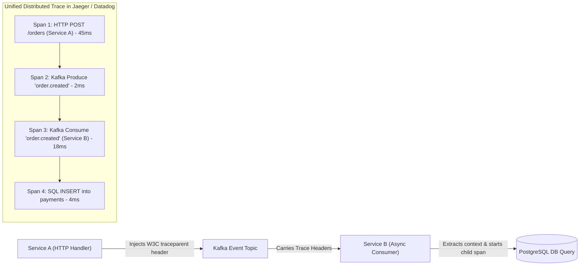
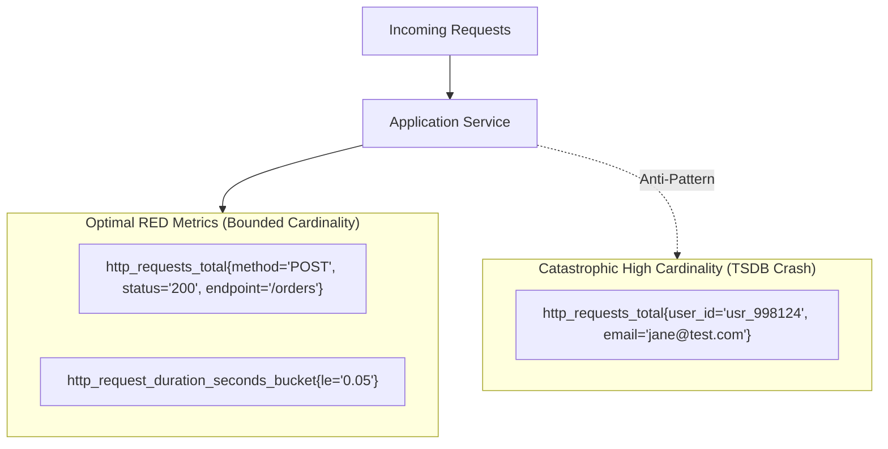

# Telemetry & Observability Scenario Spikes

> **"If an anomaly happens in production and your telemetry cannot pinpoint the offending span, SQL query, or customer ID within 60 seconds, your system is unobservable."**

---

## Challenge 1: Asynchronous Trace Context Propagation over Message Queues



### 1. Real-World Production Context
A multi-service e-commerce checkout flow issues asynchronous Kafka events. When an order fails or experiences 5,000ms latency, the HTTP trace terminates at Service A. The subsequent processing in Service B appears as an unrelated orphan trace, making cross-service root-cause debugging impossible.

### 2. Concrete Implementation (W3C TraceContext)
Use OpenTelemetry text map propagators to inject and extract `traceparent` headers across Kafka message headers:
```go
// 1. Injecting trace context into Kafka message headers (Service A)
carrier := propagation.MapCarrier{}
otel.GetTextMapPropagator().Inject(ctx, carrier)
for k, v := range carrier {
    record.Headers = append(record.Headers, kafka.Header{Key: k, Value: []byte(v)})
}

// 2. Extracting trace context from Kafka headers (Service B)
carrier := propagation.MapCarrier{}
for _, h := range record.Headers {
    carrier[string(h.Key)] = string(h.Value)
}
extractedCtx := otel.GetTextMapPropagator().Extract(context.Background(), carrier)
tracer.Start(extractedCtx, "ProcessOrderEvent")
```

### 3. Verifiable Evidence Deliverable
A Docker Compose sandbox running OpenTelemetry Collector and Jaeger, demonstrating a continuous end-to-end trace spanning from an initial HTTP request through a Kafka consumer to a database write.

---

## Challenge 2: Prometheus RED Metrics without High-Cardinality Explosions



### 1. Real-World Production Context
A developer instruments an application with custom Prometheus metrics, adding `user_id` and `order_id` as metric labels. In production, with 5 million users, the Prometheus time-series database (TSDB) crashes due to memory exhaustion from millions of unique label combinations.

### 2. Cardinality Engineering Guardrails
- **Cardinality Law**: Metric labels must have a strictly bounded, small set of possible values ($< 100$ combinations: HTTP method, status code, route pattern).
- **High-Cardinality Data Belongs in Traces or Logs**: Dynamic identifiers (`user_id`, `order_id`, `ip_address`) must be stored in structured JSON log attributes or OpenTelemetry trace span attributes, never in time-series metric labels.

### 3. Verifiable Evidence Deliverable
A Prometheus metrics endpoint implementation utilizing the RED method (Rate, Errors, Duration) with bounded histogram buckets, accompanied by a Grafana dashboard calculating real-time P95 and P99 latency percentiles using PromQL:
```promql
histogram_quantile(0.99, sum(rate(http_request_duration_seconds_bucket[5m])) by (le, route))
```
