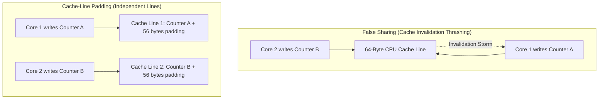
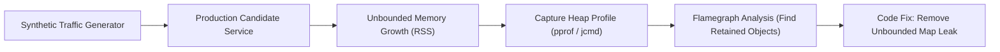

# Performance Benchmarking & Profiling Spikes

> **"Never guess where a bottleneck is. Profile CPU instructions, analyze heap allocations, trace network round-trips, and let the flamegraphs tell the truth."**

---

## Challenge 1: CPU Cache-Line False Sharing Elimination



### 1. Real-World Production Context
A multi-core metrics collector running on a 32-core AMD EPYC server tracks request counters across parallel worker threads. Despite having 32 available cores, CPU utilization hovers at 100% while throughput drops by 80% due to cache line bouncing across L1/L2 caches.

### 2. Forensic Investigation
Use Linux `perf c2c` (Cache-to-Cache) or `perf stat` to measure cache line invalidation cycles:
```bash
perf stat -e L1-dcache-load-misses,L1-dcache-loads ./counter_benchmark
```

### 3. Concrete Code Refactoring (Go / Java / C++)
Align each thread's independent counter struct to 64 bytes using cache-line padding:
```go
// Before: False Sharing Hazard
type MetricsCollector struct {
    counterA uint64 // 8 bytes
    counterB uint64 // 8 bytes (shares same 64-byte cache line!)
}

// After: Padded Cache-Line Isolation
type PaddedCounter struct {
    value uint64
    _     [56]byte // 7 x 8-byte padding to fill 64-byte cache line
}
```

### 4. Verifiable Evidence Deliverable
A benchmark report demonstrating a $> 4\times$ throughput increase on multi-threaded synthetic workloads, accompanied by `perf` cache-miss metrics.

---

## Challenge 2: Production Memory Leak Forensics



### 1. Real-World Production Context
A Go/Node/Java backend service runs smoothly for 48 hours, after which Linux kernel OOM killer abruptly terminates the container. Restarting the pod temporarily resolves the issue, but memory ramps steadily by 50MB per hour.

### 2. Forensic Profiling Steps
1. Capture live memory profiles at 1 hour and 12 hours:
   ```bash
   # For Go
   go tool pprof -proto http://localhost:6060/debug/pprof/heap > heap_12h.pb.gz
   go tool pprof -base heap_1h.pb.gz heap_12h.pb.gz
   ```
2. Generate an in-use memory flamegraph to identify retaining references.
3. Identify the leak: e.g., an in-memory session cache that never deletes expired keys, or an event listener that is never unregistered.

### 3. Verifiable Evidence Deliverable
A published technical case study with comparative flamegraphs and a pull request introducing bounded caching with eviction policies.

---

## Challenge 3: Eliminating the Relational N+1 Query Bottleneck

### 1. Real-World Production Context
An API endpoint `/api/v1/orders` returns 100 recent orders. Under production traffic, database CPU utilization hits 98%. Profiling reveals that fetching 100 orders executes **1 initial SQL query plus 100 individual queries** to fetch user profile details ($N+1$).

### 2. Concrete Refactoring
1. Replace lazy-loaded loops with SQL `JOIN` or eager batch queries (`WHERE user_id IN (...)`).
2. Add a composite index on foreign keys to accelerate join resolution.
3. Implement an automated query count assertion in the integration test suite (ensuring endpoint execution never executes $> 2$ database queries).

### 3. Verifiable Evidence Deliverable
A before-and-after query log showing database round-trips drop from 101 to 2, reducing endpoint latency from 480ms to 12ms.
