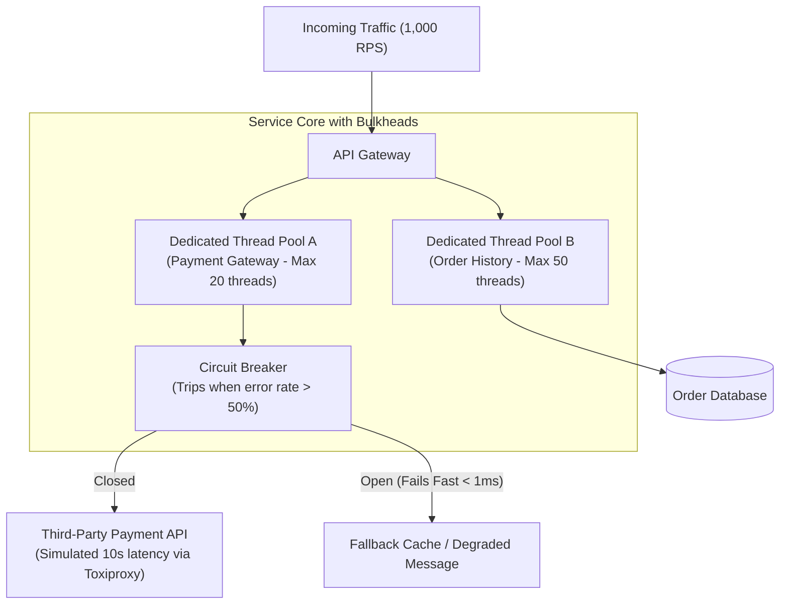
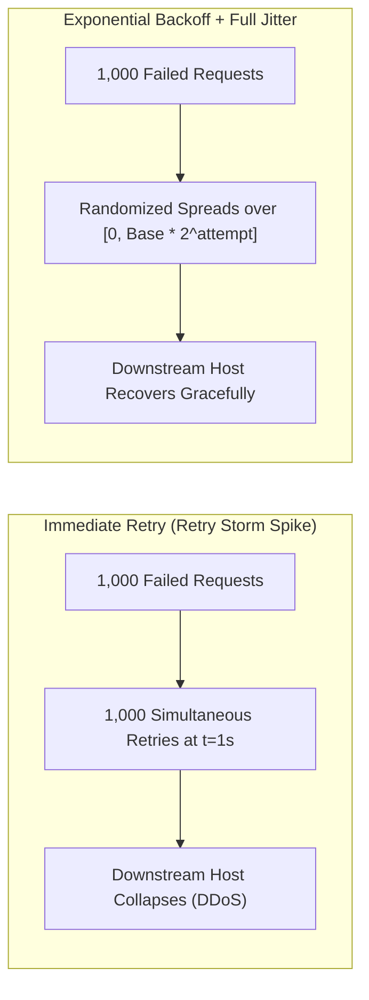

# Reliability Engineering & Chaos Scenario Spikes

> **"A resilient system is not one that never fails; it is one that fails gracefully, degrades intentionally, and recovers automatically without human intervention."**

---

## Challenge 1: Circuit Breaker with Bulkhead Isolation



### 1. Real-World Production Context
A backend service calls an external payment provider. The provider experiences a network degradation, causing outbound requests to hang for 30 seconds before timing out. The caller's thread pool saturates, causing all other unrelated endpoints (such as order history and user profile views) to hang, collapsing the entire website.

### 2. Implementation Strategy
1. **Bulkhead Isolation**: Assign separate, bounded thread/connection pools to each external dependency so saturation in one dependency cannot starve others.
2. **Circuit Breaker State Machine**: Implement standard states:
   - *Closed*: Normal operation; calls pass through.
   - *Open*: Error rate $> 50\%$ over 20 calls; calls fail fast immediately ($< 1\text{ms}$) without touching the network.
   - *Half-Open*: After 30s cooldown, allow 3 probe requests. If they succeed, reset to Closed; if they fail, return to Open.

### 3. Chaos Verification with Toxiproxy
Inject artificial 10,000ms latency into the downstream mock using Toxiproxy:
```bash
toxiproxy-cli toxic add downstream_api -t latency -a latency=10000
```
Verify via synthetic load test that upstream order history endpoints maintain 99.9% availability while payment calls fail fast in $< 1\text{ms}$.

### 4. Verifiable Evidence Deliverable
A chaos experiment report and Grafana dashboard showing the circuit breaker tripping within 3 seconds of injected latency, preserving upstream thread availability.

---

## Challenge 2: The Retry Storm & Full Jitter Simulation



### 1. Real-World Production Context
A backend database suffers a momentary 500ms network blip. 2,000 in-flight client requests fail. All 2,000 clients retry immediately at the exact same millisecond, turning a transient glitch into a 30-minute self-inflicted Distributed Denial of Service (DDoS) outage.

### 2. The Full Jitter Formula
Replace immediate or fixed retries with **Full Jitter Exponential Backoff**:
$$\text{Sleep Time} = \text{Random}(0, \min(\text{MaxBackoff}, \text{Base} \times 2^{\text{Attempt}}))$$

### 3. Verifiable Evidence Deliverable
A Python/Go simulation script plotting request distribution over time, proving that Full Jitter spreads load evenly across the recovery window while immediate retries create massive destructive traffic spikes.
