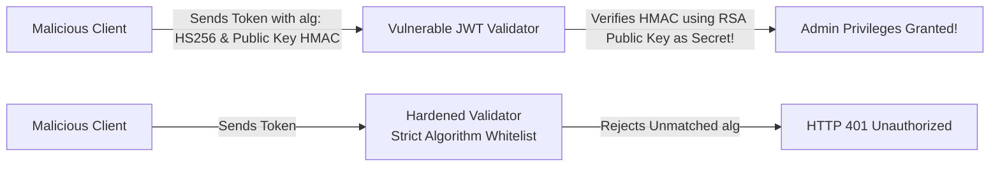
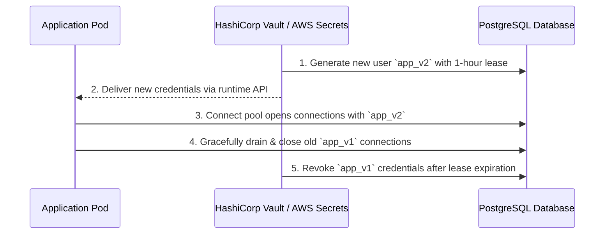

# Defensive Engineering & Security Scenario Spikes

> **"Assume the adversary has full read access to your client bundles, network packets, and open-source dependencies. Build systems that are cryptographically secure by default."**

---

## Challenge 1: JWT Algorithm Confusion Exploit & Defense



### 1. Real-World Threat Context
An application uses asymmetric RS256 (RSA private key signs, public key verifies) for authentication tokens. An attacker crafts a forged JWT containing `"role": "admin"`, changes the header to `"alg": "HS256"`, and signs the token using the server’s publicly available RSA public key as an HMAC symmetric secret. The vulnerable library verifies the signature and grants admin access.

### 2. Concrete Architectural Defense
1. **Explicit Algorithm Whitelist**: Never allow the incoming JWT header to dictate the verification algorithm. Hardcode the allowed algorithm in the validator:
   ```go
   // Go: Enforcing explicit algorithm validation
   token, err := jwt.Parse(tokenString, func(t *jwt.Token) (interface{}, error) {
       if _, ok := t.Method.(*jwt.SigningMethodRSA); !ok {
           return nil, fmt.Errorf("unexpected signing algorithm: %v", t.Header["alg"])
       }
       return rsaPublicKey, nil
   })
   ```
2. **Reject `alg: none`**: Ensure tokens claiming `none` algorithm are rejected immediately.

### 3. Verifiable Evidence Deliverable
An automated security regression test suite attempting both algorithm confusion and `alg: none` forged tokens, verifying HTTP 401 responses.

---

## Challenge 2: Zero-Downtime Dynamic Secret Rotation



### 1. Real-World Production Context
A database administrator needs to rotate database credentials without restarting application pods or dropping live customer queries. Hardcoded secrets or manual restarts cause brief connection spikes and potential outages.

### 2. Implementation Blueprint
1. Utilize dynamic secrets engines (HashiCorp Vault Database Secrets Engine).
2. Configure application connection pools (e.g., HikariCP) to refresh credentials asynchronously before the lease expires.
3. Drain existing connections gracefully without terminating in-flight queries.

### 3. Verifiable Evidence Deliverable
A Docker Compose demo running continuous synthetic transactions during an automated credential rotation, showing 0 dropped queries and zero restarts.
