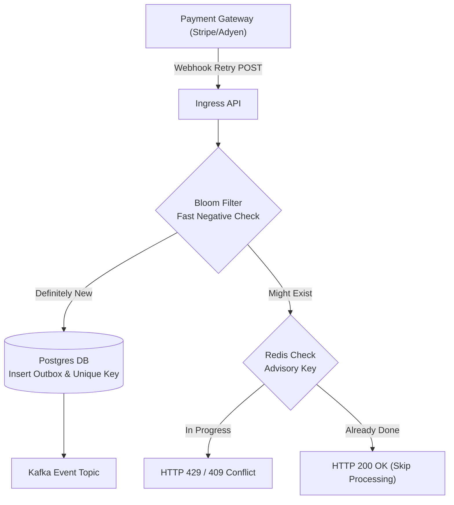
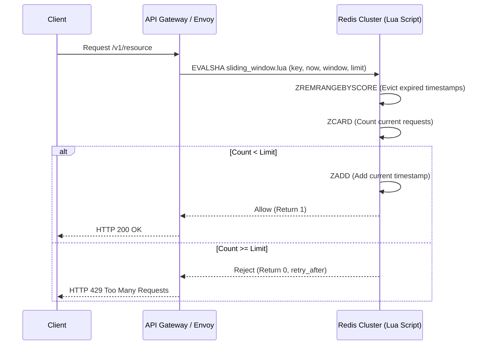

# Distributed System Design Scenario Spikes

> **"In distributed systems, everything that can go wrong will go wrong simultaneously. Your design must be idempotent, self-healing, and resilient to arbitrary network partitions."**

---

## Challenge 1: The Idempotent Payment Webhook Ingestion Engine



### 1. Real-World Production Context
A fintech platform processes payment status webhooks from external gateways. Gateways guarantee at-least-once delivery, retrying aggressively when responses take longer than 2 seconds. A network glitch triggers 4 duplicate requests per transaction within 300ms, causing duplicate credits and database deadlocks.

### 2. Constraints & Non-Functional Requirements (NFRs)
- **Zero Duplicate Allocations**: Exactly **0.000%** duplicate payment postings, even under concurrent replay attacks.
- **Latency Budget**: Ingress response must return HTTP 200/202 in $< 35\text{ms}$ at 10,000 requests/sec peak.
- **Outbox Persistence**: The internal state update and message emit must be atomic (no two-phase commits).

### 3. Architectural Solution
1. **Deduplication Tier**: Client-supplied `Idempotency-Key` or `transaction_id` is passed through an in-memory Redis Bloom filter for rapid rejection ($< 1\text{ms}$).
2. **Transactional Outbox**: Save incoming webhook payload and append to an `outbox` table within a single ACID database transaction.
3. **Asynchronous Poller / CDC**: A dedicated Debezium or background poller streams outbox records to Kafka for downstream fulfillment.

### 4. Chaos & Replay Testing Script
Use `k6` to fire 500 concurrent threads sending the exact same payload and idempotency key simultaneously:
```javascript
// k6 concurrent replay test
import http from 'k6/http';
import { check } from 'k6';

export const options = { vus: 100, duration: '10s' };

export default function () {
  const payload = JSON.stringify({ txn_id: "TX-9901-A", amount: 150.00 });
  const params = { headers: { 'Content-Type': 'application/json', 'Idempotency-Key': 'IDEMP-9901' } };
  const res = http.post('http://localhost:8080/api/v1/webhooks', payload, params);
  check(res, { 'is 200 or 409': (r) => r.status === 200 || r.status === 409 });
}
```

### 5. Verifiable Evidence Deliverable
A Git repository with the PostgreSQL outbox migration, Redis deduplication logic, and a test suite proving that 1,000 duplicate requests resulted in exactly 1 database write.

---

## Challenge 2: Distributed Sliding-Window Rate Limiter



### 1. Real-World Production Context
Public API endpoints require protection from abusive scraping and DDoS attacks. Fixed-window rate limiters permit 2x traffic bursts at window boundaries (e.g., 100 requests at 11:59:59 and 100 requests at 12:00:00). A true sliding-window rate limiter is required.

### 2. Constraints & NFRs
- **Atomic Execution**: Must evaluate and update the rate limit state atomically using a single Redis Lua script to avoid race conditions.
- **Low Latency**: Limit check overhead must add $< 2.5\text{ms}$ to upstream request latency.
- **Memory Footprint**: Must clean up expired timestamp keys to prevent Redis OOM errors.

### 3. Verifiable Evidence Deliverable
A benchmarked Redis Lua script implementation and load test report proving accurate sliding-window rate enforcement under 20,000 concurrent client requests.

---

## Challenge 3: Transactional Outbox Worker with Effectively-Once Semantics

### 1. Real-World Production Context
A monolithic application needs to notify external services when order records change. Emitting an HTTP or Kafka call directly inside the database transaction causes distributed inconsistency if the transaction rolls back after the network call was sent.

### 2. Implementation Strategy
1. Persist the business record and an outbox event in the same local database transaction.
2. Build an asynchronous worker using PostgreSQL `FOR UPDATE SKIP LOCKED` to read batches of unprocessed events without blocking other concurrent workers.
3. Publish events to Kafka, and mark the outbox rows as processed in small batches.

### 3. Verifiable Evidence Deliverable
A working Go/Java implementation demonstrating zero lost events and zero phantom events during simulated database deadlocks and process terminations.
