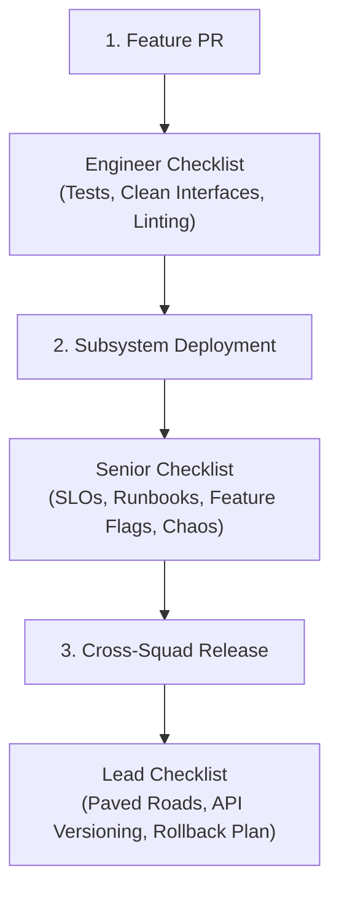

# Engineering Operational Checklists

> **"Checklists do not replace judgment; they protect judgment from cognitive fatigue, distraction, and the chaotic entropy of production deployments."** — Atul Gawande (adapted for engineering)

This directory houses the **Operational Checklists** of **Domain 25 — Software Engineer Excellence**. 

These checklists codify non-negotiable quality gates, Definition of Done standards, production readiness reviews, and periodic continuous improvement rituals into executable, unambiguous verification lists.

---

## Directory Documents

| Document | Scope & Audience | Core Verification Gate |
| :--- | :--- | :--- |
| **[engineer-checklist.md](./engineer-checklist.md)** | Software Engineer (L1–L2) | The strict **Definition of Done** for daily pull requests and features. |
| **[senior-engineer-checklist.md](./senior-engineer-checklist.md)** | Senior Engineer (L2–L3) | Production readiness, telemetry coverage, failure-mode isolation, and runbooks. |
| **[lead-engineer-checklist.md](./lead-engineer-checklist.md)** | Lead / Staff Engineer (L3–L4) | Cross-team architectural sanity, release gates, and platform paved roads. |
| **[continuous-improvement-checklist.md](./continuous-improvement-checklist.md)** | All Engineers | Periodic weekly, monthly, and quarterly development rituals. |

---

## Checklists as Evolutionary Guardrails

These checklists eliminate human memory failures and ensure that every production deployment adheres to the highest engineering standards.
