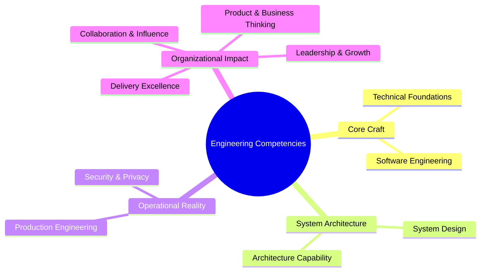

# Engineering Competency Model

> **"Competency is not an inventory of technologies known; it is a matrix of problems an engineer can solve, under what constraints, with what degree of autonomy, and with what evidence of outcome."**

This directory houses the comprehensive **10-Dimension Engineering Competency Model** of the `enterprise-architecture-handbook`. It defines the full spectrum of capabilities required of software engineers as they evolve from assisted individual contributors to staff-level engineering leaders and practicing architects.

---

## Directory Documents

| Document | Focus Dimension | Key Topics Covered |
| :--- | :--- | :--- |
| **[competency-model.md](./competency-model.md)** | Master Architecture | Unified taxonomy, maturity progression, and capability interconnections. |
| **[technical-foundations.md](./technical-foundations.md)** | Dimension 1 | CPU cache lines, memory allocation, OS scheduling, networking, I/O models, complexity. |
| **[software-engineering.md](./software-engineering.md)** | Dimension 2 | Clean code, SOLID, refactoring, test pyramids, code review rigor, tech debt stewardship. |
| **[system-design.md](./system-design.md)** | Dimension 3 | API contracts, state management, caching, distributed consistency, fault tolerance. |
| **[architecture.md](./architecture.md)** | Dimension 4 | Component boundaries, ADRs, trade-off analysis, evolutionary design, integration patterns. |
| **[production-engineering.md](./production-engineering.md)** | Dimension 5 | Telemetry, distributed tracing, SLOs, incident mitigation, debugging under pressure. |
| **[security.md](./security.md)** | Dimension 6 | Threat modeling, identity/access, cryptographic hygiene, supply chain, zero-trust. |
| **[delivery-excellence.md](./delivery-excellence.md)** | Dimension 7 | Story decomposition, risk-adjusted estimation, trunk-based CI/CD, canary releases. |
| **[collaboration.md](./collaboration.md)** | Dimension 8 | High-signal code reviews, RFC design documents, technical mentorship, consensus. |
| **[business-thinking.md](./business-thinking.md)** | Dimension 9 | Unit economics, customer workflows, ROI, commercial trade-offs, value streams. |
| **[leadership.md](./leadership.md)** | Dimension 10 | Extreme ownership, influence without authority, psychological safety, continuous growth. |

---

## The 10 Competency Dimensions

Each dimension document provides:
1. **Core Capability Scope**: What an engineer must understand and be able to execute.
2. **Behavioral Anchor Rubric (L0 to L5)**: Concrete observable behaviors at every maturity level.
3. **Evidence Artifact Catalog**: Specific, verifiable deliverables proving capability.
4. **Anti-Patterns & Traps**: Common pitfalls, misconceptions, and cargo-cult behaviors.
5. **Cross-Handbook Connections**: Direct links to authoritative technical references in domains `00` through `24`.
