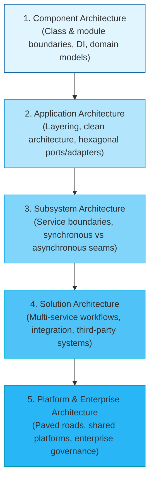

# Dimension 4: Architecture Capability

> **"Architecture is the decisions that are hard to change later. Good engineers defer those decisions until the last responsible moment; great engineers design systems where fewer decisions are irreversible."**

---

## 1. Dimension Overview

**Architecture Capability** represents the engineer's capacity to conceptualize software beyond individual classes and endpoints, structuring components into a cohesive, evolvable, and defensible system. In this dimension, the engineer transitions from an *implementer of tasks* into a *designer of systems*.

This dimension does not expect an engineer to immediately command enterprise-wide IT strategy (which is the domain of [24-architect-mastery/](../../24-architect-mastery/)). Rather, it measures the progressive expansion of architectural scope: from mastering **Component Architecture** to **Application Architecture**, **Subsystem Architecture**, and ultimately **Solution Architecture**.

---

## 2. Core Capability Areas

### Area 1: Architectural Scoping & Boundaries
- **Hexagonal / Clean Architecture**: Strictly separating core business logic (entities, use cases) from external delivery mechanisms (HTTP controllers, message listeners) and infrastructure dependencies (databases, cloud SDKs).
- **Loose Coupling & High Cohesion**: Grouping related business capabilities together while minimizing inter-module communication dependencies.
- **Architectural Seams**: Designing intentional seams (interfaces, message topics, facades) that permit future technology swaps without rewriting domain logic.

### Area 2: Architecture Decision Records (ADRs)
- **Defensible Documentation**: Authoring structured ADRs documenting the exact context, alternatives considered, chosen decision, negative trade-offs, and downstream consequences.
- **Decision Reversibility**: Distinguishing between *One-Way Doors* (irreversible decisions: database storage engine, programming language ecosystem) and *Two-Way Doors* (reversible decisions: caching TTLs, library wrappers), deferring one-way decisions until sufficient empirical data exists.

### Area 3: Non-Functional Requirement (NFR) Engineering
- **Quantifying the Vague**: Transforming ambiguous requests ("the system must be fast and reliable") into rigorous, testable NFR budgets:
  - *Latency*: P99 $< 45\text{ms}$ at $5,000\text{ RPS}$.
  - *Availability*: $99.95\%$ uptime ($< 21.9\text{ minutes}$ downtime/month).
  - *RTO / RPO*: Recovery Time Objective $< 15\text{ minutes}$, Recovery Point Objective $< 0\text{ seconds}$ (zero data loss).
  - *Cost*: Maximum infrastructure spend of $\$0.0012$ per processed transaction.

### Area 4: Trade-Off Analysis
- **The "No Free Lunch" Law**: Evaluating every architectural proposal through the lens of what is being sacrificed:
  - *Latency vs. Consistency*: Strong consistency requires coordination overhead.
  - *Throughput vs. Resource Consumption*: In-memory caching boosts speed at the expense of memory footprint and cache invalidation complexity.
  - *Flexibility vs. Simplicity*: Generic plugin architectures add indirection and cognitive load compared to straightforward, domain-specific code.

### Area 5: Evolutionary Architecture & Fitness Functions
- **Automated Guardrails**: Implementing automated architectural fitness functions in CI/CD (e.g., using ArchUnit, Dependabot, or static linters) to prevent circular package dependencies, unauthorized layer access, or security violations.
- **Strangler Fig Pattern**: Incrementally intercepting calls to legacy systems and routing them to modernized components until the legacy system can be safely decommissioned.

---

## 3. Maturity Rubric: Behavioral Anchors (L0 to L5)

| Level | Observable Engineering Behavior |
| :--- | :--- |
| **L0: Awareness** | Writes code without architectural structure; mixes SQL queries directly into UI/controller code; unaware of ADRs. |
| **L1: Assisted** | Adheres to existing application architectures (MVC, Hexagonal); writes small ADR drafts with guidance from a senior engineer. |
| **L2: Independent** | Autonomously structures modular applications using clean architecture; writes clear, defensible ADRs for component-level decisions; designs testable subsystem boundaries. |
| **L3: Advanced** | Architects multi-service solutions; leads trade-off evaluations across competing technologies; establishes automated architectural fitness functions; leads architecture review sessions. |
| **L4: Lead** | Defines architectural blueprints and paved roads across multiple teams; ensures alignment with enterprise standards; guides legacy modernizations and strangler migrations. |
| **L5: Strategic** | Defines enterprise-wide architectural strategy and platform governance; leads technical due diligence for mergers and acquisitions; recognized as a top-tier technical authority. |

---

## 4. Verifiable Evidence Artifacts

1. **Accepted Architecture Decision Record (ADR)**: A published, peer-reviewed ADR documenting a major technical choice (e.g., selecting Apache Kafka over RabbitMQ for an event-driven ledger), detailing 3 evaluated alternatives, concrete benchmark data, and long-term operational trade-offs.
2. **Hexagonal Architecture Implementation**: A Git repository diff demonstrating the refactoring of an entangled CRUD codebase into a clean Hexagonal architecture, completely decoupling the domain model from database schemas and external REST APIs.
3. **Automated Architectural Fitness Function**: An automated CI pipeline check (e.g., via ArchUnit or custom AST linter) that detects and blocks unauthorized dependencies between domain modules, accompanied by zero false positives over 90 days.
4. **Strangler Migration Blueprint & Execution**: A multi-phase migration RFC and execution dashboard demonstrating the incremental migration of 100% of user authentication traffic from a legacy monolith to an OAuth2/OIDC identity provider with zero customer-facing downtime.

---

## 5. Anti-Patterns & Misconceptions

- **Ivory-Tower Architecture**: Drafting elaborate 50-page architecture diagrams without ever writing code, verifying runtime performance, or consulting the engineers responsible for maintaining the system.
- **Resume-Driven Architecture**: Adopting cutting-edge or esoteric technologies (e.g., distributed graph databases, blockchain) to enhance personal resumes rather than solving genuine business problems.
- **Premature Generalization**: Designing massive, hyper-generic abstraction layers for hypothetical requirements that never materialize, making the code 10x harder to read and debug.
- **Ignoring Operational Cost**: Designing an architecture that works theoretically on paper but requires 20 full-time SREs to keep alive in production.

---

## 6. Handbook Cross-References

- **Architecture Fundamentals**: [01-architecture/](../../01-architecture/)
- **Architecture Deliverables & Templates**: [16-architecture-deliverables/](../../16-architecture-deliverables/)
- **Reference Architectures**: [18-reference-architectures/](../../18-reference-architectures/)
- **Modernization & Strangler Patterns**: [15-modernization/](../../15-modernization/)
- **Architect Mastery & Strategic Governance**: [24-architect-mastery/](../../24-architect-mastery/)
