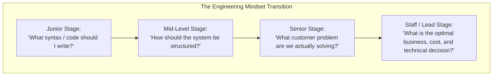

# Dimension 9: Product & Business Thinking

> **"Code is a cost center, not an asset. The asset is the business problem solved, the customer friction eliminated, and the revenue generated."**

---

## 1. Dimension Overview

**Product & Business Thinking** marks the critical transition from an engineering mechanic who merely asks *"How do I implement this ticket?"* to an engineering strategist who asks *"Why are we building this, what customer outcome does it achieve, and is this the most cost-effective technical path to get there?"*

Engineers who lack business thinking frequently over-engineer low-value internal tools, ignore infrastructure cloud costs, push back against valid business priorities out of purist aesthetic dogma, and build features that users never touch. This dimension evaluates an engineer's capability in **commercial acumen, unit economics, customer workflow empathy, cost-of-delay analysis, and technical/business trade-offs**.

---

## 2. Core Capability Areas

### Area 1: Customer Empathy & Domain Modeling
- **Understanding Real User Workflows**: Spending time directly shadowing customer support, reading user complaints, and observing how customers actually use the software in the wild.
- **Ubiquitous Language**: Ensuring that the entities, classes, and database schemas directly reflect real-world business concepts rather than arbitrary technical abstractions.

### Area 2: Unit Economics & Cloud FinOps
- **Cost per Transaction**: Calculating and monitoring the true marginal cost of processing a transaction, query, or user:
  $$\text{Unit Cost} = \frac{\text{Cloud Compute} + \text{Database IO} + \text{Third-Party API Costs}}{\text{Total Transactions}}$$
- **FinOps Discipline**: Proactively identifying idle infrastructure, unattached EBS volumes, over-provisioned Kubernetes clusters, and unnecessary NAT gateway data transfer fees.

### Area 3: Cost of Delay & ROI Trade-Offs
- **Cost of Delay (CoD)**: Understanding that delivering a feature 3 months late can destroy its commercial window of opportunity.
- **Pragmatic Technical Debt**: Intentionally accepting temporary, well-contained technical debt to capture an urgent commercial opportunity, backed by a scheduled ticket to pay it down immediately after launch.

### Area 4: Opportunity Cost & Build vs. Buy Decisions
- **Build vs. Buy Evaluation**: Recognizing when building an in-house tool (e.g., custom authentication, message queue, or CRM integration) wastes hundreds of engineering hours on commodity infrastructure that could be purchased off-the-shelf for \$50/month.
- **Opportunity Cost Awareness**: Asking: *"If we spend the next 2 months rewriting this working service in Rust, what critical customer features will we fail to deliver?"*

---

## 3. Maturity Rubric: Behavioral Anchors (L0 to L5)

| Level | Observable Engineering Behavior |
| :--- | :--- |
| **L0: Awareness** | Views product managers as "task assigners"; completely unaware of company revenue models, customer personas, or cloud bills. |
| **L1: Assisted** | Understands the user story acceptance criteria; implements features adhering to specified business logic. |
| **L2: Independent** | Autonomously clarifies ambiguous business requirements with product managers; identifies edge cases in business logic before coding; monitors the basic infrastructure cost of their service. |
| **L3: Advanced** | Partners as an equal with product leadership; challenges proposed features that offer low ROI; designs systems optimized for unit economics; champions build vs. buy trade-offs. |
| **L4: Lead** | Shapes product technical strategy across a business line; aligns multi-quarter engineering roadmaps with company revenue objectives; executes major FinOps cost-reduction initiatives. |
| **L5: Strategic** | Influences enterprise business models and executive strategy; identifies new technological capabilities that create entirely new company revenue streams and market opportunities. |

---

## 4. Verifiable Evidence Artifacts

1. **Cloud FinOps Optimization Report**: A documented infrastructure optimization initiative detailing how the engineer analyzed AWS Cost Explorer, refactored data retention policies, and downscaled over-provisioned nodes, saving \$85,000 annually without impacting SLOs.
2. **Build vs. Buy Business Case**: An engineering decision matrix comparing the total cost of ownership (TCO over 3 years: engineering salary, maintenance, hosting) of building an in-house search engine versus adopting an enterprise hosted search platform (Algolia/Elastic Cloud).
3. **Product Requirement Refinement (PRD/RFC)**: A written product design collaboration showing where the engineer identified a flaw in a proposed feature spec, proposed a 50% simpler technical alternative, and saved 6 weeks of engineering effort while delivering 95% of customer value.
4. **Unit Economics Telemetry Dashboard**: A business telemetry dashboard linking real-time system throughput to cloud infrastructure cost, showing cost per active customer decreasing over time.

---

## 5. Anti-Patterns & Misconceptions

- **Resume-Driven Architecture at Business Expense**: Choosing complex, expensive distributed databases because they look great on a resume, even when the business only has 500 daily users.
- **The "Not My Problem" Stance**: Shrugging when a feature fails to generate revenue or engagement, stating: *"I just write the code; the product manager is the one who failed."*
- **Dogmatic Perfectionism**: Refusing to ship a working, high-value feature because the internal code does not conform to an arbitrary aesthetic ideal, causing the company to miss a major contract deadline.
- **Ignoring Cloud Invoices**: Writing database queries that perform full table scans across 50 million rows on serverless billing models, resulting in surprise \$20,000 monthly cloud bills.

---

## 6. Handbook Cross-References

- **Architectural Economics & TCO**: [24-architect-mastery/economics/](../../24-architect-mastery/economics/)
- **Technology Strategy & Evaluation**: [24-architect-mastery/technology-strategy/](../../24-architect-mastery/technology-strategy/)
- **Real-World Case Studies**: [19-case-studies/](../../19-case-studies/)
- **Enterprise Architecture Governance**: [23-enterprise-architecture/](../../23-enterprise-architecture/)
