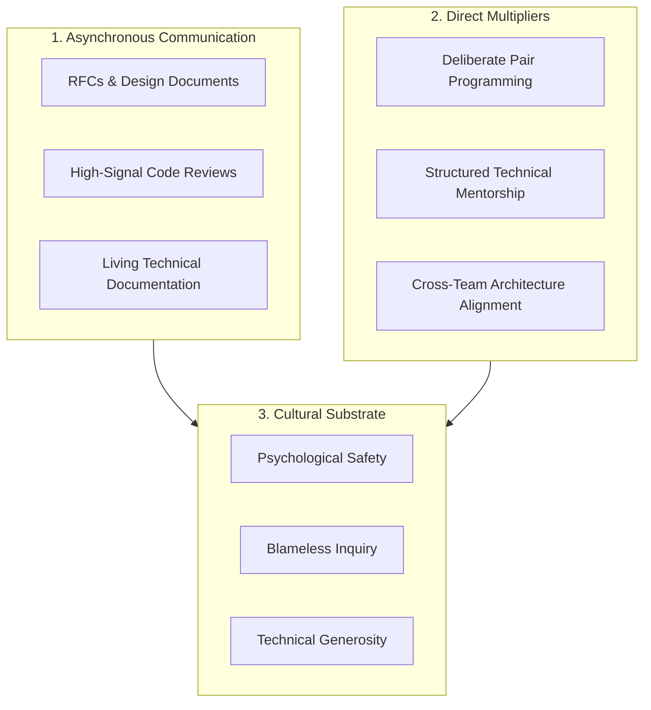

# Dimension 8: Collaboration & Influence

> **"Software engineering is not an individual typing contest; it is a team-based socio-technical communication system that happens to output source code."**

---

## 1. Dimension Overview

**Collaboration & Influence** is the capability to multiply the technical effectiveness of other engineers through rigorous communication, thoughtful design review, empathetic mentorship, and cross-team alignment. A brilliant individual contributor who cannot collaborate effectively creates an organizational bottleneck, hoards critical domain knowledge, and alienates peers.

This dimension does not evaluate generic "soft skills" or superficial friendliness. It evaluates whether an engineer can **formulate persuasive technical proposals (RFCs), provide high-signal code reviews, mentor engineers to higher levels of autonomy, resolve contentious architectural disputes constructively, and build shared technical alignment**.

---

## 2. Core Capability Areas

### Area 1: High-Signal Code Review
- **Focusing on What Matters**:
  - *Tier 1 (Automate)*: Formatting, linting, imports, trivial style $\to$ Handled entirely by automated CI linters.
  - *Tier 2 (Architectural)*: Boundary violations, leaky abstractions, race conditions, unhandled failure modes, testing gaps.
  - *Tier 3 (Pedagogical)*: Explaining *why* a pattern is dangerous and offering concrete, working code snippets as alternatives.
- **Tone & Constructive Phrasing**: Replacing judgmental declarations ("*This is completely wrong*") with curious, inquisitive framing ("*What happens to this database connection pool if the third-party payment gateway times out after 30 seconds?*").

### Area 2: RFC Authoring & Asynchronous Consensus
- **The RFC (Request for Comments) Process**: Drafting structured technical proposals before writing code for non-trivial initiatives.
- **Anatomy of an Effective RFC**:
  1. *Context & Problem Statement*: Why does this problem need solving now?
  2. *Proposed Solution*: Architecture diagrams, data models, API contracts.
  3. *Alternatives Considered*: Why were simpler or competing approaches rejected?
  4. *Negative Consequences & Costs*: What new complexity or operational burden is introduced?
- **Handling Dissent**: Welcoming pushback and synthesizing constructive feedback rather than becoming defensive.

### Area 3: Technical Mentorship & Pairing
- **Socratic Guidance**: Resisting the urge to grab the keyboard and write the code for junior engineers. Asking guiding questions that enable them to discover the architectural solution independently.
- **Structured Growth Sponsorship**: Actively assigning stretch technical tasks to mentees, helping them design the solution, and supporting their promotion readiness.

### Area 4: Cross-Team Alignment & Technical Diplomacy
- **Contract Negotiations**: Reaching alignment with upstream and downstream teams on API contracts, event schemas, and SLAs without escalation.
- **Disagree and Commit**: Vigorously debating architectural options with data and evidence during the design phase, but fully committing to the agreed decision once finalized, regardless of personal preference.

---

## 3. Maturity Rubric: Behavioral Anchors (L0 to L5)

| Level | Observable Engineering Behavior |
| :--- | :--- |
| **L0: Awareness** | Works in isolation; views code reviews as personal criticism or rubber-stamps them without reading; avoids documentation. |
| **L1: Assisted** | Participates constructively in code reviews; communicates task progress clearly; pairs effectively with senior guidance. |
| **L2: Independent** | Autonomously gives high-signal code reviews; writes clear technical documentation and bug reports; collaborates seamlessly with cross-functional peers (QA, Product, Design). |
| **L3: Advanced** | Authors widely accepted RFCs for complex initiatives; mentors junior and mid-level engineers to independence; defuses technical conflicts; leads design review discussions. |
| **L4: Lead** | Drives technical consensus across disparate engineering teams; unifies fractured standards into coherent paved roads; coaches senior engineers into technical leadership roles. |
| **L5: Strategic** | Shapes engineering culture and communication across the entire organization; establishes foundational RFC and governance processes; influences industry-wide collaboration norms. |

---

## 4. Verifiable Evidence Artifacts

1. **Published & Accepted RFC**: An architectural Request for Comments (RFC) addressing a multi-team technical initiative (e.g., standardizing event schemas across 5 microservices), showing active peer critique and documented consensus.
2. **Mentorship Promotion Case**: A documented track record of mentoring a junior/mid-level engineer over 6–12 months, detailing specific paired projects and culminating in their successful promotion to independent level.
3. **Cross-Team API Contract Specification**: A joint API contract agreement (OpenAPI or Protobuf) negotiated between two previously conflicted engineering squads, accompanied by zero integration regressions at launch.
4. **Exemplary Code Review Portfolio**: A curated sample of 5 comprehensive PR reviews demonstrating pedagogical coaching, catching subtle concurrency/architectural bugs, and receiving positive feedback from peers.

---

## 5. Anti-Patterns & Misconceptions

- **Bikeshedding**: Spending 45 comments arguing over whether a configuration key should use camelCase or snake_case while completely ignoring an unindexed database query.
- **The "Brilliant Jerk" Archetype**: Tolerating technical competence combined with condescending, arrogant, or dismissive communication that demoralizes the engineering team.
- **Rubber-Stamp Approvals**: Blindly clicking "LGTM" (Looks Good To Me) on 1,500-line pull requests without reading the code or verifying test coverage.
- **Knowledge Hoarding**: Deliberately keeping critical deployment scripts, architecture details, or operational knowledge secret to ensure personal indispensability.

---

## 6. Handbook Cross-References

- **Engineering Leadership & Mentorship**: [24-architect-mastery/leadership/](../../24-architect-mastery/leadership/)
- **Architecture Storytelling & Reviews**: [24-architect-mastery/architecture-storytelling/](../../24-architect-mastery/architecture-storytelling/)
- **RFC & Architecture Deliverable Templates**: [16-architecture-deliverables/](../../16-architecture-deliverables/)
- **Organizational Design & Conway's Law**: [24-architect-mastery/organizational-design/](../../24-architect-mastery/organizational-design/)
