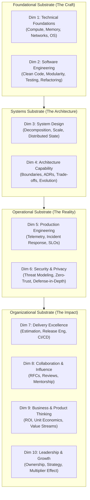
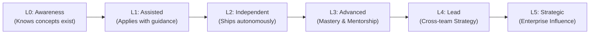

# The Master Engineering Competency Model

> **"A senior engineer is not merely a junior engineer who writes faster code; they are an engineer who sees the entire lifecycle of software—from CPU cache lines and network packets to business unit economics and team cognitive load."**

---

## 1. Unified Architecture of the Competency Model

The **Master Engineering Competency Model** provides an integrated taxonomy for evaluating, cultivating, and advancing engineering excellence. It eliminates arbitrary promotion checklists by anchoring growth in ten interdependent capability dimensions.

---

## 2. The 10 Competency Dimensions at a Glance

| # | Dimension | Primary Question | Core Focus Areas | Handbook Link |
| :-: | :--- | :--- | :--- | :--- |
| **1** | **[Technical Foundations](./technical-foundations.md)** | *How do machines actually execute programs?* | Memory models, CPU caches, OS threads, I/O multiplexing, TCP/IP, algorithmic analysis. | [00-foundations/](../../00-foundations/) |
| **2** | **[Software Engineering](./software-engineering.md)** | *How do we build maintainable, testable software?* | SOLID, refactoring, test pyramids, design patterns, cognitive complexity, code review. | [03-backend/](../../03-backend/) |
| **3** | **[System Design](./system-design.md)** | *How do distributed components coordinate reliably?* | Decomposition, CAP, caching, messaging, event streaming, data consistency, resilience. | [02-system-design/](../../02-system-design/) |
| **4** | **[Architecture Capability](./architecture.md)** | *How do we make defensible long-term technical decisions?* | Subsystem boundaries, ADRs, trade-off matrices, evolutionary runways, integration. | [01-architecture/](../../01-architecture/) |
| **5** | **[Production Engineering](./production-engineering.md)** | *How do we ensure systems run reliably in production?* | Metrics, traces, logs, SLOs/error budgets, incident mitigation, debugging under pressure. | [11-observability/](../../11-observability/) |
| **6** | **[Security](./security.md)** | *How do we defend data and systems from compromise?* | Threat modeling (STRIDE), IAM, secret rotation, zero-trust, supply chain, secure coding. | [10-security/](../../10-security/) |
| **7** | **[Delivery Excellence](./delivery-excellence.md)** | *How do we turn ambiguity into working software predictably?* | Story decomposition, risk estimation, trunk-based CI/CD, canary rollouts, fast feedback. | [09-devops/](../../09-devops/) |
| **8** | **[Collaboration](./collaboration.md)** | *How do we multiply team capability through communication?* | High-signal PR reviews, RFC authoring, blameless retros, mentorship, cross-team consensus. | [24-architect-mastery/leadership/](../../24-architect-mastery/leadership/) |
| **9** | **[Business & Product](./business-thinking.md)** | *How does code translate into sustainable commercial value?* | Unit economics, customer workflows, cost of delay, cloud ROI, business rule modeling. | [24-architect-mastery/economics/](../../24-architect-mastery/economics/) |
| **10** | **[Leadership & Growth](./leadership.md)** | *How do we take extreme ownership and elevate the organization?* | Extreme ownership, psychological safety, driving strategy without authority, continuous learning. | [24-architect-mastery/leadership/](../../24-architect-mastery/leadership/) |

---

## 3. Dimensional Interdependence: The Reinforcing Loop

No dimension operates in a silo. High performance requires symbiotic coupling between dimensions:

1. **Foundations enable System Design**: An engineer cannot design an effective caching strategy without understanding CPU cache coherence, memory allocation, and network round-trip times.
2. **System Design is governed by Architecture**: A distributed cache cannot be introduced without an ADR weighing the trade-offs of stale reads, memory cost, and operational complexity.
3. **Architecture is verified by Production Engineering**: An architecture is merely an unproven hypothesis until telemetry (P99 latency, error rate) proves it operates within SLOs under real-world traffic.
4. **Delivery is multiplied by Collaboration**: A brilliant design delivered in isolation without peer alignment, clear RFCs, or automated CI/CD pipelines creates a single point of failure and organizational friction.

---

## 4. The Maturity Progression Spectrum (L0 to L5)

Across all dimensions, an engineer progresses through six standardized competency stages:

- **L0 (Awareness)**: Can define the vocabulary and understand high-level concepts; cannot yet execute production-ready work without direct oversight.
- **L1 (Assisted)**: Executes tasks within defined bounds; requires pair programming, active code review guidance, and established scaffolding.
- **L2 (Independent)**: The benchmark for a fully qualified Software Engineer. Autonomously designs, implements, tests, and deploys high-quality components within expected timeframes.
- **L3 (Advanced)**: The benchmark for a Senior Software Engineer. Solves complex, ambiguous problems, navigates cross-cutting trade-offs, establishes best practices, and actively elevates peers.
- **L4 (Lead)**: Directs technical initiatives across multiple services or teams, writes foundational RFCs, steers system architecture, and bridges engineering with product strategy.
- **L5 (Strategic)**: Principal/Distinguished IC level. Sets organizational engineering standards, drives multi-year technological paradigms, and influences the broader tech industry.

See [maturity-levels.md](../capability-matrix/maturity-levels.md) for full cross-dimensional rubric tables.
