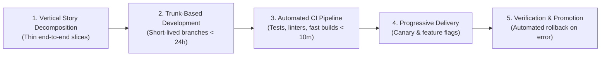

# Dimension 7: Delivery Excellence

> **"A brilliant architecture that never reaches production is indistinguishable from one that was never designed at all."**

---

## 1. Dimension Overview

**Delivery Excellence** is the discipline of reliably translating ambiguous business requirements into high-quality, working software running in production on schedule. In many organizations, delivery is marred by chronic delays, massive high-risk deployments, scope creep, and chaotic release weekends.

This dimension evaluates an engineer's capability in **work decomposition, risk-adjusted estimation, trunk-based development, automated CI/CD pipelines, feature flagging, and zero-downtime release engineering**. It bridges the gap between software design and production reality, ensuring predictable, high-cadence value delivery without compromising technical standards.

---

## 2. Core Capability Areas

### Area 1: Work Decomposition & Vertical Slicing
- **Vertical vs. Horizontal Slicing**: Rejecting horizontal slices (e.g., spending Sprint 1 writing database schemas, Sprint 2 writing APIs, Sprint 3 writing UI). Decomposing features into thin, full-stack vertical slices that deliver verifiable end-to-end functionality in 1–2 days.
- **De-Risking Critical Paths**: Identifying the most uncertain architectural or integration dependency and building an end-to-end walking skeleton in Sprint 0 before committing to full feature delivery.

### Area 2: Risk-Adjusted Estimation & Forecasting
- **The Cone of Uncertainty**: Recognizing that estimation variance is high at project inception and shrinks as code is written and integrated.
- **Three-Point Estimation**: Modeling estimates with Optimistic ($O$), Most Likely ($M$), and Pessimistic ($P$) bounds:
  $$\mu = \frac{O + 4M + P}{6}, \quad \sigma = \frac{P - O}{6}$$
- **Reference Class Forecasting**: Anchoring estimates against historical delivery data of similar systems rather than optimistic subjective guesses.

### Area 3: Trunk-Based Development & Branching Hygiene
- **Eliminating Long-Lived Branches**: Abandoning heavyweight GitFlow models with multi-month feature branches. Mandating short-lived branches ($< 24\text{ hours}$) merged into `main` via small, cohesive pull requests ($< 300\text{ lines}$).
- **Continuous Integration (CI)**: Ensuring that the main branch is always in a deployable state. Build and test pipelines must execute in under 10 minutes to maintain fast feedback loops.

### Area 4: Release Engineering & Progressive Delivery
- **Decoupling Deployment from Release**:
  - *Deployment*: Pushing code artifacts to production infrastructure (a low-risk technical operation occurring multiple times per day).
  - *Release*: Making the feature visible to users (a business operation controlled via feature flags).
- **Progressive Delivery Topologies**:
  - *Canary Deployments*: Routing 1% of traffic to the new version, observing error rates and latency for 15 minutes, then incrementally promoting to 5%, 25%, and 100%.
  - *Blue-Green Deployments*: Maintaining two identical environments, instantly switching traffic at the load balancer with zero downtime.
  - *Automated Rollback*: Automatically reverting the release if HTTP 5xx rates exceed 0.5% or P99 latency spikes during the canary phase.

### Area 5: Production Readiness & Definition of Done
- **Strict Definition of Done (DoD)**: A ticket is not done when the code is written; it is done when:
  1. Unit and integration tests pass in CI.
  2. Telemetry (metrics, structured logs, traces) is active in production.
  3. Feature flags are configured and tested.
  4. Operational runbook is updated.
  5. Code is deployed to production with zero regressions.

---

## 3. Maturity Rubric: Behavioral Anchors (L0 to L5)

| Level | Observable Engineering Behavior |
| :--- | :--- |
| **L0: Awareness** | Works on massive, multi-week feature branches; estimates tasks based on wishful thinking; deployment requires manual copy-pasting or server SSH. |
| **L1: Assisted** | Breaks tasks into smaller tickets with senior guidance; writes clean commit messages; triggers automated deployments under supervision. |
| **L2: Independent** | Autonomously decomposes complex user stories into thin vertical slices; practices trunk-based development with daily merges; implements feature flags; ships code predictably with zero downtime. |
| **L3: Advanced** | Architects high-speed CI/CD deployment pipelines; designs progressive canary rollout strategies with automated rollback triggers; accurately forecasts delivery timelines for complex multi-month epics. |
| **L4: Lead** | Optimizes engineering delivery velocity across multiple teams; establishes company-wide release engineering standards; eliminates systemic delivery bottlenecks and cognitive friction. |
| **L5: Strategic** | Defines industry-leading continuous delivery paradigms; designs developer platforms and infrastructure pipelines supporting thousands of daily production deployments across distributed organizations. |

---

## 4. Verifiable Evidence Artifacts

1. **Epic Decomposition Blueprint**: A documented decomposition of a large, ambiguous multi-month customer feature into 8 independent, incrementally deployable vertical slices, complete with feature flag strategy and release milestones.
2. **Automated CI/CD Pipeline Configuration**: A production GitHub Actions / GitLab CI pipeline configuration achieving a $< 8\text{-minute}$ build-and-test cycle, automated container vulnerability scanning, and automated canary deployment to Kubernetes.
3. **Canary Rollout & Automated Rollback Telemetry**: A Datadog/Grafana telemetry capture demonstrating a canary release automatically halting and rolling back when synthetic error rates crossed the 0.5% threshold, preventing a customer-facing outage.
4. **Trunk-Based Metric Audit**: A Git analytics report showing a 90-day track record of maintaining an average branch lifespan of $< 18\text{ hours}$ and average PR size of $< 220\text{ lines}$ across 40+ merged changes.

---

## 5. Anti-Patterns & Misconceptions

- **The "Big-Bang" Release**: Accumulating 6 months of unreleased changes across 15 services and attempting to deploy them simultaneously over a weekend, inevitably resulting in a 48-hour outage.
- **Horizontal Slicing**: Delivering backend APIs months before any frontend can consume them, resulting in stale code, unverified assumptions, and massive rework.
- **The "Done Means Coded" Trap**: Marking tasks complete as soon as code passes locally, leaving testing, deployment, and monitoring as unestimated "afterthoughts."
- **Feature Flag Sprawl**: Creating hundreds of feature flags and never deleting them after release, turning the codebase into a combinatorial labyrinth of untestable conditionals.

---

## 6. Handbook Cross-References

- **DevOps & CI/CD Fundamentals**: [09-devops/](../../09-devops/)
- **Architecture Deliverables & RFCs**: [16-architecture-deliverables/](../../16-architecture-deliverables/)
- **Production Operations & Deployments**: [24-architect-mastery/operations/](../../24-architect-mastery/operations/)
- **Delivery Strategy & Roadmapping**: [24-architect-mastery/strategy/](../../24-architect-mastery/strategy/)
