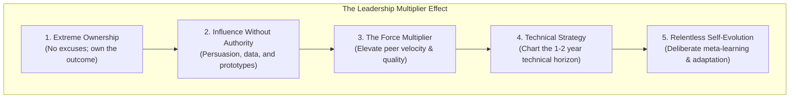

# Dimension 10: Leadership & Growth

> **"Leadership in engineering is not a title bestowed by HR; it is the daily choice to take responsibility for problems no one else wants to touch, bring clarity to chaos, and elevate the capability of everyone around you."**

---

## 1. Dimension Overview

**Leadership & Growth** is the ultimate multiplier of engineering capability. A high-performing senior engineer does not merely write more code than others; they transform their entire team into a more autonomous, resilient, and high-velocity engineering unit. They demonstrate **extreme ownership**, lead technical initiatives through persuasion rather than authority, and cultivate a culture of psychological safety and relentless continuous learning.

This dimension prepares engineers for senior IC tracks:
```text
Senior Software Engineer → Lead Software Engineer → Technical Lead → Principal / Staff Engineer → Solution / Technical Architect
```



---

## 2. Core Capability Areas

### Area 1: Extreme Ownership in Engineering
- **Zero Excuses**: Refusing to blame external factors (*"the requirements changed"*, *"the third-party API was slow"*, *"the junior dev broke it"*). If an initiative fails, the leader examines their own communication, testing guardrails, and risk planning.
- **Owning the Gaps**: Stepping up to resolve unglamorous, neglected systemic problems—such as broken CI builds, flaky test suites, missing runbooks, or outdated onboarding documentation—without waiting for permission.

### Area 2: Influence Without Authority
- **Persuasion via Evidence**: Leading architectural shifts not through seniority or loud arguments, but by building working sandbox prototypes, presenting empirical benchmark data, and authoring clear RFCs.
- **Consensus Building**: Listening deeply to competing viewpoints, addressing valid concerns, and uniting disparate team members behind a shared technical vision.

### Area 3: Psychological Safety & High-Trust Engineering
- **Blameless Culture**: Modeling vulnerability by publicly admitting one's own mistakes and framing production outages as systemic learning opportunities.
- **Constructive Candor**: Providing direct, honest technical feedback with deep personal care, creating an environment where team members feel safe challenging ideas without fear of retribution.

### Area 4: Technical Strategy & Paved Roads
- **Defining the North Star**: Translating high-level business goals into a concrete 12-to-18-month technical architectural roadmap.
- **Building Paved Roads (Golden Paths)**: Rather than policing architecture through bureaucratic gates, creating easy-to-use project templates, starter kits, and automated linters that make doing the right architectural thing the path of least resistance.

### Area 5: Deliberate Self-Evolution & Meta-Learning
- **The Learning Engine**: Maintaining a structured reading regimen of academic computer science papers, technical RFCs, and engineering post-mortems.
- **De-biasing**: Actively challenging one's own favored technologies, acknowledging when an old pattern is obsolete, and mastering emerging paradigms (e.g., generative AI integration, eBPF telemetry).

---

## 3. Maturity Rubric: Behavioral Anchors (L0 to L5)

| Level | Observable Engineering Behavior |
| :--- | :--- |
| **L0: Awareness** | Waits passively for explicit task assignments; blames others when deadlines slip or bugs escape; resistant to learning new tools. |
| **L1: Assisted** | Takes personal accountability for assigned tasks; participates actively in team ceremonies; seeks out learning opportunities with guidance. |
| **L2: Independent** | Demonstrates complete ownership of features from design to production; unblocks self independently; proactively fixes small broken tools or tests; shares learning with peers. |
| **L3: Advanced** | Leads complex multi-person technical initiatives; mentors junior and mid-level engineers; drives team-level technical improvements; models extreme ownership during outages. |
| **L4: Lead** | Drives cross-team technical strategy and standards; resolves high-stakes technical disagreements; builds organizational paved roads; sponsors high-potential engineers for promotion. |
| **L5: Strategic** | Sets the overarching technical vision and cultural tone for the entire engineering organization; acts as an advisor to executive leadership; recognized externally as a premier industry technical leader. |

---

## 4. Verifiable Evidence Artifacts

1. **Major Technical Initiative Leadership Dossier**: An end-to-end retrospective of a complex 6-month technical project (e.g., zero-downtime database migration) led by the engineer, showing project scoping, risk mitigation, coordination across 3 squads, and on-time delivery.
2. **Paved Road / Golden Path Starter Kit**: A widely adopted internal developer template, scaffolding CLI, or shared library created by the engineer that reduced new service provisioning time from 2 weeks to 20 minutes across 8 teams.
3. **Engineering Growth & Sponsorship Record**: Documented sponsorship of at least two engineers through structured 1-on-1s, pair-programming sprints, and delegated stretch projects, resulting in their formal advancement.
4. **Multi-Quarter Technical Strategy Roadmap**: A published, executive-reviewed technical roadmap outlining the 18-month evolution of a core platform subsystem, tying modernization milestones directly to company scalability goals.

---

## 5. Anti-Patterns & Misconceptions

- **The Hero Engineer / Lone Wolf**: Working 80 hours a week in secret isolation, creating systems that only they understand, and making themselves an irreplaceable, single-point-of-failure bottleneck.
- **Title-Seeking Politics**: Focusing on political games, visibility stunts, and resume padding while letting foundational engineering quality and team morale deteriorate.
- **Dictatorial Leadership**: Forcing architectural choices onto engineers through raw authority or executive mandate rather than educating, listening, and building consensus through evidence.
- **Intellectual Stagnation**: Resting on past glories, refusing to learn new paradigms, and dismissing modern engineering advancements as "just passing fads."

---

## 6. Handbook Cross-References

- **Architectural Leadership & Influence**: [24-architect-mastery/leadership/](../../24-architect-mastery/leadership/)
- **Organizational Design & Team Topologies**: [24-architect-mastery/organizational-design/](../../24-architect-mastery/organizational-design/)
- **Architecture Strategy & Roadmaps**: [24-architect-mastery/strategy/](../../24-architect-mastery/strategy/)
- **Career Transitions & Advancement**: [24-architect-mastery/career/](../../24-architect-mastery/career/)
