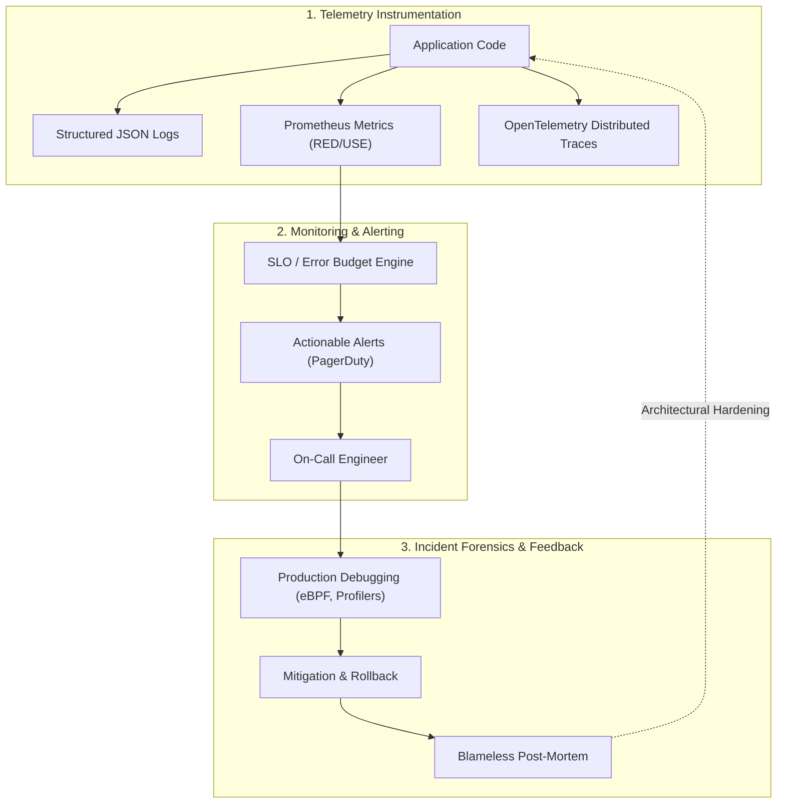

# Dimension 5: Production Engineering

> **"An engineer who does not understand what happens to their code in production has incomplete engineering capability."**

---

## 1. Dimension Overview

**Production Engineering** is the discipline of operating, monitoring, diagnosing, and sustaining software systems in live, unpredictable production environments. In high-performing engineering cultures, the wall between "software developers" and "operations teams" has been dismantled. The engineer who writes the code shares direct accountability for its availability, latency, error budgets, and operational resilience.

This dimension evaluates an engineer's capability in **observability, telemetry instrumentation, incident response, production debugging under pressure, and blameless post-mortem forensics**. It ensures that systems are designed from day one to be observable, diagnosable, and resilient to infrastructure anomalies.

---

## 2. Core Capability Areas

### Area 1: Observability & Telemetry Instrumentation
- **The Three Pillars**:
  - *Structured Logs*: Emitting contextual JSON logs with unified correlation IDs (`trace_id`, `span_id`, `user_id`). Zero unstructured plain-text logging.
  - *Metrics*: Instrumenting applications using the **RED method** (Rate, Errors, Duration) for request-driven services, and the **USE method** (Utilization, Saturation, Errors) for resources. Avoiding high-cardinality label explosions in time-series databases.
  - *Distributed Tracing*: Implementing OpenTelemetry (OTel) context propagation across asynchronous message queues, HTTP headers, and database spans to pinpoint cross-service latency bottlenecks.

### Area 2: Service Level Objectives (SLOs) & Error Budgets
- **SLI vs. SLO vs. SLA**:
  - *SLI (Indicator)*: Precise formula measuring customer experience (e.g., % of valid HTTP GET requests returning in $< 200\text{ms}$).
  - *SLO (Objective)*: Internal reliability target agreed with product management (e.g., $99.9\%$ over a 30-day rolling window).
  - *Error Budget*: The allowable room for failure ($0.1\% = 43.2\text{ minutes}$ of unreliability). When the budget is depleted, new feature rollouts pause in favor of reliability hardening.

### Area 3: Incident Response & Management
- **Incident Command System (ICS)**: Operating effectively as Incident Commander (coordinating communication, shielding responders) or Technical Lead (diagnosing failure modes, executing rollbacks).
- **Mitigation First, Root Cause Later**: Prioritizing rapid service restoration (traffic shedding, feature flag toggles, rollbacks) over deep forensic root-cause analysis during active outages.
- **Blameless Post-Mortems**: Authoring post-incident reviews that uncover systemic latent conditions rather than blaming human error. Using the "Five Whys" to identify organizational, architectural, and testing deficiencies.

### Area 4: Live Production Debugging Under Pressure
- **Non-Invasive Diagnostic Tooling**:
  - Inspecting live processes via `top`, `htop`, `vmstat`, `iostat`, `netstat`/`ss`.
  - Capturing and analyzing JVM/Go/Node thread dumps and heap dumps without crashing production hosts.
  - Utilizing modern eBPF tools (`bpftrace`, `bcc`) to inspect kernel socket events, file I/O latency, and syscall blocking without code recompilation.
  - Profiling CPU hot paths and memory allocations under live production load.

### Area 5: Operational Ownership & Alert Hygiene
- **Eliminating Alert Fatigue**: Paging on-call engineers *only* when an SLO is in jeopardy and human intervention is urgently required. Routing non-urgent warnings to ticketing queues.
- **Actionable Runbooks**: Every alert must link directly to an up-to-date, step-by-step runbook detailing how to verify the alert, mitigate the impact, and restore service.

---

## 3. Maturity Rubric: Behavioral Anchors (L0 to L5)

| Level | Observable Engineering Behavior |
| :--- | :--- |
| **L0: Awareness** | Treats production as a black box; prints unstructured text to stdout; unaware of whether their code is currently failing in production. |
| **L1: Assisted** | Adds basic metrics and logs following existing patterns; follows runbooks during on-call under senior supervision. |
| **L2: Independent** | Autonomously instruments services with structured logs, Prometheus metrics, and tracing spans; participates in on-call rotations; independently diagnoses and resolves standard production incidents. |
| **L3: Advanced** | Defines SLIs/SLOs and error budget policies; leads complex Sev-1 incident response as Incident Commander; authors comprehensive blameless post-mortems; diagnoses insidious production performance regressions. |
| **L4: Lead** | Architects company-wide observability infrastructure; establishes chaos engineering game days; drives systematic reduction in alert noise and MTTR across multiple engineering teams. |
| **L5: Strategic** | Defines industry standards for operational reliability and telemetry; authors foundational SRE frameworks or observability tools adopted across the tech ecosystem. |

---

## 4. Verifiable Evidence Artifacts

1. **Production Dashboard & SLO Specification**: A production Grafana/Datadog dashboard and accompanying SLO document defining critical user journeys, error budget burn alerts, and telemetry for a tier-1 service.
2. **Blameless Incident Post-Mortem**: A published post-mortem document analyzing a major outage, containing a precise incident timeline, contributing factors, architectural remediation items, and an automated regression test preventing recurrence.
3. **Production Debugging Teardown**: A written engineering case study documenting how the engineer used eBPF, heap profiling, or network socket inspection to isolate an elusive production latency spike or memory leak that eluded local testing.
4. **Actionable Runbook Suite**: A complete operational runbook for a critical subsystem, complete with verification commands, rollback procedures, escalation paths, and telemetry links, validated during a simulated game-day drill.

---

## 5. Anti-Patterns & Misconceptions

- **"Throwing Code Over the Wall"**: Merging code and logging off, leaving operations or on-call SREs to deal with catastrophic deployment failures.
- **Log Pollution**: Emitting millions of verbose `DEBUG` log lines per second in production, consuming terabytes of Elasticsearch/CloudWatch storage and drowning out critical error signals.
- **Alert Inundation**: Setting alerts on raw CPU or memory utilization instead of customer-facing SLIs, causing on-call engineers to wake up at 3 AM for non-impactful spikes.
- **The "Blame the Developer" Retrospective**: Writing post-mortems that conclude "the incident was caused by developer X pushing a bug," completely failing to ask why automated tests and canary deployments failed to catch it.

---

## 6. Handbook Cross-References

- **Observability Architecture**: [11-observability/](../../11-observability/)
- **Incident-Driven Architecture**: [24-architect-mastery/incident-driven-architecture/](../../24-architect-mastery/incident-driven-architecture/)
- **Real-World Case Studies & Outages**: [19-case-studies/](../../19-case-studies/)
- **Production Operations & Runbooks**: [24-architect-mastery/operations/](../../24-architect-mastery/operations/)
