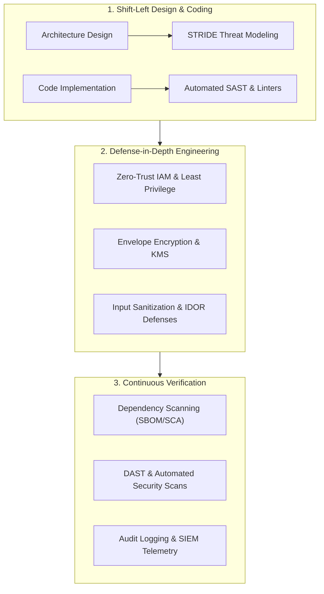

# Dimension 6: Security & Privacy

> **"Security is not a feature you bolt on the night before release; it is an architectural property woven into every data flow, API contract, and dependency choice."**

---

## 1. Dimension Overview

**Security & Privacy** is the discipline of protecting software systems, customer data, and computing infrastructure from compromise, data exfiltration, and unauthorized access. Historically, security was treated as a gatekeeping function performed by external audit teams weeks after development concluded. In modern engineering, security is shifted entirely to the left—embedded into everyday engineering craftsmanship.

This dimension evaluates an engineer's capability in **threat modeling, secure coding practices, Identity and Access Management (IAM), secrets handling, supply-chain security, and defensive architecture**. It ensures that systems are resilient to both external attackers and internal misuse by default.

---

## 2. Core Capability Areas

### Area 1: Threat Modeling & Defensive Design
- **STRIDE Methodology**: Systematically evaluating architectural components against threat categories:
  - *Spoofing*: Identity forgery $\to$ Authenticate all requests with mTLS/OIDC.
  - *Tampering*: Unauthorized modification $\to$ Cryptographic HMACs, digital signatures, immutable audit logs.
  - *Repudiation*: Denying an action $\to$ Tamper-evident audit logging with non-repudiation proofs.
  - *Information Disclosure*: Data leaks $\to$ Encryption in transit (TLS 1.3) and at rest (AES-256), strict token scopes.
  - *Denial of Service*: Resource exhaustion $\to$ Rate limiters, bulkheads, memory bounds.
  - *Elevation of Privilege*: Unauthorized access $\to$ Strict RBAC/ABAC authorization checks.

### Area 2: Secure Coding & Vulnerability Elimination (OWASP Top 10)
- **Input Validation & Sanitization**: Rejecting malformed inputs at the system boundary using strict schemas; utilizing parameterized queries (Prepared Statements) to permanently eliminate SQL Injection.
- **Access Control & IDOR Prevention**: Guarding against Insecure Direct Object References (IDOR) by validating tenant and user ownership on every single database query (never trusting client-supplied IDs).
- **Server-Side Request Forgery (SSRF)**: Restricting outbound HTTP requests from backend servers using egress proxies, IP whitelisting, and blocking link-local cloud metadata endpoints (`169.254.169.254`).
- **Memory Safety & Type Rigor**: Preventing buffer overflows, use-after-free bugs, and integer truncation errors through memory-safe languages and strict compiler flags.

### Area 3: Identity, Authentication & Authorization (IAM)
- **Modern Protocols**: Practical implementation of OAuth 2.0, OpenID Connect (OIDC), and SAML 2.0.
- **JWT Security Pitfalls**: Defending against algorithm confusion attacks (`alg: "none"`), enforcing short token lifetimes ($< 15\text{m}$), avoiding sensitive data in payloads, and implementing token revocation strategies.
- **Authorization Models**: Role-Based Access Control (RBAC) vs. Attribute-Based Access Control (ABAC) using policy-as-code engines (Open Policy Agent / OPA).

### Area 4: Secrets Management & Cryptographic Hygiene
- **Zero Hardcoded Secrets**: Absolute ban on committing API keys, private keys, or passwords to source control. Enforcing pre-commit hooks (`git-secrets`, `trufflehog`).
- **Secrets Orchestration**: Retrieving secrets dynamically at runtime from dedicated vaults (HashiCorp Vault, AWS Secrets Manager) with automated, seamless rotation.
- **Modern Cryptography**: Using vetted cryptographic libraries; avoiding outdated ciphers (MD5, SHA-1, DES); implementing envelope encryption via Key Management Services (KMS).

### Area 5: Supply Chain Security & Dependency Governance
- **Software Bill of Materials (SBOM)**: Generating and analyzing SBOMs in CI pipelines.
- **Automated Vulnerability Remediation**: Utilizing Dependabot, Snyk, or Trivy to automatically detect and patch vulnerable transitive dependencies.
- **Container Hardening**: Running containerized workloads as non-root users with read-only root filesystems and minimal base images (Distroless / Alpine).

---

## 3. Maturity Rubric: Behavioral Anchors (L0 to L5)

| Level | Observable Engineering Behavior |
| :--- | :--- |
| **L0: Awareness** | Unaware of common security vulnerabilities; hardcodes test credentials; trusts all client inputs. |
| **L1: Assisted** | Fixes flagged SAST/Snyk vulnerabilities; implements authentication endpoints under senior supervision. |
| **L2: Independent** | Autonomously writes secure code immune to OWASP Top 10; implements RBAC and input validation; manages secrets via Vault; reviews code for basic security flaws. |
| **L3: Advanced** | Conducts STRIDE threat modeling for new architectures; designs zero-trust inter-service communication (mTLS, JWT); establishes automated CI security gates; handles vulnerability disclosure forensics. |
| **L4: Lead** | Architects organizational security standards and IAM governance; establishes secure-by-default software frameworks; leads security reviews for high-risk platform initiatives. |
| **L5: Strategic** | Defines global security frameworks and enterprise cryptographic policies; pioneers zero-trust architectures at scale; collaborates with national cybersecurity agencies or standards bodies. |

---

## 4. Verifiable Evidence Artifacts

1. **STRIDE Threat Model Document**: A threat model document for a critical payment or authentication service identifying 5 distinct attack vectors, complete with data flow diagrams (DFD), risk severity scores, and verified architectural mitigations.
2. **Automated Security Pipeline Gate**: A CI/CD configuration and pull request showing the integration of SAST, secret detection, and SCA dependency scanning that successfully blocked an insecure deployment with zero developer friction.
3. **Secret Zero Elimination PR**: A Git pull request and infrastructure-as-code configuration replacing static long-lived database credentials with dynamic, 1-hour rotated IAM tokens via AWS Secrets Manager or HashiCorp Vault.
4. **Security Vulnerability Remediation & Defense**: A documented security advisory and code fix resolving a high-severity vulnerability (e.g., SSRF or ReDoS), accompanied by an automated regression test suite ensuring the exploit payload is permanently rejected.

---

## 5. Anti-Patterns & Misconceptions

- **Security Through Obscurity**: Hiding secrets in base64 strings or obfuscating URL parameters instead of enforcing cryptographic authentication and authorization.
- **The "Internal Network Is Safe" Fallacy**: Assuming that because a service runs inside a private VPC, it does not need authentication, TLS encryption, or input validation.
- **Roll Your Own Crypto**: Attempting to implement custom encryption, hashing, or token validation algorithms instead of using battle-tested libraries (libsodium, WebCrypto).
- **Ignoring Transitive Dependencies**: Auditing only top-level dependencies while ignoring the 1,200 nested packages in `node_modules` containing active remote code execution exploits.

---

## 6. Handbook Cross-References

- **Foundational Security & Cryptography**: [00-foundations/security/](../../00-foundations/security/)
- **Application Security & Vulnerabilities**: [10-security/](../../10-security/)
- **Security Architecture & Zero-Trust**: [01-architecture/security-architecture/](../../01-architecture/security-architecture/)
- **Production Operational Hardening**: [24-architect-mastery/risk/](../../24-architect-mastery/risk/)
