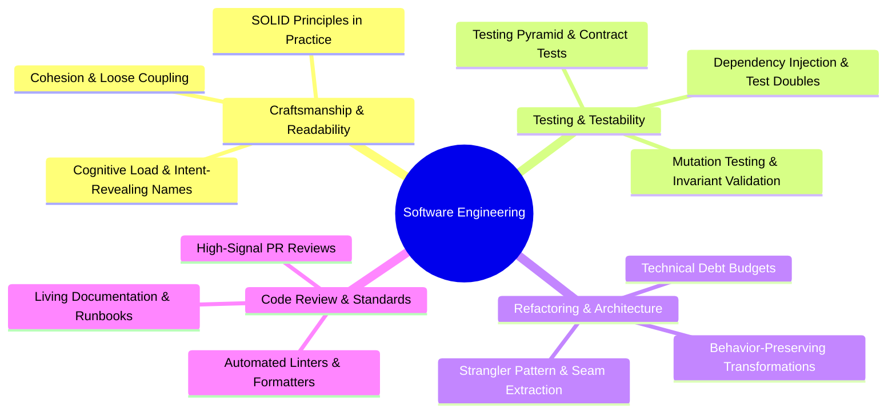

# Dimension 2: Software Engineering Excellence

> **"Any fool can write code that a computer can understand. Good engineers write code that humans can understand, modify, test, and safely refactor five years later."**

---

## 1. Dimension Overview

**Software Engineering Excellence** is the discipline of turning computer code into a durable, maintainable, and evolvable engineering asset. Writing software is easy; sustaining a living codebase across years of shifting business requirements, changing team members, and growing transaction volume is extraordinarily difficult.

This dimension evaluates an engineer's mastery of **software craftsmanship, modularity, testability, refactoring rigor, and technical debt stewardship**. It separates the "code hacker"—who produces quick, fragile scripts that collapse under future modifications—from the true software engineer, who designs clear abstractions with well-guarded invariants.

---

## 2. Core Capability Areas

### Area 1: Clean Code & Modularity
- **Cognitive Complexity**: Writing code that minimizes mental juggling. Functions should do one thing, have minimal nesting depth ($< 3$ levels), and express business intent clearly.
- **SOLID in the Real World**:
  - *Single Responsibility*: A module should have one, and only one, reason to change.
  - *Open/Closed*: Extending behavior via polymorphism or composition without modifying existing, tested code.
  - *Liskov Substitution*: Subtypes must be substitutable for their base types without breaking client invariants.
  - *Interface Segregation*: Clients should not be forced to depend on methods they do not use.
  - *Dependency Inversion*: High-level modules should not depend on low-level details; both should depend on abstractions.
- **Modularity & Information Hiding**: Designing narrow public APIs with hidden internal state. Encapsulating domain invariants.

### Area 2: Design Patterns & Idiomatic Abstractions
- **Pragmatic Pattern Application**: Knowing when to apply Factory, Strategy, Observer, Decorator, Adapter, and Builder patterns—and knowing when a simple switch statement or higher-order function is superior.
- **Anti-Pattern Avoidance**: Preventing *God Objects*, *Shotgun Surgery*, *Feature Envy*, *Primitive Obsession*, and *Lava Flow* (dead code kept out of fear).

### Area 3: Testing Strategy & Testability
- **The Testing Pyramid vs. Trophy**: Balancing fast, isolated unit tests with realistic integration tests and lightweight end-to-end smoke tests.
- **Designing for Testability**: Using Dependency Injection (DI) and clean interfaces to decouple business logic from databases, clocks, random number generators, and network I/O.
- **Test Doubles**: Appropriate use of Fakes (lightweight working in-memory implementations), Mocks (verifying behavior), and Stubs (pre-canned responses) without over-mocking the universe.
- **Mutation Testing**: Verifying test suite quality by injecting faults (mutations) into production code to ensure tests actually fail.

### Area 4: Refactoring Discipline
- **Preserving External Behavior**: Refactoring under the strict protection of passing unit and integration tests.
- **Martin Fowler Refactoring Catalog**: Extract Method, Replace Temp with Query, Decompose Conditional, Move Method, and Introduce Parameter Object.
- **Seams & Strangler Execution**: Identifying seams in legacy monoliths to carve out modular boundaries safely without big-bang rewrites.

### Area 5: Code Review Rigor & Technical Debt
- **High-Signal Code Reviews**: Focusing on architectural boundaries, test coverage, concurrency hazards, and business correctness rather than stylistic trivia (which should be automated via formatters).
- **Technical Debt Stewardship**: Actively identifying, cataloging, and retiring technical debt. Negotiating dedicated capacity ($15\text{--}20\%$) in sprint backlogs to modernize critical paths.

---

## 3. Maturity Rubric: Behavioral Anchors (L0 to L5)

| Level | Observable Engineering Behavior |
| :--- | :--- |
| **L0: Awareness** | Writes monolithic procedures; variable names are cryptic; code is untested or manual testing is the sole verification. |
| **L1: Assisted** | Writes basic unit tests with assistance; adheres to team style guides; can refactor small functions safely under senior supervision. |
| **L2: Independent** | Autonomously writes clean, modular, self-documenting code with comprehensive unit and integration tests; conducts thorough code reviews; designs testable interfaces. |
| **L3: Advanced** | Architects large, highly maintainable subsystems; safely refactors complex legacy codebases without regressions; mentors peers in test-driven design; champions code review standards. |
| **L4: Lead** | Sets organization-wide engineering standards, linting rules, and testing frameworks; establishes metrics for code health; drives architectural refactorings across multiple teams. |
| **L5: Strategic** | Defines industry-leading paradigms for code maintainability, static analysis, or compiler tooling; authors influential books, specifications, or foundational frameworks. |

---

## 4. Verifiable Evidence Artifacts

1. **Legacy Refactoring Diff**: A Git pull request demonstrating a major refactoring of a high-churn, complex legacy component (e.g., reducing cyclomatic complexity from 45 to 8) with zero regressions and an accompanying suite of characterization tests.
2. **Comprehensive Integration Test Suite**: An automated integration test suite utilizing testcontainers to verify complex database transactions and domain invariants against a real database instance, running reliably in CI in $< 90\text{ seconds}$.
3. **High-Signal Code Review Archive**: A documented collection of 5 exemplary code reviews where the engineer identified critical boundary violations, race conditions, or unhandled edge cases while providing constructive, educational explanations.
4. **Technical Debt Retirement Dossier**: An accepted plan and completed execution showing the phased retirement of an obsolete framework or library across 4 microservices, accompanied by test suites verifying identical domain behavior.

---

## 5. Anti-Patterns & Misconceptions

- **Over-Abstraction & Patternitis**: Wrapping every simple operation in three layers of factories, adapters, and builders when a plain function would suffice.
- **Mocking the World**: Writing unit tests where 95% of the lines are mock expectations, resulting in tests that pass perfectly while the production code fails catastrophically on the first real database call.
- **The "We Don't Have Time to Test" Fallacy**: Skipping tests to meet an artificial deadline, inevitably spending $10\times$ more time debugging production outages and manually verifying releases.
- **PR Nitpicking**: Leaving 30 comments on whitespace and indentation while missing a massive SQL injection vulnerability or an unindexed query.

---

## 6. Handbook Cross-References

- **Backend Architecture & Modularity**: [03-backend/](../../03-backend/)
- **Frontend Modularity & Component Architecture**: [04-frontend/](../../04-frontend/)
- **Modernization & Strangler Execution**: [15-modernization/](../../15-modernization/)
- **Architecture Deliverables & RFCs**: [16-architecture-deliverables/](../../16-architecture-deliverables/)
- **Architectural Judgment & Technical Debt**: [24-architect-mastery/mindset/](../../24-architect-mastery/mindset/)
