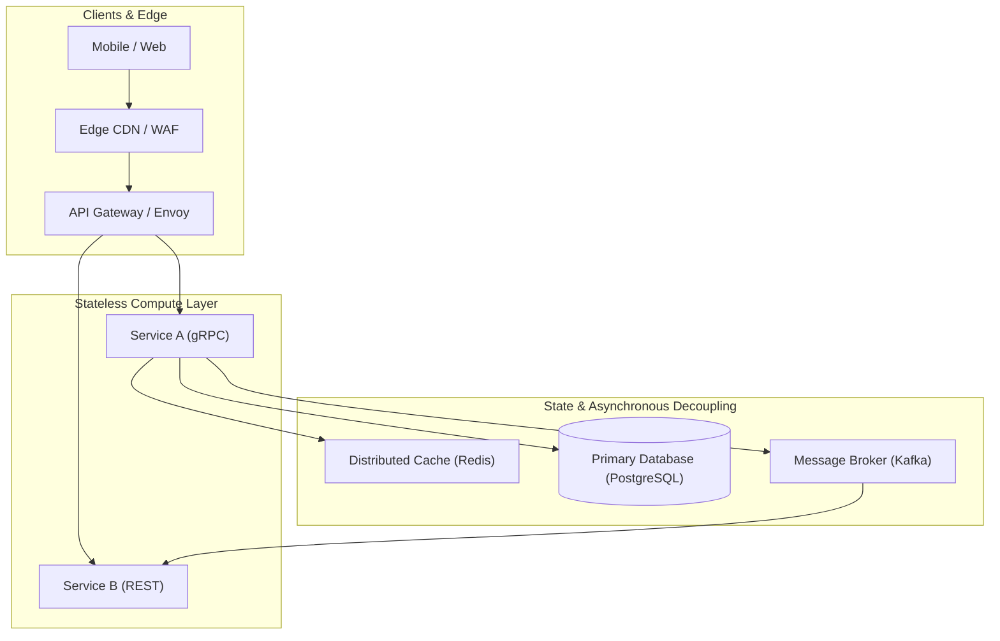

# Dimension 3: System Design

> **"A distributed system is one in which the failure of a computer you didn't even know existed can render your own computer unusable."** — Leslie Lamport

---

## 1. Dimension Overview

**System Design** is the capability to architect scalable, resilient, distributed software systems that reliably handle large-scale traffic, complex data relationships, and unexpected physical infrastructure failures. 

While Dimension 2 focuses on the structure of code within a process, Dimension 3 focuses on **how multiple independent processes, databases, network boundaries, and asynchronous queues coordinate over an unreliable network**. It demands a deep understanding of distributed systems theory, operational constraints, latency budgets, and trade-offs between consistency and availability.

---

## 2. Core Capability Areas

### Area 1: API Design & Protocol Selection
- **Protocol Evaluation**: Choosing the right communication protocol:
  - *REST / JSON*: Public client APIs, broad compatibility, human readability.
  - *gRPC / Protocol Buffers*: High-throughput inter-service RPC, binary efficiency, strict contract enforcement.
  - *GraphQL*: Complex frontends with dynamic data requirements and over-fetching constraints.
  - *WebSockets / SSE*: Real-time bi-directional streaming.
- **Contract Rigor**: Strict schema versioning (SemVer), backwards compatibility, backward/forward protobuf rules, and deprecation runways.
- **Idempotency**: Designing idempotent mutations using client-generated idempotency keys, transactional outboxes, and unique constraint enforcement.

### Area 2: Decomposition & System Boundaries
- **Domain-Driven Design (DDD)**: Mapping bounded contexts, aggregates, and domain events to subsystem boundaries.
- **Modular Monolith vs. Microservices**: Choosing modular monolithic architectures by default, splitting into independent microservices only when justified by independent deployment frequency, distinct scaling requirements, or team organizational boundaries (Conway's Law).

### Area 3: Distributed State & Consistency Models
- **Theoretical Foundations**: Deep practical intuition of the CAP Theorem, PACELC Theorem, and Fallacies of Distributed Computing.
- **Consistency Spectrum**: Linearizability vs. Sequential Consistency vs. Causal Consistency vs. Eventual Consistency.
- **Distributed Transactions**: Recognizing why Two-Phase Commit (2PC) creates extreme latency and availability bottlenecks; designing Saga patterns (choreographed or orchestrated) with compensating transactions.
- **CQRS & Event Sourcing**: Separating read models from write models to handle asymmetrical scaling and complex audit trails.

### Area 4: Caching Strategies & Topologies
- **Caching Topologies**: In-memory local caches (Guava, Caffeine) vs. Distributed out-of-process caches (Redis, Memcached).
- **Access Patterns**: Cache-Aside (Lazy Loading), Write-Through, Write-Behind (Write-Back), and Refresh-Ahead.
- **Failure Modes & Defenses**:
  - *Cache Stampede / Dogpiling*: Defended with distributed locks or probabilistic early expiration (XFetch).
  - *Cache Penetration*: Defended with Bloom filters and caching null responses.
  - *Cache Avalanche*: Defended with jittered TTL expiration windows.

### Area 5: Asynchronous Messaging & Event-Driven Topologies
- **Broker Models**: Point-to-point queues (RabbitMQ, SQS) vs. Distributed append-only event logs (Kafka, Pulsar).
- **Delivery Semantics**: At-least-once, at-most-once, and effectively-once processing guarantees; managing consumer groups, partition rebalancing, and dead-letter queues (DLQs).

### Area 6: Resilience & Fault Tolerance
- **Defensive Patterns**:
  - *Circuit Breakers*: Preventing cascading failure by failing fast when downstream services are degraded.
  - *Rate Limiting & Throttling*: Token Bucket and Leaky Bucket algorithms protecting backends from overload.
  - *Bulkheads*: Isolating thread pools and connection pools so failure in one subsystem does not consume all host resources.
  - *Retries with Exponential Backoff & Jitter*: Preventing retry storms and self-inflicted DDoS attacks.

---

## 3. Maturity Rubric: Behavioral Anchors (L0 to L5)

| Level | Observable Engineering Behavior |
| :--- | :--- |
| **L0: Awareness** | Designs basic CRUD applications with a single database; assumes the network is reliable and databases never fail. |
| **L1: Assisted** | Implements endpoints following existing API schemas; adds caching or queues under explicit architectural direction. |
| **L2: Independent** | Autonomously designs robust APIs and microservices; implements idempotency, caching, and rate limiting; correctly models relational and non-relational schemas. |
| **L3: Advanced** | Architects complex distributed systems handling high concurrency and volume; designs resilient event-driven pipelines; navigates consistency trade-offs; models capacity and latency budgets. |
| **L4: Lead** | Drives cross-service architectural topology; establishes company-wide standards for API contracts, messaging schemas, and resilience patterns; leads distributed disaster recovery planning. |
| **L5: Strategic** | Pioneers novel distributed systems architectures; designs foundational platform systems capable of millions of transactions per second; publishes peer-reviewed distributed systems research. |

---

## 4. Verifiable Evidence Artifacts

1. **System Design RFC**: A comprehensive High-Level Design (HLD) document defining service boundaries, API contracts (OpenAPI/Protobuf), data models, sequence diagrams, and capacity calculations (RPS, storage growth over 3 years).
2. **Idempotent Pipeline Implementation**: A merged pull request and production monitoring dashboard verifying an idempotent, event-driven payment processing engine utilizing the transactional outbox pattern.
3. **Resilience Benchmark Report**: A chaos testing report (using tools like Chaos Mesh or Toxiproxy) demonstrating that when a downstream dependency injected 5,000ms latency and 40% packet loss, the upstream system's circuit breaker tripped within 2 seconds, successfully shedding load and maintaining 99.9% availability on cached reads.
4. **Capacity Planning Model**: A mathematical capacity forecast model linking projected business user growth to required database IOPs, cache memory footprints, and network bandwidth, successfully validated against actual production peak traffic during a major promotion.

---

## 5. Anti-Patterns & Misconceptions

- **Microservice Sprawl**: Decomposing a 3-person team's application into 25 microservices, introducing massive network latency, distributed transaction nightmares, and operational overhead without any organizational justification.
- **Blind Eventual Consistency**: Adopting eventual consistency without understanding how to handle out-of-order event delivery, duplicate messages, and client-facing stale read anomalies.
- **The "Add a Cache" Reflex**: Slapping a Redis cache in front of a slow SQL database query instead of adding an index or fixing an $N+1$ query pattern, introducing cache invalidation bugs and stale data corruption.
- **Unbounded Retries**: Retrying failed network requests immediately without exponential backoff or jitter, converting a minor network hiccup into a total cascading outage.

---

## 6. Handbook Cross-References

- **System Design Core**: [02-system-design/](../../02-system-design/)
- **Integration Patterns & Protocols**: [07-integration/](../../07-integration/)
- **Cloud Infrastructure Architecture**: [08-cloud/](../../08-cloud/)
- **Interview System Design & Case Studies**: [20-interview-system-design/](../../20-interview-system-design/)
- **Architectural Trade-offs & Decisions**: [24-architect-mastery/trade-offs/](../../24-architect-mastery/trade-offs/)
