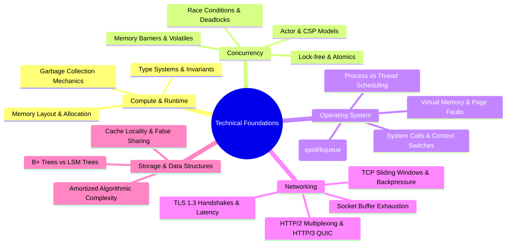

# Dimension 1: Technical Foundations

> **"Abstractions come and go, but the laws of physics, operating system kernels, and memory hierarchies remain permanent."**

---

## 1. Dimension Overview

**Technical Foundations** represents the substrate of computer science and systems knowledge upon which all software engineering rests. A software engineer with deficient technical foundations is perpetually at the mercy of framework abstractions—when an abstraction leaks, a thread deadlocks, a garbage collector pauses for 8 seconds, or a network socket runs out of file descriptors, the engineer is paralyzed.

This dimension does not evaluate whether an engineer can regurgitate textbook trivia. It evaluates whether an engineer understands **how computer hardware, operating system kernels, runtimes, and networks actually execute code**, and whether they can exploit this understanding to build fast, stable, memory-efficient systems.

---

## 2. Core Capability Areas

### Area 1: Memory Models & Runtime Execution
- **Stack vs. Heap**: Understanding allocation costs, escape analysis, pointer indirection, and cache locality.
- **Memory Management**: Manual allocation vs. reference counting vs. tracing Garbage Collection (mark-sweep, generational, concurrent).
- **Type Systems**: Structural vs. nominal typing, compile-time safety invariants, zero-cost abstractions, memory alignment, and struct padding.

### Area 2: Concurrency & Synchronization
- **Primitive Synchronization**: Mutexes, read-write locks, semaphores, condition variables, and reentrancy hazards.
- **Memory Consistency**: Hardware memory reordering, CPU store buffers, volatile/atomic semantics, and memory barriers.
- **Modern Concurrency Models**: Goroutines/Channels (CSP), Erlang/Akka Actors, async/await event loops (Node.js/Rust), and thread pools.
- **Failure Modes**: Race conditions, deadlocks, livelocks, thread starvation, priority inversion, and lock contention.

### Area 3: Operating Systems & Kernel Interactions
- **Processes & Threads**: Kernel context switching overhead, CPU affinity, thread states, and CPU scheduling algorithms.
- **Virtual Memory**: Page tables, TLB cache hits/misses, memory-mapped files (`mmap`), swapping, and Out-Of-Memory (OOM) killer mechanics.
- **I/O Subsystems**: Blocking I/O vs. Non-blocking I/O vs. Asynchronous I/O; multiplexing with `epoll`, `kqueue`, and `io_uring`.

### Area 4: Networking & Transport Protocols
- **Transport Layer**: TCP three-way handshake, sequence numbers, window scaling, TCP slow start, head-of-line blocking, and UDP semantics.
- **Security & Application Layer**: TLS 1.3 key exchange overhead, ALPN, HTTP/1.1 keep-alive pipelining, HTTP/2 binary framing, and HTTP/3 (QUIC over UDP).
- **Socket Level**: Socket buffers, `TIME_WAIT` socket exhaustion, ephemeral port depletion, and MTU packet fragmentation.

### Area 5: Data Structures & Algorithmic Complexity
- **Asymptotic Analysis**: Big-O, Big-Omega, and amortized bounds for time and spatial complexity.
- **Mechanical Sympathy**: Why an $O(N)$ array scan frequently outperforms an $O(1)$ linked-list traversal due to CPU L1/L2 cache lines and spatial locality.
- **Storage Engines**: In-memory hash tables, B+ Trees (optimized for block storage/reads), and Log-Structured Merge (LSM) Trees (optimized for write throughput).

---

## 3. Maturity Rubric: Behavioral Anchors (L0 to L5)

| Level | Observable Engineering Behavior |
| :--- | :--- |
| **L0: Awareness** | Understands basic data structures (arrays, maps) and loops; treats memory, runtime threads, and networks as opaque black boxes. |
| **L1: Assisted** | Implements standard collections; understands basic Big-O; writes thread-safe code using standard language constructs with pair-programming assistance. |
| **L2: Independent** | Autonomously chooses optimal data structures based on space/time trade-offs; handles basic concurrency (goroutines, async/await, locks) safely; profiles memory allocations to avoid obvious leaks. |
| **L3: Advanced** | Designs high-throughput, concurrent components with minimal lock contention; diagnoses subtle memory leaks, thread pool starvation, and GC latency spikes using profilers; optimizes I/O using non-blocking primitives. |
| **L4: Lead** | Guides organization-wide decisions on runtime selection, memory models, and zero-allocation critical paths; establishes performance profiling benchmarks; trains engineers to avoid insidious concurrency bugs. |
| **L5: Strategic** | Contributes to language runtimes, OS kernel modules, or low-level open-source storage/networking libraries; influences cross-industry standards on memory safety and protocol specifications. |

---

## 4. Verifiable Evidence Artifacts

To prove capability in Technical Foundations, engineers must produce concrete artifacts:

1. **Memory Profiling Report**: A flamegraph and heap analysis report (e.g., using `pprof`, `valgrind`, or `async-profiler`) identifying a memory leak or allocation bottleneck, accompanied by the merged PR eliminating it.
2. **Concurrency Benchmark**: A reproducible test suite demonstrating that a refactored lock-free or striped-lock concurrent data structure increased throughput by $3\times$ under 100-thread synthetic contention without race conditions (`go test -race` clean).
3. **Network I/O Optimization**: A telemetry dashboard proving that enabling TCP keep-alive, socket reuse, and HTTP/2 multiplexing reduced connection establishment latency from 180ms to 4ms on high-throughput upstream calls.
4. **Algorithmic Refactoring**: A Git commit diff showing the replacement of an $O(N^2)$ nested scan with an $O(N)$ hash-indexed or sliding-window algorithm, reducing batch execution time from 45 minutes to 18 seconds.

---

## 5. Anti-Patterns & Misconceptions

- **Premature Micro-Optimization**: Spending three days optimizing bit-shifts in a function that accounts for 0.001% of execution time while ignoring a network call that takes 600ms.
- **The "Garbage Collection Is Free" Fallacy**: Allocating millions of short-lived objects in hot loops, causing catastrophic GC stop-the-world pauses in production.
- **Ignoring Mechanical Sympathy**: Blindly choosing complex tree or graph data structures because of theoretical $O(\log N)$ bounds, while ignoring cache-line misses that make simple flat arrays faster by a factor of 10.
- **Thread Spawning Without Bounds**: Creating unbounded operating system threads for incoming requests until kernel context-switching latency collapses the host.

---

## 6. Handbook Cross-References

- **Compute & OS Fundamentals**: [00-foundations/](../../00-foundations/)
- **Backend Architecture & Runtimes**: [03-backend/](../../03-backend/)
- **Interview & System Foundations**: [20-interview-system-design/](../../20-interview-system-design/)
- **Architectural Trade-offs**: [24-architect-mastery/trade-offs/](../../24-architect-mastery/trade-offs/)
- **Experimental Benchmarking**: [99-experiments/](../../99-experiments/)
