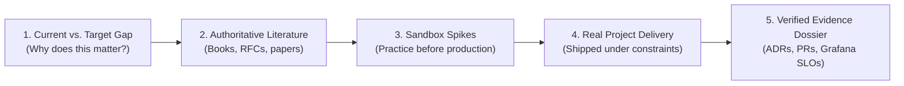

# Individual Engineering Development Plans

> **"A goal without a development plan is merely a wish. An engineering development plan turns career aspirations into measurable technical deliverables."**

This directory contains the **Individual Development Plan (IDP) Architecture** of **Domain 25 — Software Engineer Excellence**. It provides customizable, rigorous development templates tailored for different career inflection points: general individual development, technical/systems deepening, engineering leadership expansion, and transitioning into solution architecture.

---

## Directory Documents

| Document | Focus & Target Audience | Core Transition |
| :--- | :--- | :--- |
| **[individual-development-plan.md](./individual-development-plan.md)** | Core Canonical IDP Template | Universal template linking gaps, learning, spikes, projects, and evidence. |
| **[technical-development-plan.md](./technical-development-plan.md)** | Technical & Systems Deepening | Advancing in Foundations, System Design, Concurrency, and Production. |
| **[leadership-development-plan.md](./leadership-development-plan.md)** | Multiplier & Leadership Growth | Developing influence without authority, mentorship, RFC authoring, and paved roads. |
| **[engineer-to-architect-plan.md](./engineer-to-architect-plan.md)** | Transition to Architecture Track | Strategic bridge preparing Lead/Staff engineers for [24-architect-mastery/](../../24-architect-mastery/). |

---

## The IDP Structural Formula

Every development plan in this directory follows a strict structural anatomy:

These development plans are designed to be reviewed and calibrated during monthly 1-on-1s and updated every quarter alongside the [90-Day Improvement Cycle](../improvement-cycle/90-day-improvement-plan.md).
