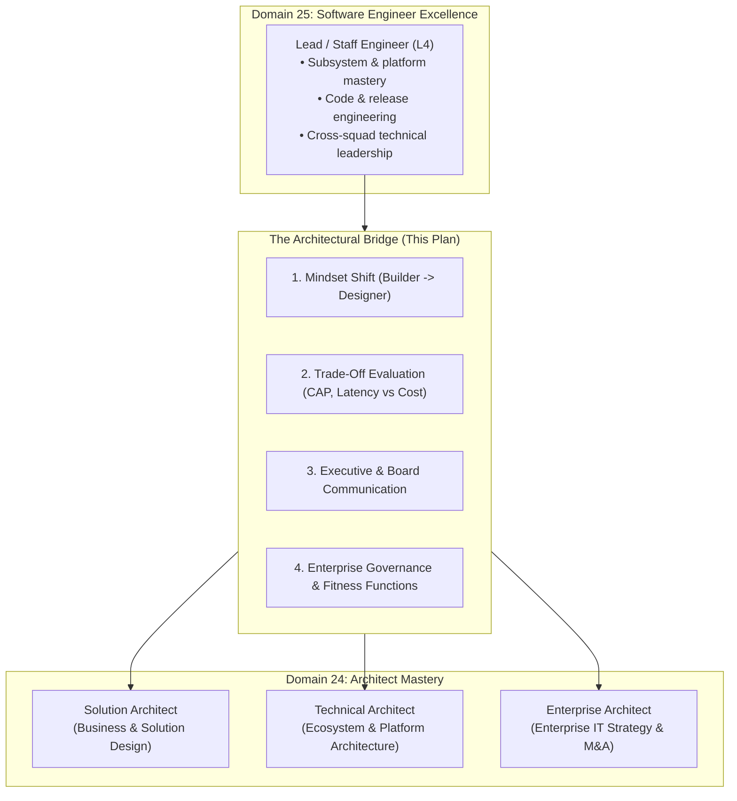
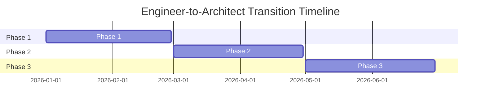

# Engineer-to-Architect Transition Development Plan

> **"The transition from Lead Engineer to Architect is not an increment in programming skill; it is a fundamental transformation in mindset from implementation craft to systemic judgment, trade-off evaluation, and strategic business alignment."**

---

## 1. Purpose & The Architectural Bridge

This development plan provides a structured, 6-to-12 month roadmap for **Lead Software Engineers (L4)** preparing to transition into formal **Solution Architect**, **Technical Architect**, or **Enterprise Architect** roles.

It serves as the direct operational bridge connecting **Domain 25 (The Software Engineer's Operating System)** to **Phase 10: Architect Mastery (Domain 24)**:

---

## 2. The Core Mindset Shift

| Dimension | Lead Software Engineer (L4) | Solution / Technical Architect (D24) |
| :--- | :--- | :--- |
| **Primary Question** | *"How do we implement and ship this service safely?"* | *"What are the long-term trade-offs, business risks, and operational consequences of this choice?"* |
| **Code Engagement** | 25–40% writing production code and PR reviews. | 5–10% building architecture spikes; 0% routine production PRs. |
| **Success Metric** | High-velocity, zero-defect shipping of multi-squad systems. | Defensible architectural decisions, low TCO, evolutionary runway. |
| **Failure Mode** | Slipping project delivery dates; bugs escaping to production. | Painting the company into an irreversible technological dead end. |
| **Audience** | Engineering peers, Product Managers, QA, SREs. | C-Suite (CTO, CIO, CFO), Business VPs, Security Councils, External Partners. |

---

## 3. Structured 3-Phase Transition Curriculum

### Phase 1: Architectural Judgment & Trade-Offs (Months 1–2)
- **Primary Focus**: Developing cognitive discernment and evaluating irreversible (one-way door) decisions.
- **Handbook Curriculum**:
  - Read [24-architect-mastery/mindset/](../../24-architect-mastery/mindset/)
  - Study the master library in [24-architect-mastery/trade-offs/](../../24-architect-mastery/trade-offs/)
  - Study historical failure modes in [24-architect-mastery/failure-analysis/](../../24-architect-mastery/failure-analysis/)
- **Practical Exercises**:
  - Write a comprehensive Architecture Decision Record (ADR) comparing three distinct database storage engines for a new multi-tenant platform.
  - Document the non-negotiable trade-offs: latency vs. consistency, write amplification vs. read throughput, and operational complexity.

### Phase 2: Enterprise Discovery & Solution Blueprints (Months 3–4)
- **Primary Focus**: Transforming vague commercial desires into rigorous NFR budgets and solution architectures.
- **Handbook Curriculum**:
  - Read [24-architect-mastery/discovery/](../../24-architect-mastery/discovery/)
  - Read [24-architect-mastery/requirements/](../../24-architect-mastery/requirements/)
  - Review templates in [16-architecture-deliverables/](../../16-architecture-deliverables/)
- **Practical Exercises**:
  - Lead an architectural discovery workshop with product, finance, and legal stakeholders for a new enterprise capability.
  - Formulate a High-Level Design (HLD) document complete with C4 diagrams, sequence flows, and precise NFR budgets (P99 latency, availability, RTO/RPO, data residency).

### Phase 3: Executive Communication & Governance (Months 5–6)
- **Primary Focus**: Communicating architectural decisions to non-technical executives and establishing automated governance.
- **Handbook Curriculum**:
  - Read [24-architect-mastery/executive-communication/](../../24-architect-mastery/executive-communication/)
  - Read [24-architect-mastery/governance/](../../24-architect-mastery/governance/)
  - Read [24-architect-mastery/architecture-review/](../../24-architect-mastery/architecture-review/)
- **Practical Exercises**:
  - Present a 5-slide executive pitch for an architectural modernization initiative to the VP of Engineering, focusing purely on business risk, ROI, and cost of delay.
  - Design an automated architectural fitness function (via CI/CD linting) to enforce domain boundaries across squads.

---

## 4. Graduation Gate: Cross-Link to Domain 24

Upon successful execution of this plan:
1. Review the role-specific transition playbook in [24-architect-mastery/career/lead-engineer-to-solution-architect.md](../../24-architect-mastery/career/lead-engineer-to-solution-architect.md).
2. Assess readiness against the master rubric in [24-architect-mastery/readiness/](../../24-architect-mastery/readiness/).
3. Formally submit your engineering portfolio to the Architecture Review Board.
