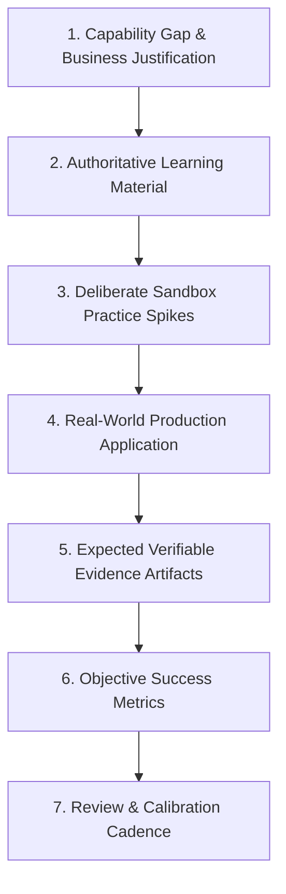

# Individual Engineering Development Plan (IDP)

> **"Your manager does not own your career; you do. An IDP is your contract with yourself to systematically elevate your engineering capability."**

---

## 1. The IDP Framework Anatomy

An **Individual Development Plan (IDP)** is not a corporate compliance checkbox. It is a technical design document for your personal career growth. A high-rigor engineering IDP contains nine essential components:



---

## 2. Canonical Engineering IDP Template

```markdown
# Individual Development Plan (IDP)

**Engineer Name**: [Candidate Name]
**Current Role**: Software Engineer (L2)
**Target Role**: Senior Software Engineer (L3)
**Plan Horizon**: Q3–Q4 2026 (6 Months)
**Sponsoring Lead / Mentor**: [Mentor Name]

---

## 1. Capability Gap Analysis
- **Primary Focus Dimension**: Dimension 3: System Design
  - *Current Level*: L2 (Independent API & CRUD design)
  - *Target Level*: L3 (Distributed systems, idempotency, event-driven pipelines)
  - *Gap*: +1.0
- **Secondary Focus Dimension**: Dimension 5: Production Engineering
  - *Current Level*: L1 (Basic logging, follows runbooks)
  - *Target Level*: L2/L3 (Telemetry instrumentation, SLO definition, on-call primary)
  - *Gap*: +1.5

## 2. Why It Matters
- **Business Rationale**: Our payment ingestion pipeline experiences transaction duplication and database locking during flash sales, risking $40K/month in reconciliation overhead.
- **Personal Career Rationale**: Transitioning from Software Engineer (L2) to Senior Engineer (L3) requires proving autonomous subsystem ownership and live production incident command.

---

## 3. Targeted Learning Curriculum (Authoritative Sources)
- [ ] Read Martin Kleppmann, *Designing Data-Intensive Applications*, Chapters 5, 7, 11 (Replication, Transactions, Stream Processing).
- [ ] Read Google SRE Book, Chapters 21–23 (Handling Overload, Addressing Cascading Failures).
- [ ] Study Stripe's technical documentation on API idempotency and transactional outboxes.
- [ ] Study OpenTelemetry specification on trace context propagation over message queues.

---

## 4. Deliberate Practice Spikes (Sandbox Challenges)
- [ ] **Spike 1**: Build an isolated Go/Java toy service simulating 10,000 concurrent webhook deliveries; implement an in-memory Bloom filter and Redis advisory lock deduplication.
- [ ] **Spike 2**: Benchmark lock contention using `k6` under artificial 200ms database latency; verify zero duplicate database inserts.
- [ ] **Spike 3**: Deploy a Prometheus and Jaeger stack locally via Docker Compose; instrument the spike with custom histograms measuring lock acquisition latency.

---

## 5. Real Project Production Application
- **Initiative**: Payment & Billing Webhook Ingestion Engine v2.
- **Scope**: Re-architecting the public webhook listener to decouple synchronous database writes into an asynchronous transactional outbox with Kafka streaming.
- **Delivery Timeline**:
  - *Days 1–15*: Draft and publish RFC-042 and ADR-019.
  - *Days 16–45*: Ship vertical slice PRs behind feature flag `billing-idempotency-v2`.
  - *Days 46–60*: Dark launch with mirrored traffic; verify zero discrepancies.
  - *Days 61–75*: Canary promotion to 10%, 50%, 100% live traffic.

---

## 6. Expected Verifiable Evidence Artifacts
1. **RFC & ADR**: Accepted [RFC-042: Idempotent Webhook Architecture] and [ADR-019: Kafka Partitioning Strategy].
2. **Pull Requests**: Merged PRs showing clean hexagonal domain boundaries, unit tests, and integration testcontainers.
3. **Telemetry Dashboard**: Production Datadog/Grafana dashboard tracking:
   - Webhook processing rate (events/sec).
   - Ingestion P99 latency ($< 40\text{ms}$).
   - Duplicate message drop count.
4. **Post-Incident / Post-Launch Review**: Published retrospective detailing operational outcomes over 60 days.

---

## 7. Success Metrics & Calibration Cadence
- **Target Metrics**:
  - 0% duplicate payment transaction allocations.
  - P99 latency reduction from 850ms to $< 45\text{ms}$ under peak load.
  - Successfully lead on-call rotation with zero un-triaged escalations.
- **Review Cadence**:
  - *Bi-Weekly*: 30-minute progress checkpoint with Tech Lead.
  - *Monthly*: Engineering health calibration and portfolio update.
  - *Day 90*: Formal milestone review and re-calibration of capability scores.

---

## 8. Sign-Off & Commitment
- **Engineer**: [Signature / Date]
- **Tech Lead / Mentor**: [Signature / Date]
- **Engineering Manager**: [Signature / Date]
```
