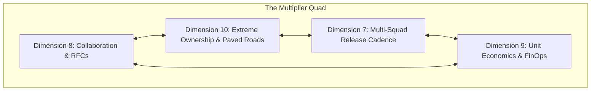

# Leadership & Engineering Multiplier Development Plan

> **"If your impact is limited to the code you personally type, your ceiling is Senior Engineer. To become a Lead or Staff Engineer, your primary output must be the velocity, quality, and architectural sanity of entire teams."**

---

## 1. Purpose & Target Persona

The **Leadership & Engineering Multiplier Development Plan** is tailored for Senior Software Engineers (L3) preparing to transition into Lead Software Engineer, Technical Lead, or Staff Engineer (L4) roles.

It emphasizes the **human, organizational, and strategic dimensions**:
- **Dimension 8: Collaboration & Influence** (RFC authoring, pedagogical reviews, cross-team diplomacy)
- **Dimension 10: Leadership & Growth** (Extreme ownership, paved roads, sponsorship)
- **Dimension 7: Delivery Excellence** (Multi-team release engineering, epic forecasting)
- **Dimension 9: Business & Product Thinking** (FinOps, ROI trade-offs, value stream alignment)

---

## 2. Structured 6-Month Multiplier Curriculum

### Module 1: Influence Without Authority & RFC Leadership (Months 1–2)
- **Authoritative Reading**:
  - Cagan, *Inspired* (Partnering with Product Management).
  - Skelton & Pais, *Team Topologies* (Stream-aligned vs. Platform vs. Enabling teams).
  - Selected materials on architectural storytelling and persuasive writing from [24-architect-mastery/architecture-storytelling/](../../24-architect-mastery/architecture-storytelling/).
- **Practical Exercises**:
  - Identify a cross-team technical friction point (e.g., mismatched API error formats across 3 squads).
  - Author a formal Request for Comments (RFC) proposing a standardized standard.
  - Host an asynchronous feedback review; address dissent constructively; achieve consensus without management escalation.

### Module 2: Paved Road Creation & Developer Velocity (Months 3–4)
- **Authoritative Reading**:
  - Forsgren, Humble, Kim, *Accelerate* (DORA metrics and developer velocity).
  - Selected materials on platform strategy from [24-architect-mastery/platform-strategy/](../../24-architect-mastery/platform-strategy/).
- **Practical Exercises**:
  - Audit developer friction across the engineering group (e.g., onboarding ramp-up, local Docker setup, flaky CI pipelines).
  - Architect and build a **Paved Road (Golden Path)** asset: a shared starter template, scaffolding CLI, or shared library that automates the right architectural choices.
  - Pilot the paved road with one squad; iterate based on feedback; drive adoption to 3+ squads.

### Module 3: Sponsorship, Mentorship & Psychological Safety (Months 5–6)
- **Authoritative Reading**:
  - Willink & Babin, *Extreme Ownership* (Leadership under pressure and owning the environment).
  - Edmondson, *The Fearless Organization* (Creating psychological safety in high-stakes environments).
- **Practical Exercises**:
  - Establish a formal 6-month mentorship engagement with at least one junior/mid engineer.
  - Delegate a non-trivial architectural component to the mentee; guide them through Socratic code reviews without writing the code for them.
  - Sponsor the mentee’s contribution in engineering demos and lead meetings, positioning them for promotion.

---

## 3. Real-World Leadership Deliverables

To complete this plan, the candidate must produce four high-grade leadership artifacts:

1. **Adopted Cross-Team RFC**: An accepted RFC establishing an engineering standard adopted across 3+ squads.
2. **Paved Road Scaffolding Tool**: A developer CLI, library, or template adopted across multiple production services that measurably reduces developer lead time.
3. **Mentorship Promotion Case**: A formal testimonial and promotion record for an engineer mentored by the candidate.
4. **FinOps Cost Optimization Case**: A documented technical initiative eliminating \$50,000+ in annual cloud waste through architectural right-sizing.
