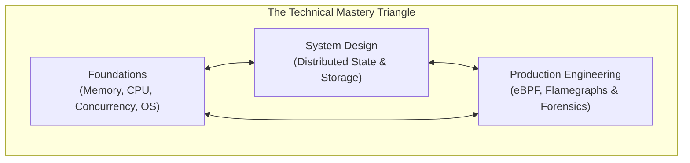

# Technical & Systems Deepening Development Plan

> **"True technical depth is the ability to diagnose what is happening five abstraction layers below where your framework operates."**

---

## 1. Purpose & Target Persona

The **Technical & Systems Deepening Development Plan** is designed for engineers seeking pure technical mastery on the Individual Contributor (IC) track (Senior $\to$ Staff $\to$ Principal Engineer). 

It focuses intensely on the **technical substrate**:
- **Dimension 1: Technical Foundations** (Compute, Memory, Concurrency, OS, Networks)
- **Dimension 3: System Design** (Distributed State, Consistency, Scalability, Storage Engines)
- **Dimension 5: Production Engineering** (Low-overhead profiling, eBPF, telemetry, forensics)

---

## 2. Structured 6-Month Technical Curriculum

### Module 1: Mechanical Sympathy & Memory Hierarchy (Months 1–2)
- **Authoritative Reading**:
  - Drepper, *What Every Programmer Should Know About Memory*.
  - Tanenbaum, *Modern Operating Systems* (Memory Management & Virtual Memory).
  - Selected articles on CPU cache coherence protocols (MESI), false sharing, and memory reordering.
- **Hands-on Sandbox Drills**:
  - Write a benchmark in Go/C/Rust proving the throughput difference between an array scan ($O(N)$ sequential memory access) and a pointer-chasing linked list of identical size.
  - Profile cache-line misses using Linux `perf` (`perf stat -e L1-dcache-load-misses`).
  - Implement a zero-allocation byte buffer parser eliminating 100% of heap allocations in a hot path.

### Module 2: Concurrency & Lock-Free Data Structures (Months 3–4)
- **Authoritative Reading**:
  - Herlihy & Shavit, *The Art of Multiprocessor Programming*.
  - Hardware memory model specifications (x86 TSO vs. ARM weak memory models).
- **Hands-on Sandbox Drills**:
  - Implement a thread-safe Multiple-Producer Single-Consumer (MPSC) lock-free ring buffer using atomic operations (`compare-and-swap`).
  - Simulate high-concurrency race conditions; verify correctness using thread sanitizers (`-race` / `tsan`).
  - Measure lock contention under 100 concurrent workers; benchmark mutex vs. RWMutex vs. striped partitioning.

### Module 3: Distributed State & Storage Internals (Months 5–6)
- **Authoritative Reading**:
  - Kleppmann, *Designing Data-Intensive Applications* (Storage and Retrieval, Distributed Transactions).
  - Raft consensus specification (*In Search of an Understandable Consensus Algorithm* by Ongaro & Ousterhout).
  - Anatomy of LSM trees (LevelDB/RocksDB) vs. B+ Trees (PostgreSQL/InnoDB).
- **Hands-on Sandbox Drills**:
  - Build a toy in-memory Log-Structured Merge (LSM) storage engine with write-ahead log (WAL), memtable, and SSTable compaction.
  - Implement a Raft leader election state machine in an isolated 3-node cluster.
  - Inject simulated network partitions using Toxiproxy; verify consistency guarantees.

---

## 3. Real-World Production Deliverable Requirements

To graduate this plan, the engineer must ship at least two production-grade systems deliverables:

1. **Production Zero-Allocation Hot Path**:
   - Refactor a critical high-throughput path in your team's production service.
   - Evidence: `pprof` flamegraphs proving a $> 75\%$ reduction in GC pause duration or memory allocations, accompanied by zero regressions.
2. **Distributed Storage / Consistency Architecture**:
   - Design and ship an event-driven system requiring distributed consistency (e.g., Saga with compensating transactions, or outbox pattern).
   - Evidence: Accepted ADR, production Grafana dashboard, and chaos test verification report.
