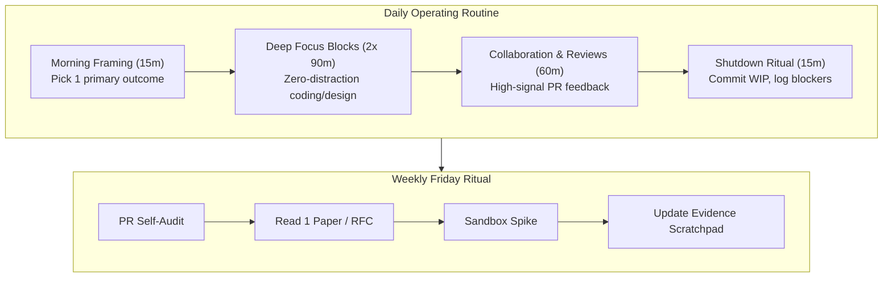

# The Software Engineer Personal Operating System

> **"You do not rise to the level of your goals. You fall to the level of your daily and weekly operating systems."** — James Clear (adapted for software engineering)

This directory defines the **Personal Engineering Operating System (EOS)** of **Domain 25 — Software Engineer Excellence**. It provides actionable protocols for structuring your daily work, isolating complex bugs, reading computer science literature, making defensible technical choices, and reflecting deliberately.

---

## Directory Documents

| Document | Operational Scope | Core Focus & Methodology |
| :--- | :--- | :--- |
| **[daily-engineering-loop.md](./daily-engineering-loop.md)** | Daily Workflow | Morning problem framing, deep work focus blocks, and end-of-day shutdown rituals. |
| **[weekly-engineering-loop.md](./weekly-engineering-loop.md)** | Weekly Cadence | Weekly retrospective, backlog grooming, PR self-audit, and 2-hour sandbox practice. |
| **[problem-solving-process.md](./problem-solving-process.md)** | Diagnostic Protocol | First-principles debugging, isolating variables, binary search bisection, and verification. |
| **[learning-loop.md](./learning-loop.md)** | Continuous Upskilling | Ingesting papers/RFCs, tracking tech radar, de-biasing, and avoiding "tutorial hell." |
| **[decision-making.md](./decision-making.md)** | Cognitive Discernment | Engineering decision journals, one-way vs. two-way doors, and trade-off matrices. |
| **[reflection.md](./reflection.md)** | Deliberate Practice | Engineering journaling, cognitive friction logs, and extracting lessons from blockers. |

---

## The Engineer's Daily & Weekly Rhythm

Adopting these daily and weekly habits transforms engineering growth from an episodic, stressful sprint into a calm, sustainable, and compounding discipline.
