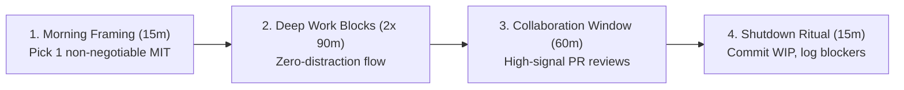

# The Daily Engineering Operating Loop

> **"A day spent reacting to Slack pings, random meetings, and context switches produces exhausted developers who have written zero lines of meaningful code and solved zero hard problems."**

---

## 1. The Anatomy of an Engineering Day

Software engineering requires prolonged, uninterrupted immersion in complex cognitive state machines. When an engineer's attention is fragmented every 15 minutes by notifications, their cognitive working memory collapses.

The **Daily Engineering Loop** protects high-leverage focus while ensuring responsive collaboration:

```mermaid
gantt
    title The Ideal High-Leverage Engineering Day
    dateFormat  HH:mm
    axisFormat %H:%M
    section Morning
    Morning Framing & Alignment (15m)      :active, 09:00, 09:15
    Deep Work Focus Block 1 (90m)          :crit, 09:15, 10:45
    Standup & Tactical Sync (30m)          :10:45, 11:15
    Code Review & PR Turnaround (45m)      :11:15, 12:00
    section Afternoon
    Lunch & Disconnect (60m)               :12:00, 13:00
    Deep Work Focus Block 2 (90m)          :crit, 13:00, 14:30
    Async Collaboration & Pairing (60m)    :14:30, 15:30
    Admin, Telemetry Check & Shutdown (30m):active, 15:30, 16:00
```



---

## 2. The 4 Essential Daily Rituals



### Ritual 1: Morning Framing (15 Minutes)
Before opening Slack, email, or social media:
1. Identify your **Single Most Important Task (MIT)**: What is the one non-negotiable technical deliverable that makes today a victory?
2. Define the exact acceptance criteria for that task (e.g., *"Write integration test suite for the payment outbox worker"*).
3. Review your calendar; defensively decline or delegate non-essential meetings that slice up focus blocks.

### Ritual 2: Deep Work Focus Blocks (2x 90 Minutes)
- **Rules of Engagement**: Full screen IDE; close Slack and email; phone in another room.
- **Cognitive Flow**: Spend the first 10 minutes reviewing test assertions, then build incrementally under the guidance of failing tests.
- **Break Protocol**: Step away from the screen for 10 minutes between blocks. Do not check social media during breaks.

### Ritual 3: The Dedicated Collaboration Window (60 Minutes)
- Review incoming peer pull requests using the [Conventional Comments standard](../feedback/peer-feedback.md).
- Respond to asynchronous Slack inquiries and thread discussions.
- Unblock junior and mid-level peers via short, targeted pairing sessions.

### Ritual 4: The End-of-Day Shutdown Ritual (15 Minutes)
Never close your laptop in the middle of a broken, half-typed thought:
1. **Commit WIP Cleanly**: If your code is incomplete, commit it to your local feature branch with an explicit WIP note (*"wip: test failing at line 84 due to nil pointer in mock"*).
2. **Log Blockers & Friction**: Write a 2-line note in your engineering scratchpad: *What blocked me today? What is the first thing I must do tomorrow morning?*
3. **Telemetry Health Check**: Scan production Grafana dashboards for your service to verify that deployments from earlier today are running stably.
4. **Disconnect Fully**: Close your work laptop; cleanly terminate work-related mental loops.

---

## 3. Daily Execution Checklist

```markdown
### Daily Engineering Habit Checklist

- [ ] Identified 1 non-negotiable technical priority before opening Slack or email.
- [ ] Completed at least one uninterrupted 90-minute deep work block today.
- [ ] Reviewed peer pull requests within the team's 18-hour turnaround SLA.
- [ ] Committed clean code and pushed branch to remote before ending the day.
- [ ] Checked production service dashboards for deployment regressions.
```
