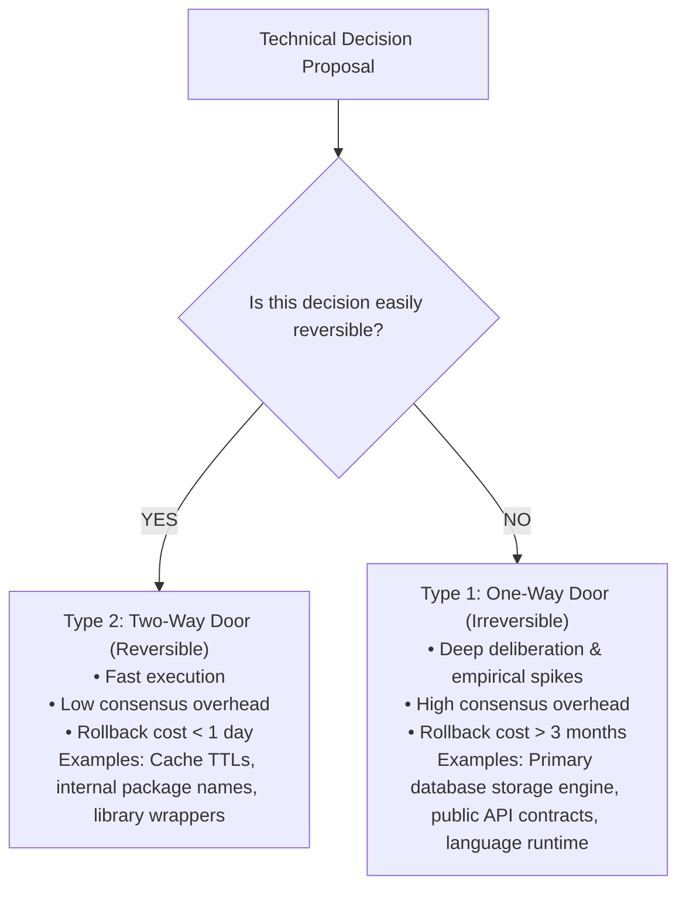

# Engineering Decision Making & Cognitive Discernment

> **"A good engineer makes decisions quickly and reverses them slowly if two-way; an architect makes decisions slowly and deliberates deeply if one-way."**

---

## 1. The Reversibility Framework: One-Way vs. Two-Way Doors

Not all technical decisions carry equal risk. Treating minor, reversible choices with committee-level bureaucracy cripples engineering velocity; conversely, treating irreversible choices with impulsive haste creates permanent architectural debt.

The **Reversibility Matrix** classifies all technical choices into two types:



---

## 2. The Engineering Decision Journal

To combat hindsight bias and objectively evaluate past architectural judgment, maintain a **Personal Decision Journal**:

```markdown
### Engineering Decision Journal Entry

- **Decision ID**: DEC-2026-018
- **Date**: 2026-08-14
- **Decision Type**: Type 1 (One-Way Door)
- **Problem Statement**: We need an event broker for asynchronous order fulfillment across 4 services.

#### Context & Constraints
- Projected volume: 15,000 events/sec peak.
- Latency requirement: P99 < 50ms.
- Team familiarity: High in RabbitMQ, Zero in Kafka.

#### Alternatives Evaluated
1. **RabbitMQ**: Team knows it; handles basic routing well; struggles with durable event replay at scale.
2. **Apache Kafka**: High operational complexity; steep learning curve; excellent partition throughput and durable event replay.

#### Decision & Rationale
We choose **Apache Kafka**. Although RabbitMQ is simpler today, our business model requires replaying event streams to rebuild read models in our reporting data lake. Rebuilding our broker in 12 months would cost \$200K in migration effort.

#### Expected Consequences & Accepted Costs
- Team must invest 4 weeks mastering partition keys and consumer group rebalancing.
- We must provision a managed Kafka cluster (Confluent Cloud) costing \$1,400/month.

#### Review Date: 2027-02-14 (6 Months Post-Launch)
- *Actual Outcome*: [To be filled on review date: evaluate throughput, operational incidents, and cost].
```

---

## 3. Cognitive Biases in Technical Decision Making

| Cognitive Bias | Manifestation in Software Engineering | Antidote |
| :--- | :--- | :--- |
| **The Sunk Cost Fallacy** | Refusing to abandon a failing custom library because "we already spent 6 months building it." | Dispassionately ask: *"If this library did not exist today, would we build it or adopt open-source?"* |
| **The IKEA Effect** | Believing an internal custom tool is vastly superior to battle-tested OSS simply because your team wrote it. | Benchmark the internal tool against external alternatives using identical synthetic load scripts. |
| **Recency Bias** | Using the database technology featured in a conference talk you attended three days ago for an unrelated problem. | Enforce explicit ADR reviews requiring justification against NFR budgets. |
| **Bikeshedding** | Spending 2 hours arguing over CamelCase vs. snake_case in JSON keys while ignoring missing database indexes. | Delegate all syntax and formatting to automated linters; spend human review time purely on architecture. |
