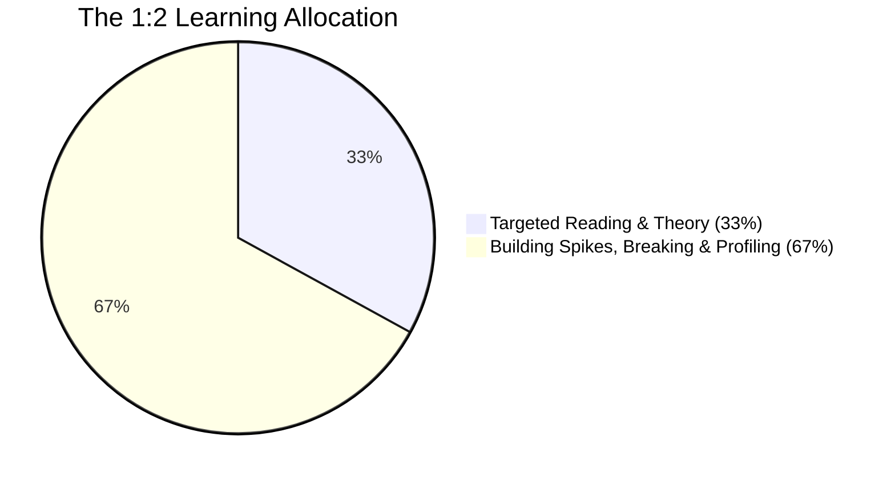
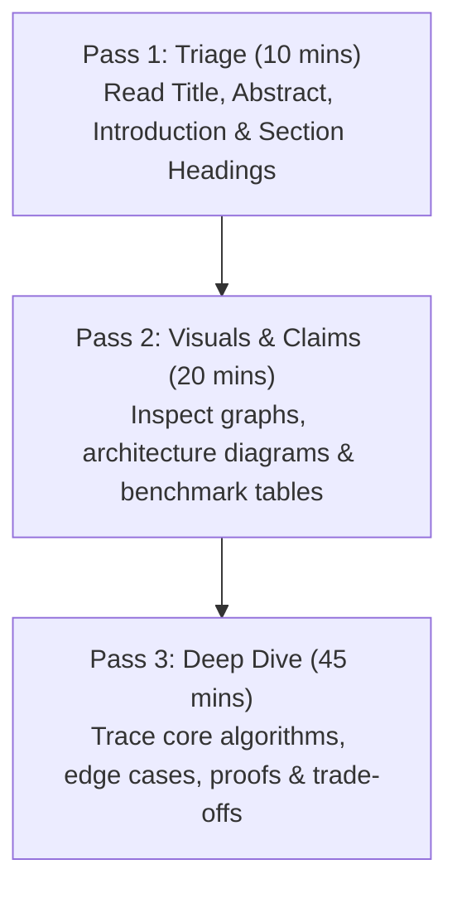

# The Engineering Continuous Learning Loop

> **"Consuming twenty hours of programming video tutorials without typing code builds an illusion of competence; building a toy key-value store from scratch in three hours builds permanent engineering capability."**

---

## 1. The 1:2 Learning-to-Building Ratio

The most pervasive pathology in modern software engineering self-education is **"Tutorial Hell"**—the passive, low-effort consumption of video courses, books, and blog summaries that creates the psychological feeling of learning without building tactile neural pathways.

The **Continuous Learning Loop** enforces the **1:2 Learning-to-Building Ratio**:



> **For every 1 hour spent reading a technical paper, book chapter, or RFC, you must spend at least 2 hours implementing, breaking, or benchmarking code in a sandbox.**

---

## 2. How to Read a Computer Science Paper

Academic systems papers contain the fundamental architectural paradigms underlying modern infrastructure (Kafka, Cassandra, Kubernetes, Raft). Reading them directly eliminates dependence on third-party blog interpretations.



### The 3-Pass Reading Protocol:
1. **Pass 1 (The Bird's-Eye View)**: Read the Abstract, Introduction, and Conclusion. Ask: *What specific problem did the authors solve that existing systems could not?*
2. **Pass 2 (The Data & Diagrams)**: Inspect the architecture diagrams and benchmark charts. What are the axes? Where does the curve flatten or spike?
3. **Pass 3 (The Implementation Details)**: Trace the state machine transitions, pseudocode, and failure mode mitigations. Note where real-world physical constraints forced compromises.

---

## 3. Maintaining a Personal Technology Radar

To avoid jumping on every ephemeral framework trend, maintain a personal four-ring **Technology Radar** (adapted from ThoughtWorks):

```mermaid
quadrantChart
    title Personal Technology Radar
    x-axis Core Infrastructure --> Emerging Paradigms
    y-axis High Production Readiness --> Experimental
    quadrant-1 ADOPT (Proven daily drivers)
    quadrant-2 TRIAL (Piloting on low-risk services)
    quadrant-3 ASSESS (Researching & building spikes)
    quadrant-4 HOLD (Deprecated / Dangerous anti-patterns)
```

- **ADOPT**: Technologies you have operated in production, know their failure modes intimately, and recommend by default (e.g., PostgreSQL, Go, Docker, Redis).
- **TRIAL**: Technologies you have built sandbox spikes for and are piloting on a secondary service (e.g., OpenTelemetry, eBPF).
- **ASSESS**: Technologies you are actively reading papers and exploring in weekend spikes (e.g., Vector databases, WebAssembly).
- **HOLD**: Technologies proven to introduce net-negative operational complexity in your context (e.g., raw microservices for 2-person teams, unindexed NoSQL for relational domains).

---

## 4. De-Mystifying Frameworks: The "Toy System" Kata

Whenever a framework or library feels like "magic," build a minimal toy implementation from scratch in a single afternoon:
- *Confused by Docker?* $\to$ Write a 100-line Go/C script creating Linux `cgroups` and `namespaces`.
- *Confused by Git?* $\to$ Build a toy version control script creating SHA-1 blob and tree objects in `.git/objects`.
- *Confused by Web Frameworks?* $\to$ Build an HTTP router from scratch using raw TCP sockets and regex path matching.
- *Confused by Raft?* $\to$ Build a 3-node in-memory leader election loop with heartbeats and randomized timers.
