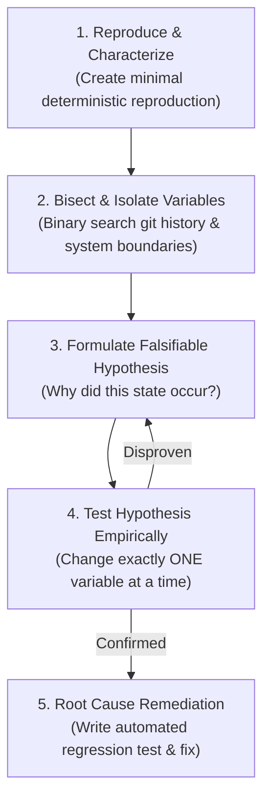

# First-Principles Problem Solving & Debugging

> **"Shotgun debugging—randomly changing code, tweaking configs, and restarting servers in the hope that an error disappears—is not engineering; it is superstition."**

---

## 1. The Scientific Method of Debugging

Elite software engineers debug systems the way forensic pathologists investigate complex physical anomalies: dispassionately, methodically, and through rigorous hypothesis testing.



---

## 2. The 5-Stage Diagnostic Protocol

### Stage 1: Reproduce & Characterize
- **The Golden Rule**: If you cannot reliably reproduce an issue, you cannot prove you have fixed it.
- **Isolating Noise**: Strip away external dependencies. Can you reproduce the bug in an isolated, single-threaded unit test or a minimal Docker Compose script?
- **Characterize Boundaries**: Does it happen on all browsers or just Safari? Does it happen under 10 concurrent requests or only under 5,000? Does it happen on empty database tables or only with 1M rows?

### Stage 2: Bisect & Isolate Variables
- **Git Bisect**: Use binary search on the commit history to locate the exact commit that introduced the regression:
  ```bash
  git bisect start
  git bisect bad HEAD
  git bisect good v2.4.0
  git bisect run ./test_script.sh
  ```
- **Boundary Bisection**: Isolate where in the network or process stack the failure occurs:
  - *Client $\to$ Gateway $\to$ Application $\to$ Database*. Inspect logs at each boundary to identify where the data payload diverges from expectation.

### Stage 3: Formulate Falsifiable Hypotheses
- Avoid vague theories (*"The database seems slow"*).
- Write down explicit, falsifiable hypotheses:
  > *"Hypothesis: The worker pool deadlocks when a database query takes longer than 5 seconds because the caller holds an exclusive transaction lock while waiting for the HTTP response."*

### Stage 4: Test One Variable at a Time
- Change **exactly one parameter** (e.g., increase connection pool size from 10 to 50).
- Run the benchmark or reproduction script.
- If multiple variables are changed simultaneously, it is impossible to determine which variable caused the change in behavior.

### Stage 5: Root-Cause Remediation & Regression Lock-in
- Never patch a bug by masking the symptom (e.g., catching all exceptions and swallowing them, or adding an arbitrary `sleep(500ms)`).
- **The Regression Rule**: Write a failing unit or integration test that reproduces the bug *before* modifying production code. The bug is only solved when the test passes.

---

## 3. Classic Debugging Anti-Patterns

| Anti-Pattern | Manifestation | Forensic Consequence |
| :--- | :--- | :--- |
| **Shotgun Debugging** | Changing 6 different lines of code and configuration at once. | Obscures the true root cause; introduces latent secondary bugs. |
| **The Sleep Patch** | Inserting `time.Sleep(100ms)` to fix a race condition. | Converts a deterministic failure into an intermittent, untraceable production flake. |
| **Silent Catching** | Wrapping complex logic in `try { ... } catch (Exception e) {}` with no logging. | Destroys telemetry; makes subsequent failures completely unobservable. |
| **Restart & Pray** | Periodically restarting containers via cron to "cure" memory leaks. | Allows systemic architectural degradation to compound until catastrophic failure. |
