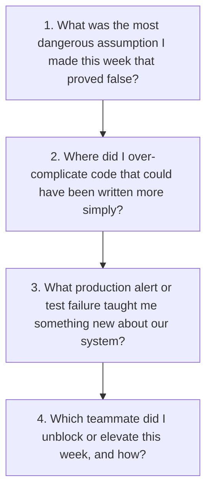
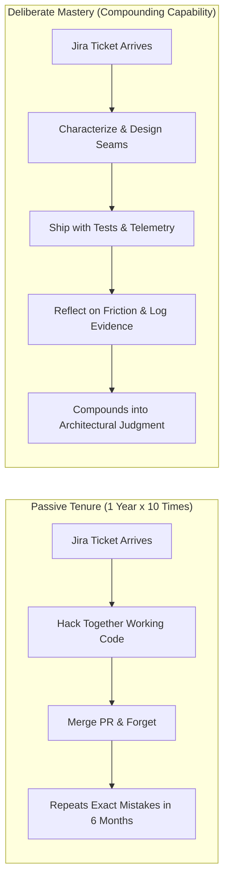

# Deliberate Engineering Reflection & Journaling

> **"Experience without reflection is merely physical presence in an office. Reflection is the cognitive compiler that converts operational pain into permanent engineering judgment."**

---

## 1. The Friction Log Protocol

Engineers frequently encounter subtle friction—slow test suites, confusing documentation, cryptic compiler error messages, or awkward APIs—and immediately forget the experience once the ticket is closed. 

The **Cognitive Friction Log** captures these micro-frustrations before they vanish from memory:

```markdown
### Weekly Cognitive Friction Log Template

| Timestamp | Source of Friction | Impact / Time Lost | Root Cause | Permanent Action Item |
| :--- | :--- | :---: | :--- | :--- |
| **Mon 10:30** | Local Docker Compose setup failed with port conflicts. | 45 minutes | Hardcoded port `5432` collided with local Postgres. | Update `docker-compose.yml` to use dynamic ephemeral port mapping via `.env`. |
| **Tue 14:15** | Integration test suite flaked 3 times in CI build. | 30 minutes | Test depended on unseeded clock time (`time.Now()`). | Refactor test to inject a deterministic frozen clock fixture. |
| **Thu 11:00** | Spent 1 hour searching for API payload schema for User Service. | 60 minutes | Documentation in stale Confluence wiki was obsolete. | Generate OpenAPI spec automatically from code in CI and publish to Swagger UI. |
```

---

## 2. The 4 Weekly Reflection Prompts

During your Friday afternoon loop, spend 10 minutes answering these four core questions in your personal engineering journal:



---

## 3. From Passive Tenure to Deliberate Mastery



By maintaining a friction log and engaging in weekly reflection, an engineer ensures that every production bug, review critique, and deployment hurdle permanently elevates their capability.
