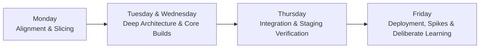
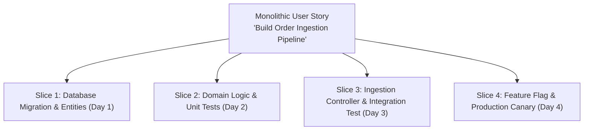

# The Weekly Engineering Operating Cadence

> **"A sprint is won or lost on Monday morning during task decomposition, and consolidated on Friday afternoon during reflection and deliberate practice."**

---

## 1. Structuring the Engineering Week

High-performing software engineers do not treat all five days of the work week identically. Different days have natural cognitive energies that should be aligned with specific types of technical work:

| Day of Week | Cognitive Focus | Primary Objective |
| :--- | :--- | :--- |
| **Monday** | Framing & Alignment | Sprint kickoff, breaking epics into vertical slices, defining test contracts. |
| **Tuesday & Wednesday** | Maximum Flow / Deep Work | Writing core domain logic, refactoring, building major features in uninterrupted focus. |
| **Thursday** | Integration & Hardening | Merging PRs, end-to-end integration tests, dark launching behind feature flags. |
| **Friday** | Reflection & Deliberate Practice | Deployment verification, 3-hour weekly practice spike, reading CS papers, updating evidence portfolio. |

---

## 2. Monday Morning: Story Decomposition Ritual

Never begin a sprint by pulling a monolithic, 8-point ticket and immediately typing code. Spend 45 minutes on Monday morning decomposing the work:

### The Slicing Rules:
1. **Vertical Over Horizontal**: Each slice must connect the endpoint to the database and be verifiable in isolation.
2. **The 24-Hour PR Rule**: If a slice cannot be coded, tested, and submitted as a pull request in under 24 hours, it is too large. Decompose it further.
3. **Define the Walking Skeleton**: Ship the simplest possible end-to-end path (even if hardcoded) to staging on Day 1 to de-risk CI/CD and deployment pipelines.

---

## 3. Friday Afternoon: The Sharpening Ritual

As detailed in [weekly-improvement.md](../improvement-cycle/weekly-improvement.md), block off 2–3 hours every Friday afternoon:
- Conduct an honest self-audit of your merged pull requests.
- Read one external technical paper, RFC, or post-mortem.
- Build an isolated technical challenge spike in your sandbox.
- Append new artifact links to your weekly evidence scratchpad.
