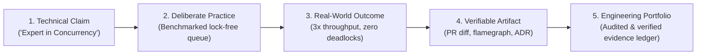

# Engineering Evidence Framework & Portfolio

> **"Without evidence, you're just another engineer with an opinion and an inflated resume."**

This directory establishes the **Engineering Evidence Framework** of **Domain 25 — Software Engineer Excellence**. It provides the standards, classifications, quality rubrics, and templates needed to construct an unassailable, artifact-backed technical portfolio.

---

## Directory Documents

| Document | Focus & Scope | Core Question Answered |
| :--- | :--- | :--- |
| **[engineering-evidence-framework.md](./engineering-evidence-framework.md)** | Core Evidentiary Rules | *What constitutes valid engineering proof, and how do we enforce the Claim $\to$ Practice $\to$ Outcome $\to$ Evidence model?* |
| **[evidence-types.md](./evidence-types.md)** | The 12 Evidence Categories | *What are the 12 canonical artifact formats (PR diffs, ADRs, telemetry dashboards, post-mortems)?* |
| **[evidence-quality.md](./evidence-quality.md)** | Weak vs. Strong Rubric | *How do we objectively discriminate between weak vanity metrics and high-grade, outcome-proven engineering proof?* |
| **[engineering-portfolio.md](./engineering-portfolio.md)** | Portfolio Management Guide | *How does an engineer build, structure, and maintain a machine-readable, living engineering portfolio?* |

---

## The Evidentiary Progression

All career progression and promotion gates in Domain 25 rely directly on the standards defined within this directory.
