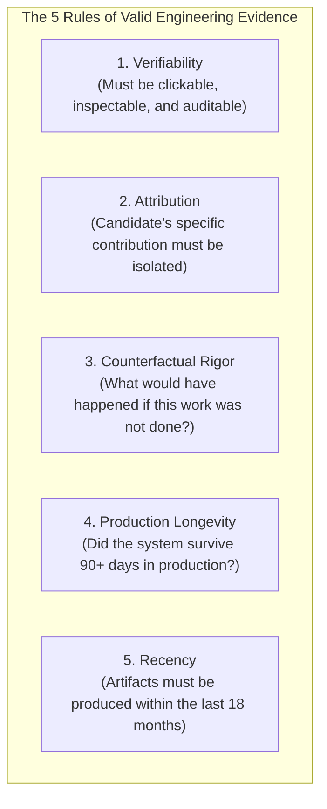
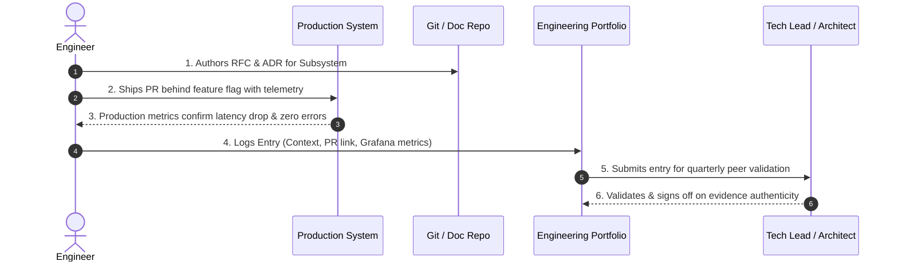
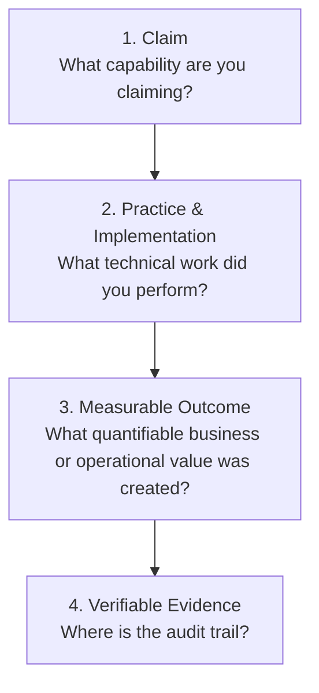

# The Engineering Evidence Framework

> **"In science and engineering, assertions without empirical verification are hypotheses at best and fabrications at worst. Capability is an empirical claim that demands verifiable proof."**

---

## 1. Foundational Evidentiary Principles

The **Engineering Evidence Framework (EEF)** eliminates subjectivity, charisma bias, and tenure inflation from engineering career development. It applies the standards of scientific peer review and forensic auditing to software engineering capability.

### Rule 1: Verifiability
An artifact must be publicly or internally auditable by an independent Staff Engineer or Architect. Verbal claims ("*I optimized the database*") are disqualified. The engineer must provide a clickable Git commit diff, an accepted markdown ADR, or a persisted telemetry dashboard link.

### Rule 2: Attribution
Modern software is built by teams. The candidate must clearly isolate their individual contribution from the collective output of the team. If a PR contains 10 authors, the candidate's specific commits, design choices, and architectural leadership must be explicitly documented.

### Rule 3: Counterfactual Rigor
High-grade evidence proves not just that work was performed, but that it achieved a quantifiable, beneficial outcome that would not have occurred otherwise. Did it prevent an outage? Did it save \$100,000? Did it reduce latency by 60%?

### Rule 4: Production Longevity
A feature merged into production that causes chronic alert fatigue, breaks two weeks later, or requires an emergency rewrite is **negative evidence**. True capability is demonstrated by systems that run stably, reliably, and quietly in production for months.

### Rule 5: Recency
Software engineering moves rapidly. Mastery of an obsolete framework from 2018 does not substantiate L3 capability in modern cloud-native systems. Evidence must have been generated within the preceding 18 months unless actively maintained.

---

## 2. The Evidentiary Lifecycle

Evidence is not gathered in a desperate scramble the night before a promotion review. It is captured continuously as part of the engineer's daily and weekly operating loop:

---

## 3. The Claim $\to$ Practice $\to$ Outcome $\to$ Evidence (CPOE) Model

Every entry in an engineer’s portfolio must follow the four-part CPOE structure:

### Example 1: System Design & Concurrency
- **Claim**: Advanced capability in distributed consistency and high-throughput event processing (L3).
- **Practice**: Designed and implemented an idempotent transactional outbox consumer in Go using PostgreSQL advisory locks and Redis Bloom filters.
- **Outcome**: Processed 14 million daily transactions with zero duplicate payments and zero row-lock timeouts, reducing P99 processing latency from 450ms to 28ms.
- **Evidence**:
  - RFC: `https://github.com/company/rfcs/blob/main/rfc-042-idempotent-outbox.md`
  - Pull Request: `https://github.com/company/billing-core/pull/1120`
  - Dashboard: `https://grafana.internal.net/d/billing-outbox-v2`
  - Benchmark: `https://github.com/company/billing-core/blob/main/bench/k6-loadtest.js`

### Example 2: Production Engineering & Observability
- **Claim**: Advanced production troubleshooting, incident response, and SLO management (L3).
- **Practice**: Served as Incident Commander during a major database connection pool exhaustion outage; diagnosed the root cause (unbounded thread spawning in legacy ORM); implemented connection pooling, circuit breakers, and SLO-based alerting.
- **Outcome**: Restored service in 14 minutes; eliminated all subsequent connection pool failures over the next 180 days; reduced off-hours PagerDuty alerts by 85%.
- **Evidence**:
  - Post-Mortem: `https://company.atlassian.net/wiki/spaces/ENG/pages/89012/inc-402-postmortem`
  - PR: `https://github.com/company/user-service/pull/982` (HikariCP connection pool refactor)
  - Dashboard: `https://grafana.internal.net/d/user-service-slo`
