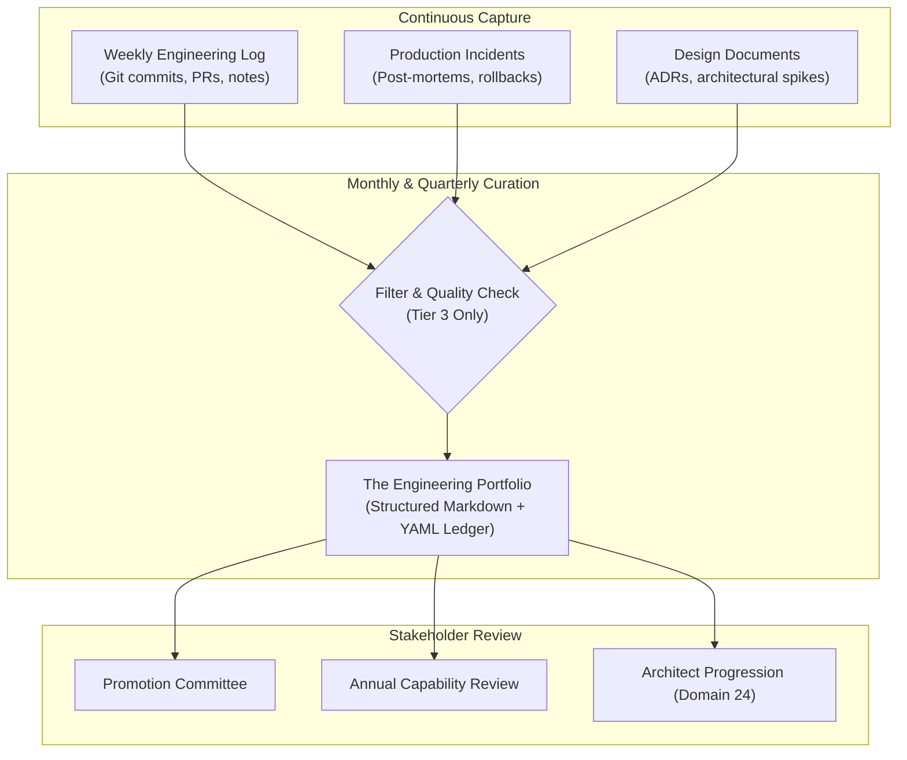

# Building an Engineering Portfolio

> **"Your resume is marketing; your engineering portfolio is the audited ledger of your technical craftsmanship and production outcomes."**

---

## 1. Purpose of the Engineering Portfolio

An **Engineering Portfolio** is a living, artifact-backed repository maintained by a software engineer throughout their career. It serves three distinct functions:
1. **Self-Calibration**: Provides objective data on whether you are actually expanding your capability or merely repeating routine sprint tasks.
2. **Promotion & Review Defense**: Eliminates recency bias and subjective memory during quarterly and annual performance calibrations.
3. **Career Portability**: Enables you to demonstrate demonstrable, high-grade competence to future employers, engineering committees, and architecture councils.



---

## 2. Canonical Portfolio Structure

A comprehensive engineering portfolio is organized into four standardized sections:

```text
my-engineering-portfolio/
├── README.md                           # Executive summary, role target, current CHI score
├── portfolio.yaml                      # Machine-readable capability and evidence ledger
├── dossiers/                           # Deep-dive dossiers for major technical initiatives
│   ├── 2026-q1-idempotent-webhooks.md
│   └── 2026-q2-strangler-auth-migration.md
├── incidents/                          # Incident forensics and post-mortems
│   └── inc-402-connection-exhaustion.md
└── mentorship/                         # Coaching logs and peer testimonials
    └── mentee-growth-plans.md
```

---

## 3. Machine-Readable Schema (`portfolio.yaml`)

To facilitate future automation, assessment tooling, and AI coaching, maintain a structured YAML ledger:

```yaml
# portfolio.yaml - Machine-Readable Engineering Ledger
schema_version: "1.0"
engineer:
  name: "Jane Doe"
  current_role: "Software Engineer (L2)"
  target_role: "Senior Software Engineer (L3)"
  last_calibrated: "2026-08-30"
  composite_health_index: 4.35

capability_profile:
  technical_foundations: 3.0
  software_engineering: 3.0
  system_design: 2.5
  architecture: 2.5
  production_engineering: 2.0
  security: 2.5
  delivery_excellence: 3.0
  collaboration: 3.0
  business_thinking: 2.5
  leadership: 2.5

evidence_ledger:
  - id: "EVD-001"
    dimension: "System Design"
    claimed_level: "L3"
    date: "2026-06-12"
    title: "Idempotent Webhook Processing Engine"
    summary: "Re-engineered webhook ingestion using transactional outbox pattern and Redis Bloom filter deduplication."
    artifacts:
      rfc: "https://github.com/company/rfcs/blob/main/rfc-042.md"
      pr: "https://github.com/company/billing/pull/1042"
      dashboard: "https://grafana.internal.net/d/billing-webhooks"
    outcomes:
      - "Eliminated 100% of duplicate transaction allocations ($18K/day risk)."
      - "Reduced P99 processing latency from 850ms to 32ms under peak load."
    verified_by: "Alex Chen (Staff Engineer)"

  - id: "EVD-002"
    dimension: "Production Engineering"
    claimed_level: "L3"
    date: "2026-07-19"
    title: "Incident Command: Database Connection Exhaustion"
    summary: "Acted as Incident Commander during Sev-1 outage; diagnosed leak in ORM, mitigated via flag, and implemented HikariCP pooling."
    artifacts:
      post_mortem: "https://company.atlassian.net/wiki/spaces/ENG/pages/89102/inc-402"
      pr: "https://github.com/company/users/pull/982"
    outcomes:
      - "Restored full service in 14 minutes."
      - "Zero repeat connection pool incidents in subsequent 90 days."
    verified_by: "Marcus Vance (Principal Architect)"
```

---

## 4. Maintenance Cadence: Keeping the Portfolio Alive

| Cadence | Time Required | Action |
| :--- | :---: | :--- |
| **Weekly** | 15 minutes | **Log Raw Artifacts**: Append merged PR links, accepted ADRs, and interesting debugging wins to a scratchpad log. |
| **Monthly** | 45 minutes | **Curate & Upgrade**: Select the top 1–2 artifacts of the month; format them into CPOE entries; discard trivial tasks. |
| **Quarterly** | 2 hours | **Audit & Calibrate**: Recalculate your [Engineering Health Scorecard](../assessment/engineering-health-assessment.md); update `portfolio.yaml`; review with your Tech Lead. |
