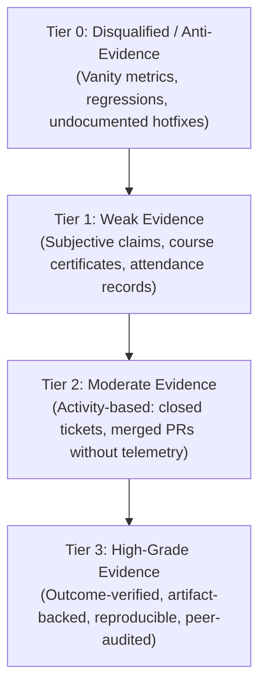
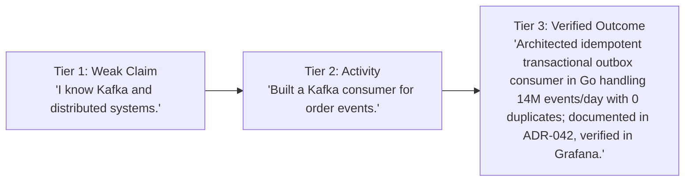

# Evidence Quality Rubric: Weak vs. Strong

> **"Activity is not achievement. Writing 10,000 lines of code that introduces 15 regressions is not progress; it is technical arson."**

---

## 1. The 4-Tier Evidence Quality Hierarchy

To ensure consistency and objectivity across technical evaluations, the handbook classifies all engineering evidence into four discrete tiers:



---

## 2. Comprehensive Quality Scoring Rubric

| Criterion | Tier 0: Disqualified | Tier 1: Weak | Tier 2: Moderate | Tier 3: High-Grade (Target) |
| :--- | :--- | :--- | :--- | :--- |
| **Verifiability** | Unverifiable or fictional; broken links. | Self-asserted verbal statement or resume bullet. | Internal ticket link; PR exists but lacks context or review trail. | Clickable, public/internal Git diff, accepted ADR, and live telemetry dashboard. |
| **Attribution** | Claiming team accomplishments as sole personal work. | Unclear individual contribution ("We improved latency"). | Candidate authored the code, but design and debugging were done by others. | Clearly isolated contribution; authored design, implementation, and verified results. |
| **Outcome** | Introduced production regressions or severe technical debt. | Zero measurable outcome; purely completed task. | Feature shipped to production without operational monitoring. | Quantifiable metric improvement (e.g., P99 latency dropped by 65%, \$80K saved). |
| **Rigor** | Code un-tested; pushed directly to main. | Manual testing only; no automated unit/integration tests. | Basic unit tests ($< 50\%$ coverage); mocks everything. | High coverage ($> 80\%$); integration tests with testcontainers; chaos-verified. |
| **Longevity** | Reverted within 48 hours due to outages. | System decayed or became unmaintainable within weeks. | System functions, but requires periodic manual restarts or interventions. | System operates stably, reliably, and quietly in production for $\ge 90\text{ days}$. |

---

## 3. Before-and-After: Upgrading Evidence from Weak to Strong

Transforming weak resume bullets into incontrovertible, Tier 3 engineering evidence:



### Scenario 1: Performance Optimization
- **Weak (Tier 1)**: *"Optimized database queries and made the backend faster."*
- **Moderate (Tier 2)**: *"Added indexes to the `orders` table and refactored the SQL query."*
- **Strong (Tier 3)**: *"Identified an $N+1$ query bottleneck in the order checkout endpoint using pprof flamegraphs; refactored the query with batch eager-loading and added a composite B-tree index on `(tenant_id, created_at)`. Reduced P99 response time from 1,250ms to 42ms under 8,000 RPS synthetic load, documented in PR #412 and verified via Datadog dashboard `checkout-perf`."*

### Scenario 2: Production Incident Response
- **Weak (Tier 1)**: *"Helped resolve a production outage."*
- **Moderate (Tier 2)**: *"Participated in the Sev-1 incident call and restarted the payment pods."*
- **Strong (Tier 3)**: *"Served as Incident Commander during Sev-1 outage INC-802 (Redis connection pool exhaustion); mitigated customer impact in 12 minutes by toggling feature flag `disable-enrichment-cache`. Authored the published blameless post-mortem identifying systemic socket leaks, and merged PR #608 implementing bounded connection pooling with automated circuit-breaking, resulting in zero repeat incidents over 6 months."*

### Scenario 3: Technical Mentorship
- **Weak (Tier 1)**: *"Great team player; always happy to help junior developers."*
- **Moderate (Tier 2)**: *"Conducted regular pair-programming sessions with Associate Engineer Mark."*
- **Strong (Tier 3)**: *"Structured a 6-month mentorship plan for Associate Engineer Mark focusing on system design and integration testing. Paired on 4 architectural spikes, conducted pedagogical code reviews on 25 PRs, and sponsored his promotion to L2 Software Engineer, verified by promotion committee records."*

---

## 4. Evidentiary Audit Checklist for Promotion Committees

Promotion committees must use this audit checklist to filter candidate packets:

```markdown
### Evidence Audit Checklist

- [ ] **Artifact Link Integrity**: Every claim contains a live, accessible link to a repository diff, ADR, dashboard, or post-mortem.
- [ ] **Zero Tier 0/1 Evidence**: No points awarded for vanity metrics (LOC, commit counts, course completion badges).
- [ ] **Outcome Corroboration**: Metric improvements are backed by actual Grafana/Datadog telemetry or financial reports.
- [ ] **Peer Sign-Off**: The Tech Lead or Staff Engineer has reviewed and signed off on the attribution accuracy.
```
