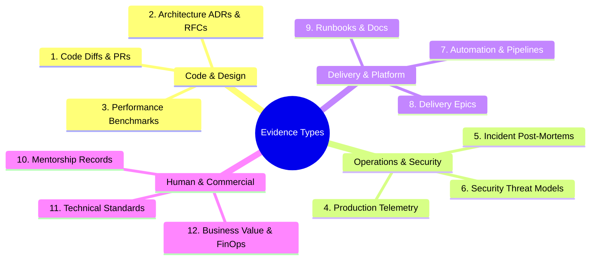

# The 12 Canonical Evidence Types

> **"Different engineering capabilities leave different physical footprints in an organization. An incident commander leaves a post-mortem; an architect leaves an ADR; a craftsman leaves clean code diffs."**

---

## 1. Overview of the 12 Evidence Types

To build a balanced, indisputable engineering portfolio, an engineer must collect artifacts across twelve distinct categories:

---

## 2. Exhaustive Classification of Evidence Types

### 1. Code Diffs & Pull Requests
- **Purpose**: Proves craftsmanship, modularity, test-driven design, and clean abstraction.
- **Valid Artifacts**: Clickable Git pull request links demonstrating small batch sizes ($< 300$ lines), clear commit narratives, $> 80\%$ test coverage, and clean domain separation.
- **Verification Method**: Code inspection by a Staff Engineer; verification that the PR passed CI linting and automated tests without manual overrides.
- **Weak Substitute**: High commit count, massive 4,000-line squash merges with no tests.

### 2. Architecture ADRs & RFCs
- **Purpose**: Proves systemic thinking, trade-off evaluation, and long-term technical judgment.
- **Valid Artifacts**: Accepted Architecture Decision Records (ADRs) or RFCs documenting problem context, alternatives evaluated, trade-offs, and consequences.
- **Verification Method**: Peer review by an Architect; verification that the decision was successfully implemented in production.
- **Weak Substitute**: Unstructured Slack messages, whiteboard diagrams without trade-off analysis.

### 3. Performance Benchmarks & Flamegraphs
- **Purpose**: Proves mechanical sympathy, runtime mastery, and empirical optimization capability.
- **Valid Artifacts**: Benchmark reports (`k6`, `wrk`, `go bench`, `pprof` flamegraphs) comparing baseline vs. optimized profiles under identical synthetic load.
- **Verification Method**: Reproducible test scripts that can be rerun to achieve identical latency/throughput improvements.
- **Weak Substitute**: "I rewrote the loop and it feels much faster now."

### 4. Production Telemetry & SLO Dashboards
- **Purpose**: Proves operational ownership and customer-centric reliability.
- **Valid Artifacts**: Links and screenshots of production Grafana/Datadog dashboards showing custom SLIs, error budget burn rates, and P99 latency profiles.
- **Verification Method**: Direct inspection of live production metrics over a 30-to-90 day window.
- **Weak Substitute**: Default CPU/memory charts with no correlation to user journeys or error rates.

### 5. Incident Forensics & Blameless Post-Mortems
- **Purpose**: Proves emotional composure under pressure, root-cause forensic analysis, and systemic remediation.
- **Valid Artifacts**: Published post-mortems for Sev-1/Sev-2 outages containing clear timelines, Five-Why analyses, and automated regression tests preventing recurrence.
- **Verification Method**: Review of Jira tickets proving that all architectural remediation action items were implemented.
- **Weak Substitute**: "The incident was resolved when I restarted the server."

### 6. Security Threat Models & Vulnerability Fixes
- **Purpose**: Proves shift-left security mindset and defensive architecture.
- **Valid Artifacts**: STRIDE threat modeling diagrams, SAST/DAST pipeline configurations, or code diffs remediating critical CVEs/exploits.
- **Verification Method**: Security team sign-off; automated security scans showing zero remaining vulnerabilities.
- **Weak Substitute**: Passing an annual multiple-choice security compliance quiz.

### 7. Automation & CI/CD Pipelines
- **Purpose**: Proves delivery velocity, build engineering, and release reliability.
- **Valid Artifacts**: GitHub Actions / GitLab CI pipeline definitions, Dockerfile multi-stage builds, and automated canary deployment scripts.
- **Verification Method**: Demonstration that commit-to-production lead time is $< 15\text{ minutes}$ with automated rollbacks.
- **Weak Substitute**: Manual SSH deployment scripts stored on a developer’s local laptop.

### 8. Delivery Epics & Vertical Decompositions
- **Purpose**: Proves scoping accuracy, risk management, and predictable execution.
- **Valid Artifacts**: Jira/Linear epic roadmaps showing multi-month projects decomposed into 1-to-2 day vertical slices shipped behind feature flags.
- **Verification Method**: Historical burndown telemetry demonstrating on-time delivery with zero post-release regressions.
- **Weak Substitute**: Missed deadlines followed by 80-hour hero-crunch weekends.

### 9. Operational Runbooks & Living Documentation
- **Purpose**: Proves team empathy, knowledge sharing, and operational rigor.
- **Valid Artifacts**: Markdown runbooks in repository roots detailing triage steps, verification commands, and escalation procedures for active alerts.
- **Verification Method**: Tested and executed by another engineer during a simulated game day drill with zero senior intervention.
- **Weak Substitute**: Outdated Confluence pages created 2 years ago with broken links.

### 10. Mentorship & Growth Records
- **Purpose**: Proves the force-multiplier effect and talent development capability.
- **Valid Artifacts**: Documented 1-on-1 coaching plans, paired programming logs, and promotion packets for junior/mid engineers sponsored by the candidate.
- **Verification Method**: Direct feedback interviews with mentees confirming specific technical acceleration.
- **Weak Substitute**: "I answer questions in Slack when people ask."

### 11. Technical Standards & Paved Roads
- **Purpose**: Proves leadership without authority and organizational alignment.
- **Valid Artifacts**: Shared service templates, developer CLIs, or company-wide RFCs establishing coding or architectural standards across 3+ squads.
- **Verification Method**: Analytics showing adoption across multiple internal repositories and squads.
- **Weak Substitute**: Dictating coding standards in a meeting without providing automated linters or templates.

### 12. Business Value & FinOps Deliverables
- **Purpose**: Proves commercial acumen and alignment with business objectives.
- **Valid Artifacts**: Cloud billing reports (AWS Cost Explorer) showing quantified infrastructure savings, or conversion telemetry linking code performance to revenue.
- **Verification Method**: Verification by Product Managers or Finance / FinOps partners.
- **Weak Substitute**: "The product manager was happy with our sprint."
