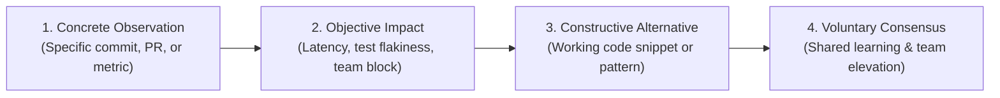

# Engineering Feedback & Retrospective Framework

> **"Feedback is the breakfast of champions, but in software engineering, uncalibrated feedback is the primary source of team toxicity, bikeshedding, and cognitive fatigue."**

This directory defines the **Feedback & Retrospective Framework** of **Domain 25 — Software Engineer Excellence**. It provides actionable mechanisms for delivering high-signal code reviews, critiquing architecture design documents (RFCs), conducting psychological safety retrospectives, and receiving critical feedback constructively.

---

## Directory Documents

| Document | Focus & Scope | Core Question Answered |
| :--- | :--- | :--- |
| **[feedback-framework.md](./feedback-framework.md)** | Core Feedback Models | *How do we give direct, actionable, and psychologically safe technical feedback (SBI Model, Radical Candor)?* |
| **[peer-feedback.md](./peer-feedback.md)** | Code Review & Peer Dynamics | *How do we deliver high-signal PR reviews while permanently eliminating bikeshedding and pedantry?* |
| **[design-review-feedback.md](./design-review-feedback.md)** | RFC & Architecture Critique | *How do we critique architectural designs rigorously without triggering defensive reactions?* |
| **[retrospective-framework.md](./retrospective-framework.md)** | Team & Personal Retrospectives | *How do we run blameless sprint, project, and personal retrospectives that drive permanent systemic improvement?* |

---

## The Constructive Feedback Cycle

Every document in this directory is designed to build a high-trust, high-velocity engineering culture where engineers actively welcome rigorous peer review.
