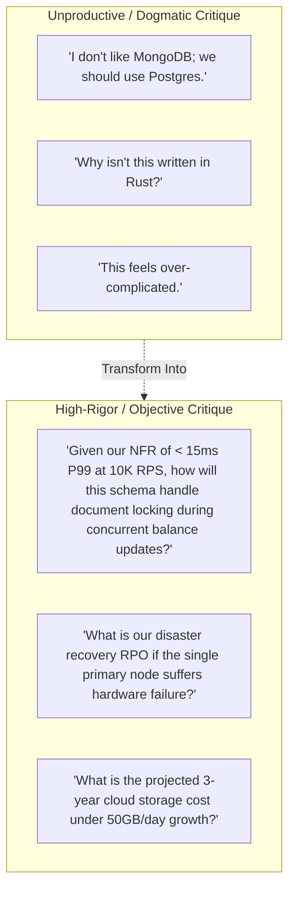
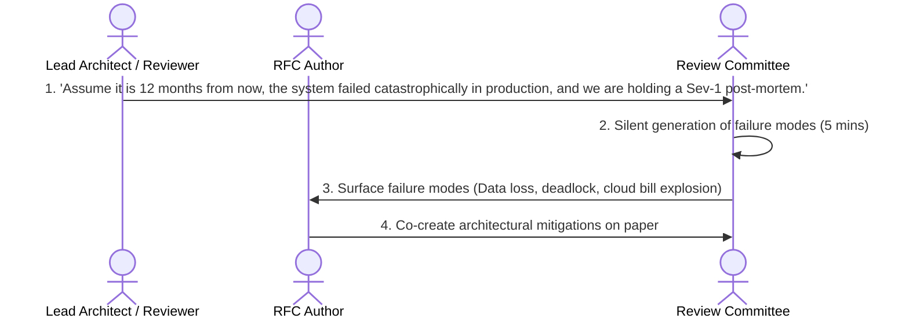

# Architectural Design Review & RFC Feedback

> **"A design review is not an audition to prove who is the smartest engineer in the room. It is a collaborative stress-test designed to break the architecture on paper before we spend six months building it in production."**

---

## 1. The Mindset of Architectural Critique

When reviewing an Architecture Decision Record (ADR) or Request for Comments (RFC), reviewers must balance rigorous scrutiny with intellectual humility. Critiquing an architecture requires evaluating **trade-offs against business constraints**, not enforcing personal aesthetic preferences:

---

## 2. The Architectural Pre-Mortem Protocol

The most effective technique for critiquing an architectural proposal is the **Architectural Pre-Mortem**:

### Pre-Mortem Prompt Questions:
1. *Where will this system bottleneck when transaction volume grows by $5\times$?*
2. *What happens to customer requests when the third-party dependency injects a 30-second timeout?*
3. *How will an on-call engineer diagnose this distributed state machine at 3:00 AM using our existing dashboards?*
4. *How difficult will it be to reverse this decision if our business assumptions prove false in 6 months?*

---

## 3. The 4 Categories of Architectural Review Feedback

Reviewers should organize their RFC comments into four distinct categories:

1. **Constraint Incompatibility (Blocking)**:
   - The proposed design directly violates a hard business, regulatory, or infrastructure constraint (e.g., violating GDPR data residency or exceeding maximum latency budgets).
2. **Unaddressed Failure Mode (Blocking)**:
   - The design fails to specify behavior during network partitions, disk saturation, or poison-pill message processing.
3. **Operational Burden / TCO (Non-Blocking Advisory)**:
   - Highlighting that a technology introduces significant operational complexity (e.g., self-hosting a multi-node distributed cluster when a managed service exists).
4. **Simplification Opportunity (Non-Blocking Suggestion)**:
   - Proposing an alternative architecture that achieves 90% of the desired business capability with 30% of the architectural complexity.
