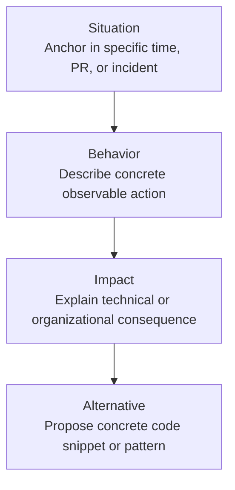

# The Engineering Feedback Framework

> **"You are not your code. Your value as a human being is distinct from the memory efficiency or thread safety of the pull request you submitted this morning."**

---

## 1. Principles of Technical Feedback

Feedback in software engineering is frequently contaminated by two cultural pathologies:
1. **Ruinous Empathy**: Hesitating to point out race conditions, memory leaks, or missing tests because you don't want to hurt a teammate's feelings, inevitably leading to production outages.
2. **Obnoxious Aggression**: Delivering technical critiques with condescending, sarcastic, or pedantic arrogance (*"Did you even read the documentation before writing this garbage?"*), demoralizing peers and destroying psychological safety.

The **Engineering Feedback Framework** balances extreme technical rigor with deep human respect using Kim Scott’s **Radical Candor** model:

```mermaid
quadrantChart
    title The Radical Candor Model in Software Engineering
    x-axis Low Personal Care --> High Personal Care
    y-axis Low Direct Challenge --> High Direct Challenge
    quadrant-1 Radical Candor (High Rigor, High Respect)
    quadrant-2 Ruinous Empathy (Silent on bugs to avoid conflict)
    quadrant-3 Manipulative Insincerity (Passive-aggressive Slack notes)
    quadrant-4 Obnoxious Aggression (Sarcastic, toxic PR comments)
```

---

## 2. The Technical Situation-Behavior-Impact (SBI) Model

When delivering feedback on code, architectural designs, or operational behavior, use the **SBI-A (Situation-Behavior-Impact-Alternative)** formula:



### Example 1: Code Review Critique
- **Situation**: *"In PR #412 during yesterday's review of the payment worker..."*
- **Behavior**: *"...you used a global mutex lock around the entire HTTP request execution block..."*
- **Impact**: *"...which serializes all outbound payment requests, degrading throughput from 1,200 RPS to 35 RPS and causing downstream timeout errors."*
- **Alternative**: *"...here is a snippet showing how we can use a striped lock keyed by customer ID, preserving thread concurrency while preventing double charges."*

### Example 2: Operational Hygiene
- **Situation**: *"During the database failover incident on Tuesday..."*
- **Behavior**: *"...you manually modified production table constraints using an unlogged psql shell without updating the migration scripts..."*
- **Impact**: *"...which caused staging and production schemas to drift, breaking the subsequent CI deployment pipeline for 3 hours."*
- **Alternative**: *"...next time, run the emergency DDL through our automated migration runner or document the manual command in the incident channel before executing."*

---

## 3. The 4 Rules for Receiving Critical Feedback

1. **Suppress the Amygdala Hijack**: When someone critiques your pull request, pause for 60 seconds before typing. Your brain naturally interprets critique of your code as a physical threat to your identity.
2. **Assume Positive Intent**: Assume your reviewer wants the system to be reliable and wants to help you look good in front of the on-call pager.
3. **Ask for Clarification, Not Justification**: Replace defensive arguments (*"Well, I had to do it this way because..."*) with curious inquiry (*"Could you explain how this loop creates a memory leak under high load?"*).
4. **Distinguish Style from Correctness**: If the comment is about functional correctness, security, or performance, address it immediately. If it is purely subjective personal aesthetic, politely cite the team style guide or automated linter.
