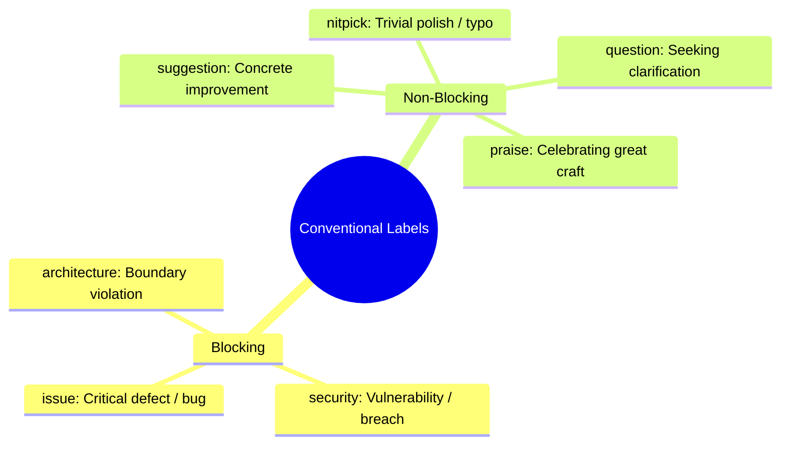
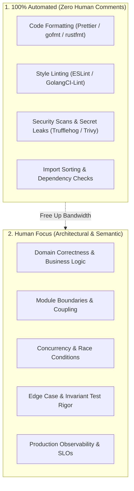

# High-Signal Peer Feedback & Code Review Dynamics

> **"A code review is not a gatekeeping toll booth; it is a collaborative design synchronization and learning ritual."**

---

## 1. The Conventional Comments Standard

To eliminate ambiguity, tone misinterpretation, and emotional defensiveness in Git pull request reviews, adopt the **Conventional Comments** specification. Every review comment must be prefixed with a standardized semantic label:

### Comment Labels & Examples:

| Label | Blocking? | Description & Example |
| :--- | :---: | :--- |
| `issue:` | **YES** | A functional bug, data corruption risk, or race condition.  *`issue: This database transaction does not rollback on error, leaving orphaned records.`* |
| `security:` | **YES** | A vulnerability violating security standards.  *`security: Unsanitized user parameter passed directly to raw SQL query; vulnerable to SQLi.`* |
| `architecture:`| **YES** | Violation of domain boundaries or established design patterns.  *`architecture: The domain entity imports the HTTP presentation controller, breaking clean architecture.`* |
| `suggestion:` | **NO** | An alternative approach that may be cleaner or faster, but author has discretion.  *`suggestion: We could use a Go sync.Once here to avoid atomic checking in the hot path.`* |
| `nitpick:` | **NO** | Minor stylistic preference or typo. Must not block PR approval.  *`nitpick: Typo in log message ('authentiction' -> 'authentication').`* |
| `question:` | **NO** | Seeking educational context or understanding.  *`question: What was the motivation for choosing a 15-minute TTL here instead of 1 hour?`* |
| `praise:` | **NO** | Celebrating exceptional craftsmanship, clean tests, or elegant abstractions.  *`praise: Exceptional test coverage! Using testcontainers for this edge case is brilliant.`* |

---

## 2. Preventing Code Review Bikeshedding

**Parkinson's Law of Triviality (Bikeshedding)** dictates that the amount of discussion given to an item is inversely proportional to its complexity. Teams will spend 4 days arguing over variable names while rubber-stamping a massive, un-tested distributed transaction.

### The Iron Law of Code Reviews:
> **If a comment can be enforced by an automated linter or compiler, it is strictly forbidden for a human to comment on it in a pull request.**

---

## 3. Code Review Turnaround SLAs & Batch Sizes

- **The 18-Hour SLA**: Peer reviews must be completed within 18 working hours. Code sitting unreviewed in a PR queue is inventory decay, accumulating merge conflicts and delaying customer feedback.
- **The 300-Line Limit**: Pull requests should ideally be under **250–300 lines of code**. Reviewing a 1,500-line PR produces superficial "rubber-stamp" approvals because human cognitive bandwidth degrades after 400 lines.
- **The "Reject Large PRs" Protocol**: If an engineer submits a 2,000-line PR, the senior reviewer should politely decline:
  > *"suggestion: This PR contains multiple unrelated refactorings and features. Let’s pair for 15 minutes to split this into 3 smaller, reviewable pull requests so we can verify correctness and deploy safely."*
