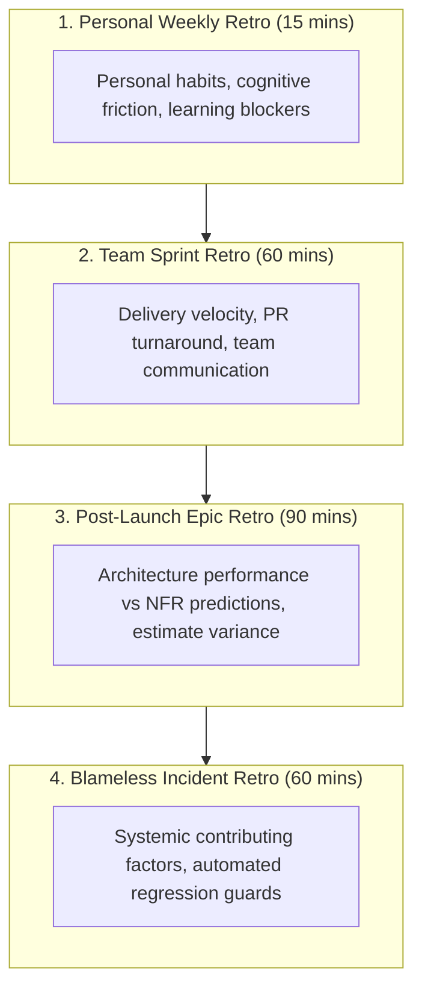
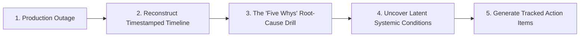

# Engineering Retrospective Frameworks

> **"Regardless of what we discover, we understand and truly believe that everyone did the best job they could, given what they knew at the time, their skills and abilities, the resources available, and the situation at hand."** — Norm Kerth, The Retrospective Prime Directive

---

## 1. The Retrospective Hierarchy

Retrospectives are the cybernetic feedback loop through which software engineering teams debug their own socio-technical processes. The handbook establishes four synchronized retrospective formats:



---

## 2. Running a High-Impact Blameless Incident Post-Mortem

When a production outage occurs, the incident review must focus on **systemic vulnerabilities**, never on individual blame. Human error is the *starting point* of an investigation, never the conclusion.



### The "Five Whys" in Action:
1. *Why did the service crash?* $\to$ It ran out of database connections.
2. *Why did it run out of connections?* $\to$ A slow query blocked connection pool threads.
3. *Why was the query slow?* $\to$ A full table scan was performed on a table with 40 million rows.
4. *Why did it perform a full table scan?* $\to$ The foreign key index was missing from the migration script.
5. *Why was the missing index not caught before production?* $\to$ Our CI integration tests only run against mock databases with 10 rows, where table scans execute in 0.2ms.
- **Root Remediation**: Add automated query plan execution (`EXPLAIN ANALYZE`) in CI against realistic synthetic row volumes to fail builds containing unindexed table scans.

---

## 3. The Retrospective Action Item Standard

The most common failure mode of retrospectives is generating vague, unowned action items (*"We should communicate better"* or *"We should write more tests"*) that are immediately forgotten.

Every retrospective action item must adhere to the **SMART Action Item Standard**:

```markdown
### Valid Retrospective Action Item Format

- **ID**: ACT-2026-089
- **Problem Statement**: The checkout service connection pool saturated during the marketing campaign.
- **Concrete Deliverable**: Add an automated integration test verifying that `GET /checkout/summary` executes <= 2 SQL queries and uses indexed joins.
- **Single Directly Responsible Individual (DRI)**: Sarah Jenkins (Senior Engineer)
- **Tracking Ticket**: JIRA-4091 (Scheduled in Sprint 43 Backlog)
- **Verification Gate**: Will be reviewed in next monthly calibration.
```
