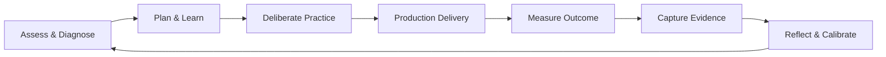

# Engineering Excellence Framework

> **"A craft without a framework is merely intuition; intuition cannot be systematically scaled or measured."**

This directory contains the core conceptual architecture of **Domain 25 — Software Engineer Excellence**. It establishes the foundational philosophy, the continuous improvement cycle, the multi-dimensional capability formula, the evidence-based progression model, and the holistic engineering health score.

---

## Directory Documents

| Document | Focus | Core Question Answered |
| :--- | :--- | :--- |
| **[engineer-excellence-framework.md](./engineer-excellence-framework.md)** | Core Architecture | *How do the dimensions, loops, and feedback mechanisms interlock into a coherent operating framework?* |
| **[continuous-improvement-cycle.md](./continuous-improvement-cycle.md)** | Improvement Engine | *What is the step-by-step loop (Assess $\to$ Diagnose $\to$ Practice $\to$ Apply $\to$ Measure $\to$ Reflect)?* |
| **[engineering-excellence-model.md](./engineering-excellence-model.md)** | Capability Formula | *How do Knowledge, Skill, Practice, Judgment, Execution, and Evidence combine into true capability?* |
| **[evidence-based-development.md](./evidence-based-development.md)** | Anti-Credentialism | *Why must capability be proven through Claim $\to$ Practice $\to$ Outcome $\to$ Evidence rather than certificates?* |
| **[engineering-health-model.md](./engineering-health-model.md)** | Health Profile | *How do we monitor technical, operational, and delivery health without falling into vanity metric traps?* |

---

## The Core Feedback Loop

All other sections in `25-engineer-excellence/`—including competency assessments, 90-day cycles, and practical challenges—rest upon the principles detailed in this framework foundation.
