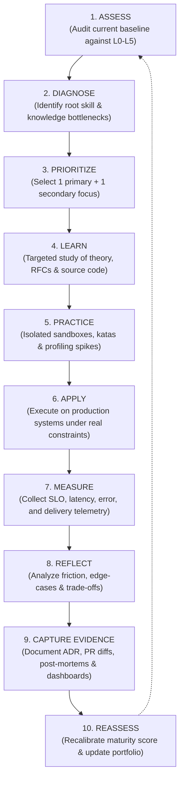
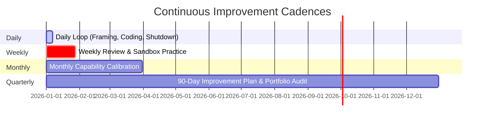

# The Continuous Improvement Cycle

> **"Most engineers do not have ten years of experience; they have one year of experience repeated ten times. Continuous improvement is the deliberate algorithm that breaks this plateau."**

---

## 1. Overview of the Improvement Engine

The **Continuous Improvement Cycle (CIC)** is a closed-loop cybernetic feedback mechanism designed to systematically elevate engineering capability. Rather than relying on sporadic bursts of enthusiasm or annual performance panic, the CIC embeds steady, iterative growth into the software engineer's routine.

---

## 2. The 10 Steps of the Continuous Improvement Cycle

### Step 1: Assess (Audit Current Baseline)
Before any progress can occur, the engineer must obtain an unvarnished audit of current capability across the [10 Excellence Dimensions](../competency-model/competency-model.md).
- **Tool**: [Self-Assessment Diagnostic](../assessment/self-assessment.md).
- **Anti-Pattern**: Inflationary self-rating based on perceived effort or tenure ("I've been here 4 years, so I must be L3 in distributed systems").
- **Output**: A calibrated maturity score (L0–L5) for each dimension with concrete behavioral justifications.

### Step 2: Diagnose (Root Cause Analysis of Gaps)
Identify the exact theoretical, practical, or environmental bottlenecks preventing advancement.
- **Diagnostic Framework**:
  - *Is it a Knowledge gap?* (e.g., Engineer does not understand TCP window exhaustion).
  - *Is it a Practice gap?* (e.g., Engineer understands the Raft algorithm conceptually but has never written an RPC state machine).
  - *Is it an Environmental gap?* (e.g., The team currently lacks distributed caching opportunities).
- **Output**: A clear diagnostic problem statement (e.g., *"My system designs fail at scale because I default to synchronous REST calls instead of decoupled event streaming"*).

### Step 3: Prioritize (Constrain Active WIP)
Attempting to improve across all 10 dimensions simultaneously guarantees superficial progress and eventual burnout.
- **The 1+1 Rule**: 
  - **1 Primary Growth Priority** (e.g., System Design: L1 $\to$ L2). Target: 70% of discretionary learning time.
  - **1 Secondary Growth Priority** (e.g., Production Telemetry: L1 $\to$ L2). Target: 30% of discretionary learning time.
  - **All other dimensions**: Maintenance mode (keep operational standards high, but do not set stretch objectives).
- **Output**: Documented focus areas within the [90-Day Improvement Plan](../improvement-cycle/90-day-improvement-plan.md).

### Step 4: Learn (Targeted Conceptual Acquisition)
Ingest authoritative computer science and systems literature. Avoid generic video tutorials and superficial blog summaries.
- **Target Materials**:
  - Authoritative literature (e.g., Kleppmann's *Designing Data-Intensive Applications*, Tanenbaum's *Distributed Systems*).
  - Technical RFCs and specifications (e.g., IETF RFC 9110, OpenTelemetry specifications).
  - Production codebases of proven open-source platforms (e.g., Envoy, PostgreSQL, Kafka).
- **Output**: Annotated reading notes and conceptual architecture diagrams.

### Step 5: Practice (Deliberate Sandbox Spikes)
Practice in an isolated, failure-tolerant environment before touching production code.
- **Execution**:
  - Build architectural spikes (see [Engineering Challenges](../challenges/)).
  - Benchmark performance using tools like `k6`, `wrk`, or `go bench`.
  - Simulate chaos: kill nodes, inject network packet drops, simulate disk saturation.
- **Verification Gate**: Do not apply a new architectural pattern in production until you have successfully broken and repaired it in a sandbox.

### Step 6: Apply (Real Project Execution)
Apply the newly cultivated capability to a high-impact, real-world business initiative.
- **Execution Constraints**:
  - Write an explicit Architecture Decision Record (ADR) or RFC before coding.
  - Establish measurable Non-Functional Requirements (NFRs) up front (e.g., P99 latency $< 50\text{ms}$, 99.99% availability).
  - Ship code incrementally via dark launches, feature flags, or canary releases.
- **Output**: Merged pull requests, production-deployed services, and automated test pipelines.

### Step 7: Measure (Production Telemetry & Impact)
Evaluate the real-world outcome using hard operational and business telemetry.
- **Operational Metrics**: P95/P99 latency profiles, memory footprints, error budgets, CPU utilization under load.
- **Delivery Metrics**: Lead time for changes, defect escape rate, deployment frequency.
- **Business Impact**: Infrastructure cost reduction, support ticket volume drop, transaction throughput increase.

### Step 8: Reflect (Forensic Evaluation & Retrospective)
Analyze the delta between what was predicted and what actually occurred in production.
- **Questions for Reflection**:
  1. *What unexpected edge cases or failure modes emerged under load?*
  2. *Which assumptions in the design RFC proved false?*
  3. *What cognitive friction or technical debt was inadvertently introduced?*
- **Format**: Personal engineering retrospective or post-incident review (blameless).

### Step 9: Capture Evidence (Portfolio Hardening)
Synthesize the work into verifiable artifacts that permanently validate the capability claim.
- **Verifiable Artifacts**:
  - Merged PR links showing clean refactoring, concurrency primitives, or test coverage.
  - Accepted ADRs documenting trade-offs, evaluated alternatives, and consequences.
  - Grafana/Datadog dashboard screenshots showing verified performance gains.
  - Blameless incident post-mortem documenting root cause identification and architectural remediation.
- **Output**: Updated [Engineering Portfolio](../evidence/engineering-portfolio.md).

### Step 10: Reassess (Calibrate & Next Cycle)
Re-evaluate your maturity profile. Has the primary dimension crossed the threshold from L1 to L2, or L2 to L3?
- If **Yes**: Consolidate the capability into your permanent daily habits, and select the next primary priority.
- If **No**: Diagnose why the cycle failed to achieve the target maturity (e.g., lack of deliberate practice, inadequate measurement) and iterate.

---

## 3. The Multi-Scale Cadence of Improvement

Continuous improvement operates at four synchronized temporal frequencies:

| Cadence | Primary Activity | Focus Document |
| :--- | :--- | :--- |
| **Daily** | Morning framing, focused execution blocks, clean shutdown, blocker logging. | [daily-engineering-loop.md](../engineer-operating-system/daily-engineering-loop.md) |
| **Weekly** | PR self-audit, reviewing one external RFC/incident, 2-hour sandbox coding drill. | [weekly-improvement.md](../improvement-cycle/weekly-improvement.md) |
| **Monthly** | Health check audit, 1-on-1 career calibration, reviewing metric trends. | [monthly-improvement.md](../improvement-cycle/monthly-improvement.md) |
| **Quarterly** | 90-day plan retrospective, evidence portfolio update, promotion readiness check. | [90-day-improvement-plan.md](../improvement-cycle/90-day-improvement-plan.md) |

---

## 4. Anti-Patterns in Continuous Improvement

| Anti-Pattern | Description | Remediation |
| :--- | :--- | :--- |
| **Tutorial Hell** | Consuming endless courses and reading books without ever writing code or building spikes. | Enforce the **1:2 Learning-to-Building Ratio**: For every 1 hour of reading, spend 2 hours building and breaking code in a sandbox. |
| **Resume-Driven Development** | Adopting unproven frameworks or distributed systems solely to check a personal career box. | Enforce explicit ADR reviews. Architecture decisions must be justified by business requirements, not personal learning desires. |
| **The Unmeasured Spike** | Building an experiment or refactoring without establishing baseline performance before and after. | Never optimize without a benchmark (`k6`, `wrk`, or memory profiler) capturing P99 latency and CPU profiles. |
| **Single-Dimension Fixation** | Obsessing over coding speed or algorithms while ignoring production telemetry, security, and team collaboration. | Review the [Engineering Health Scorecard](../assessment/engineering-health-assessment.md) quarterly to identify blind spots. |
