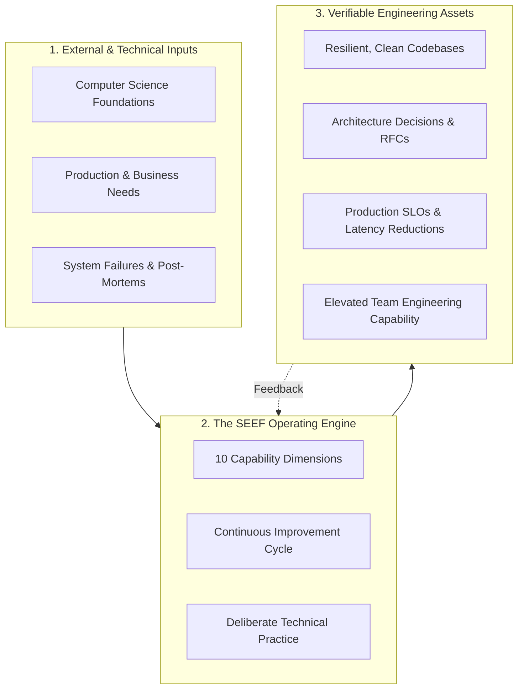
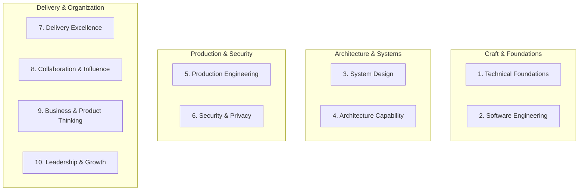
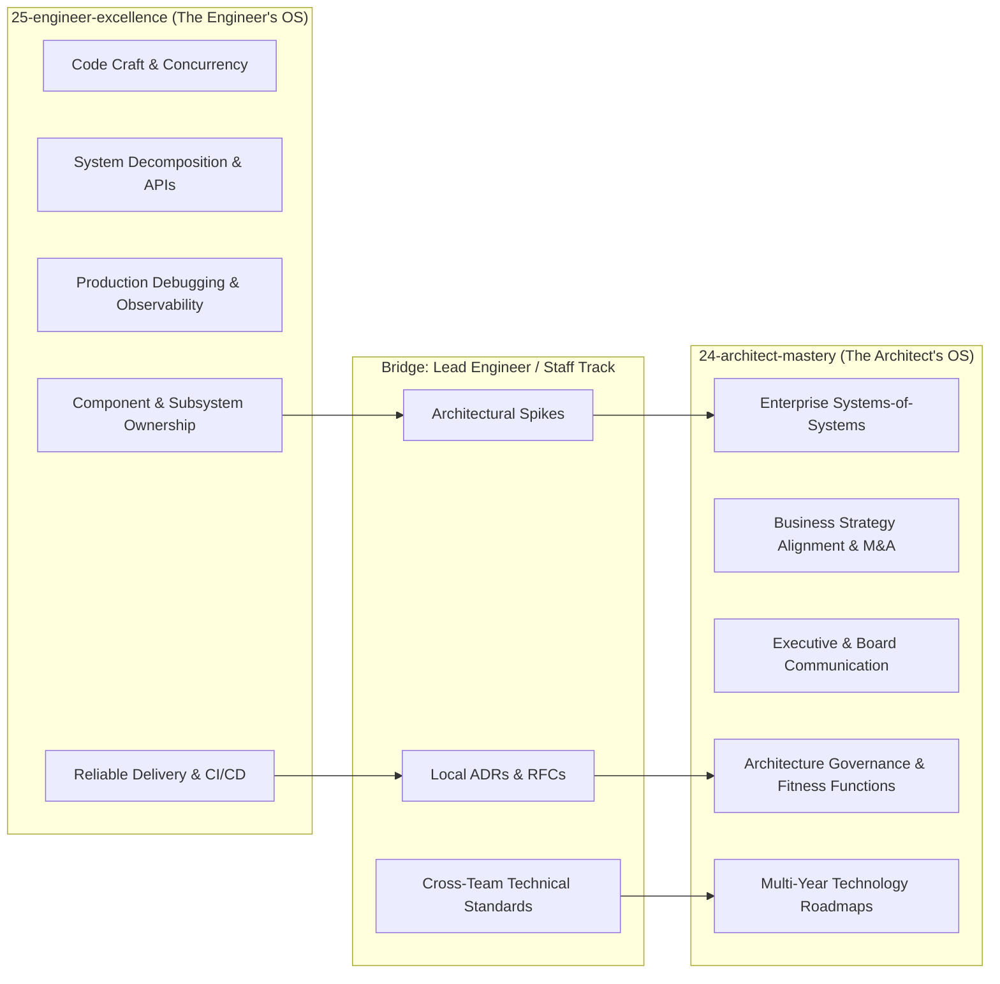

# The Software Engineer Excellence Framework

> **"True engineering maturity is the transition from 'I wrote the code and it runs on my machine' to 'I designed the system, verified its boundaries, automated its delivery, observed its production telemetry, and took accountability for its failure modes.'"**

---

## 1. Executive Overview

The **Software Engineer Excellence Framework (SEEF)** is an operational architecture designed to transform individual software engineering capability. In high-performing engineering organizations, senior leadership cannot rely on ad-hoc tenure, tribal heuristics, or superficial certification metrics to build technical excellence.

SEEF organizes software engineering into an integrated operating system:
1. **The Capability Engine**: Systematically diagnosing and advancing skills across 10 core dimensions.
2. **The Execution Cadence**: Translating theoretical knowledge into daily, weekly, and quarterly delivery rhythms.
3. **The Evidence Ledger**: Maintaining verifiable proof of real-world outcomes, system resilience, and code quality.

---

## 2. Core Architectural Principles

The framework is governed by six immutable tenets:

### Tenet 1: Capability Over Credentials
Certifications, degrees, and conference attendance prove exposure, not execution capability. Capability is only proven when an engineer can reliably diagnose an unfamiliar failure, formulate a defensible design, and ship working software into an unpredictable production environment.

### Tenet 2: The Shift-Left Ownership Model
An engineer's responsibility does not end when code is merged into `main`. The engineer owns:
- Local testability and automated test suites.
- CI/CD build stability and deployment pipelines.
- Security boundary validation and secrets management.
- Production telemetry, SLO monitoring, alerting, and incident response.

### Tenet 3: Deliberate Practice Precedes High-Stakes Execution
Surgeons do not practice new incisions during emergency cardiac arrests; pilots do not learn stall recovery with 300 passengers on board. Software engineers must cultivate skills through isolated sandboxes, architectural spikes, and performance profiling drills before executing under high-stakes production deadlines.

### Tenet 4: Continuous Architecture, Not Ivory-Tower Dictates
Architecture is not an isolated function reserved for a remote committee. In a modern engineering organization, every senior engineer is an practicing architect at the component and subsystem level. The framework explicitly trains engineers in the writing of Architecture Decision Records (ADRs), system boundary definition, and trade-off analysis.

### Tenet 5: Evidence-Based Claims
Any assertion of competency must be backed by verifiable artifacts:
- *Weak*: "I am proficient in distributed systems."
- *Strong*: "I redesigned our order processing engine with an idempotent transactional outbox pattern, reducing downstream duplicate transactions to 0.00% across 12 million daily events, documented in ADR-042 and verified in Grafana dashboard `order-exec-v2`."

### Tenet 6: Multi-Dimensional Health
Technical brilliance combined with toxic communication or reckless delivery produces net-negative organizational value. Engineering excellence balances deep technical craftsmanship with delivery discipline, security diligence, and empathetic peer collaboration.

---

## 3. The 10 Dimensions of Engineering Excellence

The framework organizes engineering capability into ten distinct dimensions. Each dimension progresses along a standardized [L0–L5 maturity scale](../capability-matrix/maturity-levels.md).

| Dimension | Scope & Primary Focus | Repository Cross-Reference |
| :--- | :--- | :--- |
| **1. Technical Foundations** | CPU caching, memory allocation, OS threads, networking protocols, I/O models, and algorithmic complexity. | [00-foundations/](../../00-foundations/) |
| **2. Software Engineering** | Modular design, SOLID, refactoring patterns, unit/integration testing, clean interfaces, and code review. | [03-backend/](../../03-backend/) |
| **3. System Design** | Scalability, availability, CAP theorem, caching strategies, messaging topologies, and distributed state. | [02-system-design/](../../02-system-design/) |
| **4. Architecture Capability** | Subsystem boundaries, ADRs, trade-off analysis, evolutionary design, and enterprise integration. | [01-architecture/](../../01-architecture/), [24-architect-mastery/](../../24-architect-mastery/) |
| **5. Production Engineering** | Observability, metric design, distributed tracing, alerting hygiene, SLOs, and incident forensics. | [11-observability/](../../11-observability/), [19-case-studies/](../../19-case-studies/) |
| **6. Security** | Shift-left security, OWASP top 10, cryptographic primitives, IAM, supply chain security, and threat modeling. | [10-security/](../../10-security/) |
| **7. Delivery Excellence** | Story decomposition, risk-adjusted estimation, trunk-based development, zero-downtime deployments, CI/CD. | [09-devops/](../../09-devops/) |
| **8. Collaboration** | High-signal code reviews, RFC authoring, structured mentorship, and cross-functional technical alignment. | [24-architect-mastery/leadership/](../../24-architect-mastery/leadership/) |
| **9. Business & Product Thinking** | Cost of delay, unit economics, cloud cost optimization, ROI, and translating technical choices to business value. | [24-architect-mastery/economics/](../../24-architect-mastery/economics/) |
| **10. Leadership & Growth** | Extreme ownership, psychological safety, driving consensus without authority, and deliberate continuous learning. | [24-architect-mastery/leadership/](../../24-architect-mastery/leadership/) |

---

## 4. Architectural Boundaries: Domain 25 vs. Domain 24

A common failure mode in career frameworks is blurring the boundary between engineering progression and dedicated architecture practice. SEEF enforces a strict separation of concerns:

- **Domain 25 (`25-engineer-excellence`)** answers: *"How do I master code, systems, production operations, and delivery to become a peerless technical builder and senior engineering leader?"*
- **Domain 24 (`24-architect-mastery`)** answers: *"How do I exercise multi-year strategic judgment, govern enterprise-wide architectures, communicate with C-suite executives, and navigate complex organizational politics?"*

---

## 5. Implementation Roadmap for Engineers & Teams

1. **For Individual Engineers**:
   - Establish your baseline using the [Self-Assessment Matrix](../assessment/self-assessment.md).
   - Identify your highest-leverage gap (e.g., strong in coding, weak in production telemetry).
   - Commit to a [90-Day Continuous Improvement Plan](../improvement-cycle/90-day-improvement-plan.md).
   - Capture your achievements and verified metrics in an [Engineering Portfolio](../evidence/engineering-portfolio.md).

2. **For Engineering Managers & Leads**:
   - Use the [Capability Matrix](../capability-matrix/role-capability-matrix.md) for transparent 1-on-1 career development discussions.
   - Replace subjective promotion arguments with objective, artifact-backed evidence.
   - Incorporate [Engineering Health Audits](../assessment/engineering-health-assessment.md) into quarterly team retrospectives.
