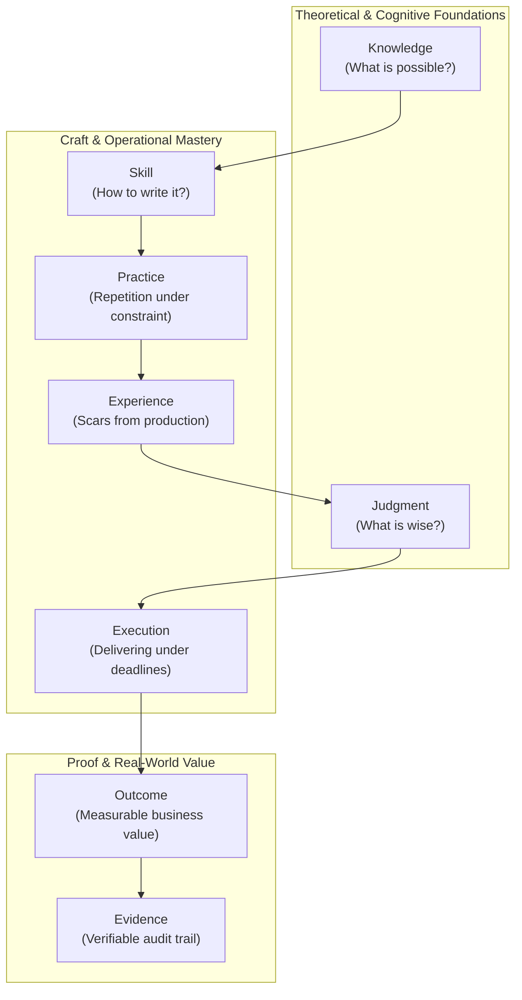
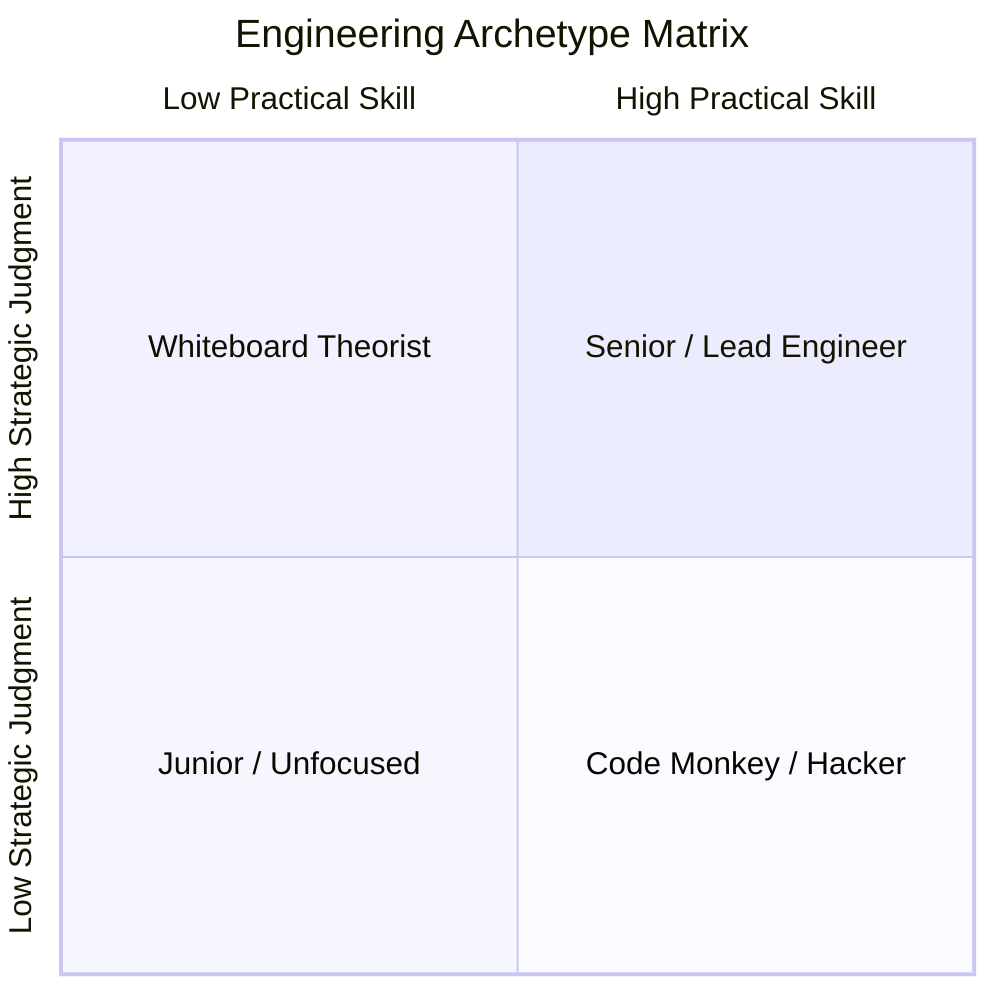

# The Engineering Excellence Model

> **"Knowledge is knowing what a distributed transaction is; Skill is writing a two-phase commit coordinator; Judgment is knowing never to use one if you can avoid it; and Execution is delivering the eventual-consistency saga that replaced it on schedule without losing a single cent."**

---

## 1. The Engineering Capability Formula

Many career matrices equate engineering capability with **tenure** (years in role) or **knowledge acquisition** (degrees, certifications, books read). This leads to organizational pathologies: senior engineers who cannot debug production deadlocks, or architects who design brittle, un-deployable abstractions.

The **Engineering Excellence Model** models capability as a multi-factored equation where each component serves a critical role:

$$\mathbf{Capability} = \mathbf{Knowledge} \times (\mathbf{Skill} + \mathbf{Practice}) \times \mathbf{Experience} \times \mathbf{Judgment} \times \mathbf{Execution} \to (\mathbf{Outcome} \land \mathbf{Evidence})$$

---

## 2. Anatomy of the Capability Formula

### 1. Knowledge (The Theoretical Base)
- **Definition**: The conceptual understanding of computer science, operating systems, data structures, network protocols, and architectural patterns.
- **Acquisition**: Technical books, academic papers, RFC specifications, and deep architecture teardowns.
- **Failure Mode Without It**: The *Cargo-Cult Coder* who copies solutions from StackOverflow or LLM prompts without understanding concurrency hazards, memory layouts, or algorithmic complexity.

### 2. Skill (The Hands-on Craft)
- **Definition**: The tactile fluency in turning abstract concepts into syntactically idiomatic, type-safe, maintainable, and bug-free code.
- **Acquisition**: Pair programming, refactoring legacy code, writing automated test suites, and building production components.
- **Failure Mode Without It**: The *Whiteboard Theorist* who can talk eloquently about microservices and CAP theorem but struggles to write clean, concurrent Go, Rust, Java, or TypeScript.

### 3. Practice (Deliberate Repetition)
- **Definition**: The intentional repetition of high-friction engineering scenarios in non-production environments to build muscle memory.
- **Acquisition**: Deliberate spikes, memory-leak profiling katas, chaos engineering drills, and building toy storage engines or HTTP routers from scratch.
- **Failure Mode Without It**: The *Stagnant Practitioner* whose technical growth is completely constrained by whatever superficial tasks happen to be on the current Jira sprint.

### 4. Experience (Battle Scars & Failure Modes)
- **Definition**: The lived exposure to real-world operational entropy: network partitions, cascading database deadlocks, memory leaks under load, and high-pressure incident mitigation.
- **Acquisition**: On-call rotations, incident commander roles, legacy system migrations, and post-mortem investigations.
- **Failure Mode Without It**: The *Naive Optimist* who designs systems assuming networks never partition, disks never fill up, third-party APIs never time out, and users always input valid data.

### 5. Judgment (Trade-Off Discernment)
- **Definition**: The cognitive ability to evaluate competing constraints (latency, cost, throughput, simplicity, delivery date) and choose the least harmful set of compromises.
- **Acquisition**: Forensic retrospectives, studying historical system failures, writing ADRs, and enduring the long-term maintenance consequences of past decisions.
- **Failure Mode Without It**: The *Over-Engineer* who introduces Kubernetes, Kafka, and CQRS to solve a problem that required a single PostgreSQL instance and a background worker.

### 6. Execution (Shipping Reliability)
- **Definition**: The discipline of decomposing complex, ambiguous initiatives into small, testable, incrementally deployable pull requests and shipping them on schedule.
- **Acquisition**: Trunk-based development, dark launching, feature flagging, risk-adjusted estimation, and relentless elimination of blockers.
- **Failure Mode Without It**: The *Perpetual Perfectionist* whose branch lives for 9 months, accumulates 4,000 merge conflicts, and never reaches production because it was never deemed "ready."

### 7. Outcome (Business & Operational Value)
- **Definition**: The quantifiable, positive shift in business revenue, operational reliability, developer productivity, or infrastructure cost produced by the engineer's work.
- **Metrics**: 
  - Reduced P99 latency by 65%.
  - Eliminated \$8,000/month in idle cloud compute.
  - Zero Sev-1 outages across 4 consecutive quarters.
  - Reduced deployment lead time from 3 days to 15 minutes.
- **Failure Mode Without It**: The *Busywork Champion* who submits 50 PRs a week refactoring variable names, yet the platform remains slow, unstable, and unprofitable.

### 8. Evidence (The Verifiable Trail)
- **Definition**: Permanent, publicly auditable engineering artifacts that prove the validity of claims, decisions, and outcomes.
- **Artifacts**: Merged Git diffs, accepted ADRs, published post-mortems, Datadog dashboards, performance benchmark scripts.
- **Failure Mode Without It**: The *Self-Promoter* whose perceived reputation is built on political maneuvering, charismatic presentations, and unsubstantiated claims in performance reviews.

---

## 3. Real-World Capability Profiles: Case Studies

The following scenarios demonstrate how the capability formula discriminates between different engineering archetypes:

### Archetype A: The Code Hacker
- **Profile**: High Skill, High Execution, Low Judgment, Zero Evidence.
- **Behavior**: Pumps out features at breakneck speed. Cuts corners on automated tests, hardcodes configurations, ignores edge cases, and leaves unmaintainable spaghetti code. Leaves the company before the technical debt explodes into Sev-1 incidents.
- **Diagnosis**: High initial velocity, catastrophic long-term organizational cost.

### Archetype B: The Ivory-Tower Academic
- **Profile**: High Knowledge, High Judgment, Low Skill, Low Execution.
- **Behavior**: Recommends complex event-driven microservice architectures for simple CRUD applications. Writes 40-page specification documents that no one reads. Paralyzed by edge cases; struggles to ship a functional service into production.
- **Diagnosis**: Analysis paralysis and zero business delivery.

### Archetype C: The Production Master (Target SEEF Profile)
- **Profile**: Balanced Knowledge, High Skill, Deliberate Practice, Deep Experience, Prudent Judgment, Relentless Execution, Backed by Concrete Evidence.
- **Behavior**: Diagnoses customer needs, designs the simplest architecture that satisfies NFRs, writes clean, modular, self-testing code, deploys behind feature flags, monitors Grafana dashboards during deployment, and documents key trade-offs in concise ADRs.
- **Diagnosis**: Sustainable, high-velocity, low-defect engineering impact.

---

## 4. How to Use the Model for Personal Calibration

When preparing for career conversations, 90-day improvement cycles, or role transitions, conduct a gap audit across the 8 elements:

| Element | Diagnostic Self-Audit Question | Warning Signal |
| :--- | :--- | :--- |
| **Knowledge** | *Can I explain the OS, memory, and network mechanics behind my framework?* | Relying on framework "magic" without knowing what happens under the hood. |
| **Skill** | *Can I quickly write clean, modular, testable code without constant IDE assistance?* | Struggling to write unit tests for complex domain logic without mocking everything. |
| **Practice** | *Did I build and benchmark any isolated technical spikes outside my sprint tickets this month?* | Only learning when forced by an urgent production bug. |
| **Experience** | *Have I participated in on-call rotations and investigated complex multi-service outages?* | Feeling panicked or helpless when a production P1 alert fires. |
| **Judgment** | *Did I push back against unnecessary complexity or unproven technology this quarter?* | Choosing new databases or languages simply because they are trending on social media. |
| **Execution** | *Did my last 3 major features ship on time with zero post-release regressions?* | Habitually slipping deadlines or introducing bugs that break production. |
| **Outcome** | *Can I cite 3 specific, quantified business or operational metrics improved by my work?* | Measuring personal success solely by number of PRs or tickets closed. |
| **Evidence** | *Do I have clickable links to ADRs, post-mortems, and dashboards to back my claims?* | Relying on memory and verbal assertions during annual performance reviews. |
