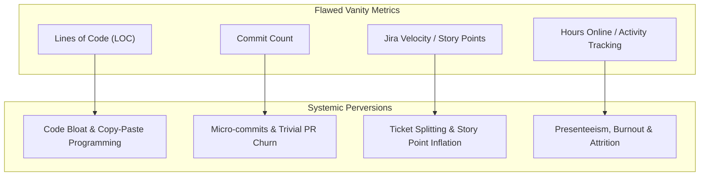
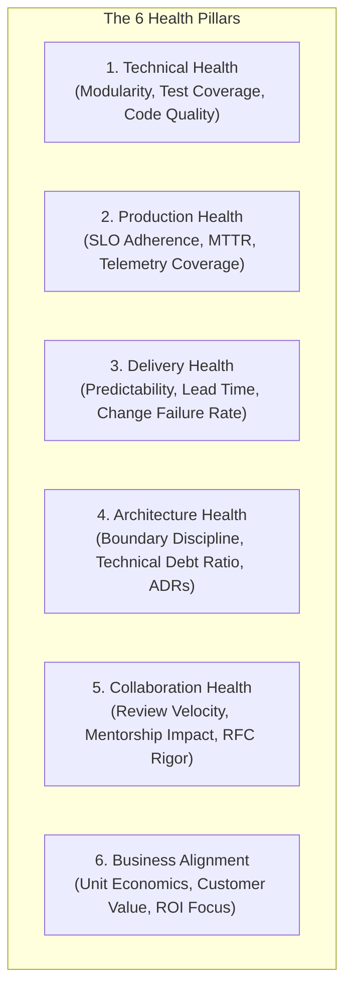

# The Engineering Health Model

> **"Show me how you measure an engineer, and I will show you how they will subvert your architecture."**

---

## 1. The Perils of Simplistic Engineering Metrics

Throughout the software industry, engineering performance has historically been corrupted by simplistic, one-dimensional metrics. These metrics are notoriously vulnerable to Goodhart's Law (*"When a measure becomes a target, it ceases to be a good measure"*):



Engineering productivity and excellence cannot be collapsed into a single scalar number. A senior engineer who spends three weeks investigating an insidious memory leak, writes zero new features, deletes 400 lines of obsolete code, and documents a permanent prevention rule in an ADR has created vastly more business and technical value than an engineer who churns out 20,000 lines of untested, brittle code across 50 commits.

---

## 2. The Multi-Dimensional Health Matrix

The **Engineering Health Model (EHM)** evaluates engineering health across six balanced quadrants. Every quadrant balances speed with stability, and individual craft with organizational leverage:

```mermaid
radar-chart
    title Engineering Health Profile
    axis Technical Health, Production Health, Delivery Health, Architecture Health, Collaboration Health, Business Alignment
    curve true
```



| Health Pillar | High-Integrity Indicators | Degraded Warning Signals |
| :--- | :--- | :--- |
| **1. Technical Health** | Comprehensive unit/integration suites; minimal cognitive complexity; clean module boundaries; fast local builds ($< 60\text{s}$). | High cyclomatic complexity; fragile end-to-end tests that flake; copy-pasted logic; slow builds ($> 20\text{m}$). |
| **2. Production Health** | Services operate within established error budgets; 100% telemetry coverage (logs, metrics, traces); actionable alerts; zero repeat Sev-1s. | Alert fatigue; frequent manual database interventions; unmonitored background workers; high MTTR ($> 4\text{h}$). |
| **3. Delivery Health** | High deployment frequency; lead time for changes $< 1\text{ day}$; small PR batch sizes ($< 250$ lines changed); low change failure rate ($< 5\%$). | Massive multi-thousand line PRs; branch living for weeks; frequent rollbacks; sprint commitments routinely missed. |
| **4. Architecture Health** | Documented ADRs for key trade-offs; low coupling; strict domain boundary enforcement; proactive tech-debt retirement budget ($15\text{--}20\%$). | Undocumented architectural drift; circular dependencies; database shared between services without contracts. |
| **5. Collaboration Health** | High-signal, respectful code review feedback; timely PR turnarounds ($< 24\text{h}$); active mentorship of junior engineers; clear RFCs. | Nitpicky, pedantic code reviews; PRs sitting unreviewed for days; gatekeeping knowledge; silos of code ownership. |
| **6. Business Alignment** | Deep understanding of user workflows; proactive cloud cost optimization; awareness of unit economics (e.g., cost per query/transaction). | Treating business requirements as nuisances; building over-engineered solutions for low-value internal tools. |

---

## 3. The Composite Health Scorecard & Limitations

When organizations require a summary metric for tracking broad health trends across engineering cohorts, the **Composite Health Index (CHI)** can be calculated using a weighted vector:

$$\mathbf{CHI} = w_1 \cdot \text{Tech} + w_2 \cdot \text{Prod} + w_3 \cdot \text{Deliv} + w_4 \cdot \text{Arch} + w_5 \cdot \text{Collab} + w_6 \cdot \text{Biz}$$

Where weights ($\sum w_i = 1.0$) are calibrated by organizational maturity:
- **Seed / Early Stage**: Delivery ($0.30$), Business ($0.25$), Tech ($0.20$), Prod ($0.15$), Collab ($0.05$), Arch ($0.05$).
- **Growth / Scale Stage**: Prod ($0.25$), Delivery ($0.20$), Tech ($0.20$), Arch ($0.15$), Collab ($0.10$), Business ($0.10$).
- **Enterprise / Critical Infrastructure**: Prod ($0.30$), Arch ($0.20$), Security/Tech ($0.20$), Collab ($0.10$), Delivery ($0.10$), Business ($0.10$).

### Mandatory Warnings & Limitations:
1. **Never use the numerical score for compensation or termination**: As soon as salary is tied to CHI, teams will optimize the metric inputs rather than the engineering reality.
2. **Confidence Bounds**: A score without an audit trail of concrete evidence has zero confidence. An engineer scoring 4.2 with verified Grafana dashboards and ADRs is superior to an engineer claiming 4.8 based on self-reported feelings.
3. **Use for Diagnostic Coaching**: The primary purpose of the scorecard is to highlight unaddressed friction points (e.g., *"Our Delivery Health is dropping because our PR review turnaround time has doubled this month"*).

---

## 4. Engineering Health Diagnostic Audit

Engineers and teams should perform this audit at the conclusion of every monthly or quarterly cycle:

```markdown
### Monthly Engineering Health Audit Template

**Engineer / Team**: Billing & Ingestion Core
**Evaluation Period**: Q3 2026

#### Pillar 1: Technical & Code Health
- [x] Unit test execution runs locally in under 60 seconds.
- [x] Static analysis (linter, SonarQube, security SAST) reports 0 high/critical issues.
- [ ] Technical debt items were formally scheduled and addressed during this cycle (1/3 completed).
*Score*: 3.8 / 5.0

#### Pillar 2: Production & Operational Health
- [x] All production services met their availability SLO (99.99%).
- [x] P99 latency remained within agreed SLAs under synthetic and peak traffic.
- [x] Zero un-actionable alerts paged the on-call engineer during this rotation.
*Score*: 4.5 / 5.0

#### Pillar 3: Delivery & Release Health
- [x] Average PR turnaround time was under 18 hours.
- [x] Average PR size remained under 300 lines of code.
- [ ] 2 releases required minor rollbacks due to migration lock timeouts.
*Score*: 3.5 / 5.0

#### Pillar 4: Architecture & Design Health
- [x] 2 ADRs written, reviewed, and accepted for schema decoupling.
- [x] No circular dependencies detected in dependency graph.
*Score*: 4.5 / 5.0

#### Pillar 5: Collaboration & Cultural Health
- [x] Conducted 12 code reviews with constructive, actionable architectural feedback.
- [x] Hosted 1 brown-bag tech talk on Kafka consumer group rebalancing.
*Score*: 4.2 / 5.0

#### Priority Remediation for Next Cycle:
Focus on eliminating database lock contention during migrations to restore Delivery Health to 4.5+.
```

See [engineering-health-assessment.md](../assessment/engineering-health-assessment.md) for full interactive evaluation forms.
