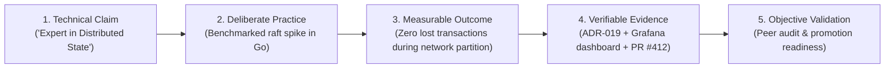
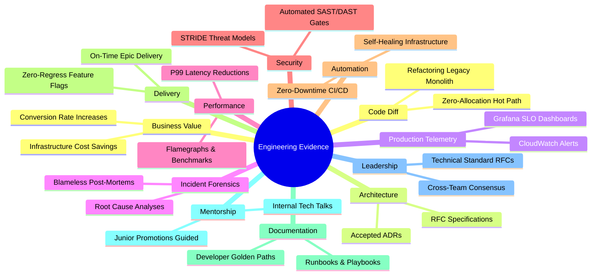
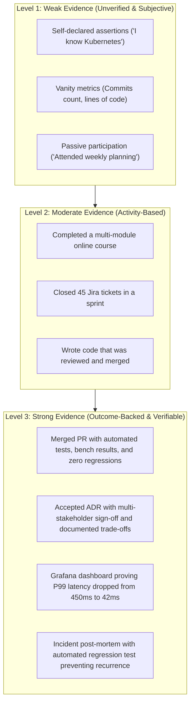

# Evidence-Based Engineering Development

> **"In God we trust; all others must bring telemetry, code diffs, and accepted ADRs."**

---

## 1. The Anti-Credentialist Manifesto

In modern software engineering, traditional credentialing mechanisms have collapsed under the weight of commercial inflation:
- Multiple-choice cloud certifications can be passed via memorization brain dumps without ever deploying a VPC.
- University computer science degrees frequently fail to teach Git discipline, CI/CD, production telemetry, or legacy refactoring.
- Years of experience ("tenure") frequently correlate with organizational comfort rather than technical mastery.
- Self-evaluations are inherently prone to the Dunning-Kruger effect.

**Evidence-Based Development (EBD)** replaces credentialism and subjective self-ratings with a verifiable evidentiary standard:



If an engineer claims proficiency in an engineering discipline, they must provide verifiable, reproducible artifacts showing the real-world outcome of that proficiency.

---

## 2. The 12 Canonical Evidence Categories

To build an incontrovertible engineering portfolio, artifacts are categorized across 12 distinct evidence types:



| Category | High-Value Evidence Artifact | Weak / Unacceptable Evidence |
| :--- | :--- | :--- |
| **1. Code Diff** | Pull request demonstrating clean architectural boundaries, comprehensive unit/integration tests, and zero deadlocks. | "I wrote 15,000 lines of code last month." |
| **2. Architecture** | Accepted ADR documenting evaluated alternatives, trade-offs, consequences, and fitness functions. | Whiteboard photo with no context, trade-offs, or follow-through. |
| **3. Production** | Telemetry dashboard demonstrating compliance with a strict SLO (e.g., 99.99% availability over 90 days). | "The service feels stable." |
| **4. Incident** | Published blameless post-mortem identifying systemic contributing factors and implementing permanent architectural guardrails. | "I stayed up all night to restart the server when it crashed." |
| **5. Performance** | Benchmark reports (e.g., `k6`, `wrk`, flamegraphs) proving a $>50\%$ drop in P99 latency or CPU utilization. | "I refactored the loop to make it faster." |
| **6. Security** | Threat model document (STRIDE) identifying an attack vector, accompanied by automated integration tests and mitigation code. | "I completed the mandatory annual security compliance quiz." |
| **7. Automation** | Fully automated CI/CD pipeline achieving $<10\text{m}$ commit-to-production lead time with automated canary rollback. | "I manually deployed the code using an SSH bash script." |
| **8. Delivery** | Delivering a critical multi-month initiative on schedule through incremental feature flagging and zero regressions. | "I worked 60 hours a week to finish the sprint." |
| **9. Documentation** | Comprehensive incident runbook or onboarding golden path that reduced team ramp-up time from 4 weeks to 3 days. | Outdated Confluence page with broken links and stale instructions. |
| **10. Mentorship** | Guided a junior engineer through their first major system design, leading to their successful independent delivery and promotion. | "I am always available on Slack to answer questions." |
| **11. Leadership** | Driving consensus across 3 divergent engineering teams to standardize an internal API protocol via an RFC process. | "I voiced my opinion loudly in the architecture meeting." |
| **12. Business Value** | Direct, quantified business outcome (e.g., eliminated \$140,000/year in cloud egress fees through VPC endpoint re-architecture). | "Management seemed very pleased with the project." |

---

## 3. Evidence Quality Rubric: Weak vs. Strong

When assessing an engineering portfolio, evaluate each artifact against the **Evidence Quality Rubric**:



### The 4 Criteria of High-Grade Evidence:
1. **Verifiability**: Can an independent staff engineer or architect click a link, inspect the Git commit history, and examine the telemetry data directly?
2. **Attribution**: Is the individual's specific contribution clearly isolated from the broader team's work?
3. **Counterfactual Rigor**: What would have happened if this work was not done? Did it tangibly prevent failure or create new business leverage?
4. **Longevity**: Did the system survive the test of production reality over 3 to 6 months without degrading into chronic operational burden?

---

## 4. Constructing the Engineering Portfolio

Engineers should maintain a live, machine-readable repository or document tracking their evidence ledger:

```yaml
# engineering-evidence-entry.yaml
entry_id: EVD-2026-004
date: 2026-08-14
author: "Engineering Lead / Senior IC"
dimension: "System Design & Production Engineering"
target_maturity: "L3 -> L4"

claim: "Engineered high-throughput, idempotent payment webhook ingestion engine."

context:
  problem: "Third-party payment gateways flooded ingestion endpoint with duplicate webhooks during retries, causing database row-locking and duplicate credit allocations."
  scale: "18,000 requests/sec peak, $45M daily transactional volume."

practice_and_execution:
  spike: "Benchmarked Redis distributed locks vs. PostgreSQL transactional advisory locks using k6 in sandbox environment."
  implementation: "Implemented transactional outbox with Redis Bloom filter deduplication layer and PostgreSQL unique idempotency keys."

artifacts:
  adr: "https://github.com/company/architecture-decisions/blob/main/adr/0042-idempotent-webhooks.md"
  pull_request: "https://github.com/company/billing-service/pull/1289"
  dashboard: "https://grafana.internal.net/d/billing-idempotency-v2"
  post_mortem: "https://company.atlassian.net/wiki/spaces/ENG/pages/90124/post-mortem-inc-402"

outcomes:
  duplicate_allocations: "Reduced from 0.04% (approx. $18,000/day) to 0.0000%."
  p99_latency: "Dropped from 840ms to 38ms under 2x peak synthetic load."
  operational_toil: "Zero on-call alerts triggered for webhook ingestion in the subsequent 90 days."

validation:
  reviewed_by: "Principal Solution Architect"
  status: "Verified & Accepted"
```

See [evidence-types.md](../evidence/evidence-types.md) and [engineering-portfolio.md](../evidence/engineering-portfolio.md) for full formatting standards and portfolio management guides.
