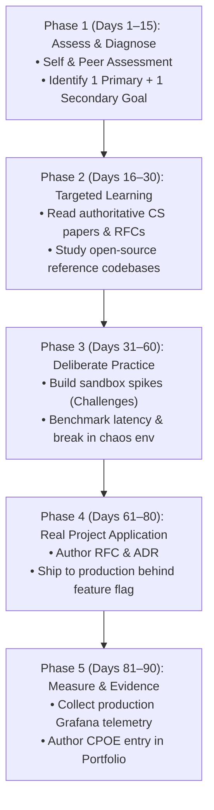

# The 90-Day Engineering Improvement Plan

> **"Most people overestimate what they can accomplish in a single week, and vastly underestimate what they can systematically achieve in 90 days of deliberate, focused practice."**

---

## 1. The Canonical 90-Day Architecture

The **90-Day Improvement Plan** is the core execution vehicle of Domain 25. It structures capability acquisition into five distinct, sequential phases that guarantee theoretical knowledge is translated into real-world production evidence:

```mermaid
gantt
    title The Canonical 90-Day Continuous Improvement Roadmap
    dateFormat  X
    axisFormat Day %s
    section Phase 1
    Phase 1: Assess & Diagnose (Days 1–15) :active, 1, 15
    section Phase 2
    Phase 2: Targeted Learning (Days 16–30) :16, 30
    section Phase 3
    Phase 3: Sandbox Spikes & Benchmarking (Days 31–60) :31, 60
    section Phase 4
    Phase 4: Real Production Application (Days 61–80) :61, 80
    section Phase 5
    Phase 5: Measurement, Evidence & Reflection (Days 81–90) :81, 90
```

---

## 2. Phase-by-Phase Breakdown



### Phase 1: Assessment & Diagnosis (Days 1–15)
- **Activity**: Complete the [Self-Assessment](../assessment/self-assessment.md) and run the [Capability Gap Analysis](../assessment/capability-gap-analysis.md).
- **Deliverable**: A calibrated baseline score and selection of **1 Primary Goal** (70% focus) and **1 Secondary Goal** (30% focus).
- **Rule**: Lock in the scope. Do not alter goals after Day 15.

### Phase 2: Targeted Learning (Days 16–30)
- **Activity**: Ingest deep, authoritative literature on the target capability.
- **Rules**: Zero video tutorials or superficial blog posts. Read:
  - Technical book chapters (e.g., Kleppmann, Tanenbaum, Fowler).
  - Official specifications (IETF RFCs, OpenTelemetry specs).
  - Production codebases of proven OSS systems (PostgreSQL, Envoy, Kafka).
- **Deliverable**: Annotated reading summary and architecture diagrams.

### Phase 3: Sandbox Practice & Spikes (Days 31–60)
- **Activity**: Build isolated, failure-tolerant code experiments (see [Engineering Challenges](../challenges/)).
- **Rules**: Never touch production code in this phase.
  - Build the pattern from scratch in a local toy repository.
  - Profile memory allocations, CPU hot paths, and lock contention.
  - Subject the spike to synthetic chaos (inject latency, kill nodes).
- **Deliverable**: A working, benchmarked GitHub sandbox repository.

### Phase 4: Production Application (Days 61–80)
- **Activity**: Apply the newly mastered pattern to a real business initiative in your team's production codebase.
- **Rules**:
  - Author a formal Architecture Decision Record (ADR) or RFC before writing production code.
  - Decompose the implementation into thin vertical slices ($< 250$ lines per PR).
  - Ship code behind feature flags using progressive canary rollouts.
- **Deliverable**: Merged pull requests and deployed production service.

### Phase 5: Measurement, Reflection & Evidence (Days 81–90)
- **Activity**: Verify production outcomes and assemble permanent portfolio artifacts.
- **Deliverable**:
  - Production telemetry capture (P99 latency, error rates, cost savings).
  - A formatted **Claim $\to$ Practice $\to$ Outcome $\to$ Evidence (CPOE)** entry in [portfolio.yaml](../evidence/engineering-portfolio.md).
  - Post-mortem or retrospective document detailing lessons learned.
  - Re-calibration of your score on the [Maturity Rubric](../capability-matrix/maturity-levels.md).

---

## 3. The Reusable 90-Day Plan Template

```markdown
# 90-Day Engineering Improvement Plan

**Engineer**: [Name]
**Current Role**: Software Engineer (L2)
**Target Horizon**: Q3 2026

## 1. Focus Objectives
- **Primary Focus (70%)**: Dimension 3: System Design (L2 -> L3)
  *Goal*: Master high-throughput, idempotent event-driven architectures.
- **Secondary Focus (30%)**: Dimension 5: Production Engineering (L1 -> L2)
  *Goal*: Master Prometheus RED metric instrumentation and on-call alerting.

---

## 2. Milestone Execution Roadmap

### Phase 1: Assessment & Baseline (Days 1–15)
- [ ] Complete 40-question self-assessment audit.
- [ ] Review baseline with Tech Lead during monthly 1-on-1.
- [ ] Establish initial hypothesis and project alignment.

### Phase 2: Targeted Learning (Days 16–30)
- [ ] Read Kleppmann, *Designing Data-Intensive Applications*, Chapters 11 & 12 (Stream Processing & Reliability).
- [ ] Study the Kafka transactional producer/consumer specification.
- [ ] Read Stripe's engineering blog on payment webhook idempotency.

### Phase 3: Deliberate Sandbox Practice (Days 31–60)
- [ ] Build a standalone Go/Java toy service implementing the Transactional Outbox pattern with Redis Bloom filter deduplication.
- [ ] Benchmark using `k6` under 10,000 requests/sec with injected network latency.
- [ ] Verify zero duplicate records created under concurrent replay attack.

### Phase 4: Production Application (Days 61–80)
- [ ] Author ADR-042 proposing the idempotent payment webhook architecture.
- [ ] Decompose the implementation into 4 vertical PRs merged to `main`.
- [ ] Deploy behind feature flag `billing-idempotency-v2` with canary traffic.

### Phase 5: Measurement & Evidence (Days 81–90)
- [ ] Verify production metrics: 0% duplicate charges across 10M events, P99 latency < 40ms.
- [ ] Author CPOE entry `EVD-2026-004` and commit to `portfolio.yaml`.
- [ ] Conduct end-of-cycle review with Tech Lead; recalibrate System Design to L3.
```
