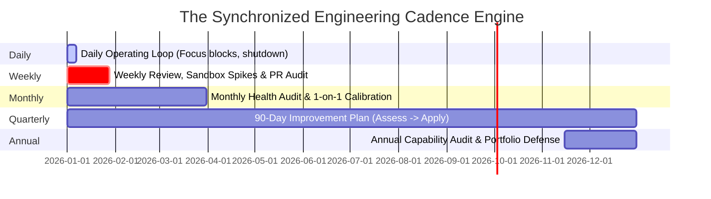

# Engineering Continuous Improvement Cycles

> **"We are what we repeatedly do. Engineering excellence, then, is not an act, but a rhythm."**

This directory defines the temporal cadences and execution blueprints of **Domain 25 — Software Engineer Excellence**. It translates theoretical capability frameworks into concrete daily, weekly, monthly, quarterly, and annual improvement rituals.

---

## Directory Documents

| Document | Cadence & Focus | Core Question Answered |
| :--- | :--- | :--- |
| **[weekly-improvement.md](./weekly-improvement.md)** | Weekly Rituals (2–3h/wk) | *How do I integrate deliberate practice, code reviews, and technical reading into my regular sprint work?* |
| **[monthly-improvement.md](./monthly-improvement.md)** | Monthly Health Calibration | *How do I review metric trends, audit technical debt, and calibrate my 1-on-1 career goals?* |
| **[quarterly-improvement.md](./quarterly-improvement.md)** | Quarterly Capability Sprints | *How do I set high-leverage engineering OKRs and align capability growth with major technical initiatives?* |
| **[90-day-improvement-plan.md](./90-day-improvement-plan.md)** | Canonical Transformation Blueprint | *What is the exact 90-day roadmap for moving a capability dimension from L1 to L2, or L2 to L3?* |
| **[annual-capability-review.md](./annual-capability-review.md)** | Year-End Capability Audit | *How do I audit my annual engineering impact, update my portfolio, and prepare for promotion gates?* |

---

## The Synchronized Cadence Engine

Each cycle reinforces the next, ensuring that daily habits compound into multi-year engineering mastery.
