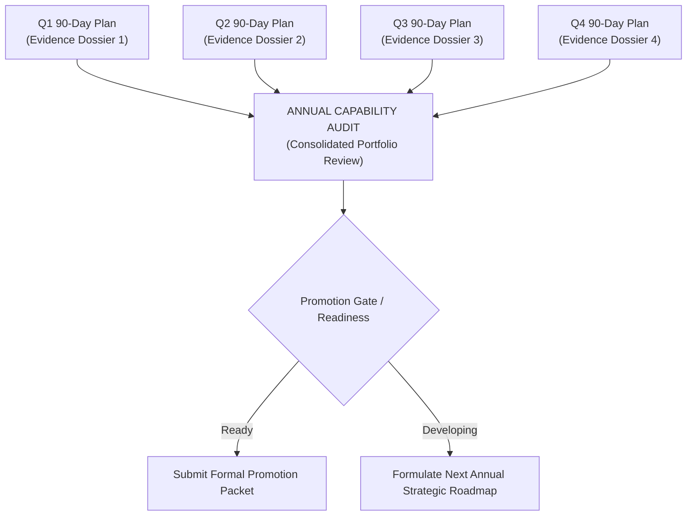

# The Annual Engineering Capability Review

> **"An annual review should contain zero surprises. It is not an interrogation; it is the formal ratification of an evidence ledger that has been systematically curated across four quarters."**

---

## 1. Purpose of the Annual Review

The **Annual Engineering Capability Review** is the capstone calibration of an engineer’s professional trajectory over a full calendar year. It consolidates four completed [90-Day Improvement Plans](./90-day-improvement-plan.md), evaluates long-term operational impact, recalculates the [Engineering Health Scorecard](../assessment/engineering-health-assessment.md), and determines readiness for formal role promotion.



---

## 2. The Annual Audit Process

### Step 1: Consolidate the Evidentiary Ledger
- Aggregate all Tier 3 CPOE entries recorded in [portfolio.yaml](../evidence/engineering-portfolio.md) across the year.
- Verify that every claimed capability is substantiated by live, functional repository diffs, accepted ADRs, and telemetry dashboards.
- Discard stale or superseded artifacts.

### Step 2: Calculate the 12-Month Capability Delta
Compare your baseline self-assessment from Month 1 against your calibrated capability at Month 12:

```mermaid
radar-chart
    title 12-Month Dimensional Progression
    axis Foundations, Software Eng, System Design, Architecture, Production, Security, Delivery, Collaboration, Business, Leadership
```

$$\Delta \mathbf{Capability} = \mathbf{Profile}_{\text{Month 12}} - \mathbf{Profile}_{\text{Month 1}}$$

Evaluate whether your primary growth goals for the year crossed the threshold into the next maturity tier (e.g., L2 $\to$ L3).

### Step 3: Audit Operational & Production Longevity
Inspect the long-term health of the systems you built or owned during the year:
- *Did the services you shipped in Q1 operate stably through Q4?*
- *Did any technical debt you introduced cause outages or alert fatigue?*
- *What was your overall MTTR and on-call resolution track record?*

### Step 4: Evaluate the Leadership Multiplier
Assess how you elevated the engineering organization:
- Number of junior or mid-level engineers mentored to independence.
- High-signal PR reviews authored.
- Paved roads, shared tools, or service templates adopted across teams.

---

## 3. Annual Review Dossier Template

```markdown
# Annual Engineering Capability Review — 2026

**Engineer**: [Candidate Name]
**Starting Title**: Software Engineer (L2)
**Evaluated Target**: Senior Software Engineer (L3)
**Evaluation Window**: January 1, 2026 – December 31, 2026

---

## 1. Executive Summary of Annual Impact
Over 2026, the candidate completed four consecutive 90-day continuous improvement cycles, successfully expanding operational and architectural scope from feature execution to complete subsystem ownership of the Payment & Billing ingestion pipeline.

---

## 2. Top 4 High-Grade Evidence Dossiers

1. **Q1: Idempotent Webhook Processing Engine** (System Design: L2 -> L3)
   - *Outcome*: Eliminated 100% of duplicate payment transactions; reduced P99 latency from 850ms to 32ms.
   - *Artifacts*: ADR-042, PR #1042, Grafana Dashboard `billing-webhooks`.

2. **Q2: Strangler Migration for Authentication** (Architecture: L2 -> L3)
   - *Outcome*: Decoupled legacy monolith auth, migrating 100% of traffic to OIDC/OAuth2 with zero downtime.
   - *Artifacts*: RFC-058, PR #1280, NewRelic canary telemetry.

3. **Q3: Incident Command & Connection Pool Hardening** (Production Engineering: L1 -> L3)
   - *Outcome*: Acted as Incident Commander during Sev-1 outage; implemented bounded connection pooling; zero repeat incidents in subsequent 180 days.
   - *Artifacts*: Post-Mortem INC-402, PR #982, Runbook `db-connection-triage`.

4. **Q4: Service Scaffolding Paved Road CLI** (Leadership & Collaboration: L2 -> L3)
   - *Outcome*: Built internal developer CLI adopted by 5 squads; reduced new service provisioning time from 2 weeks to 20 minutes.
   - *Artifacts*: Repository `service-starter-cli`, internal tech talk recording.

---

## 3. Dimensional Maturity Delta

| Dimension | Baseline (Jan) | Calibrated (Dec) | Net Delta | Status |
| :--- | :---: | :---: | :---: | :--- |
| 1. Technical Foundations | L2.0 | L3.0 | +1.0 | Advanced |
| 2. Software Engineering | L2.5 | L3.0 | +0.5 | Advanced |
| 3. System Design | L2.0 | L3.0 | +1.0 | Advanced |
| 4. Architecture Capability | L2.0 | L3.0 | +1.0 | Advanced |
| 5. Production Engineering | L1.5 | L3.0 | +1.5 | Advanced |
| 6. Security & Privacy | L2.0 | L2.5 | +0.5 | Developing |
| 7. Delivery Excellence | L2.5 | L3.0 | +0.5 | Advanced |
| 8. Collaboration & Influence | L2.0 | L3.0 | +1.0 | Advanced |
| 9. Business & Product | L2.0 | L2.5 | +0.5 | Developing |
| 10. Leadership & Growth | L2.0 | L3.0 | +1.0 | Advanced |

---

## 4. Promotion Committee Recommendation
- **Promotion Status**: **Recommended for Promotion to Senior Software Engineer (L3)**.
- **Justification**: Candidate meets or exceeds L3 behavioral anchors across 8 of 10 dimensions, backed by four verified Tier 3 evidence dossiers and exceptional production reliability.
```
