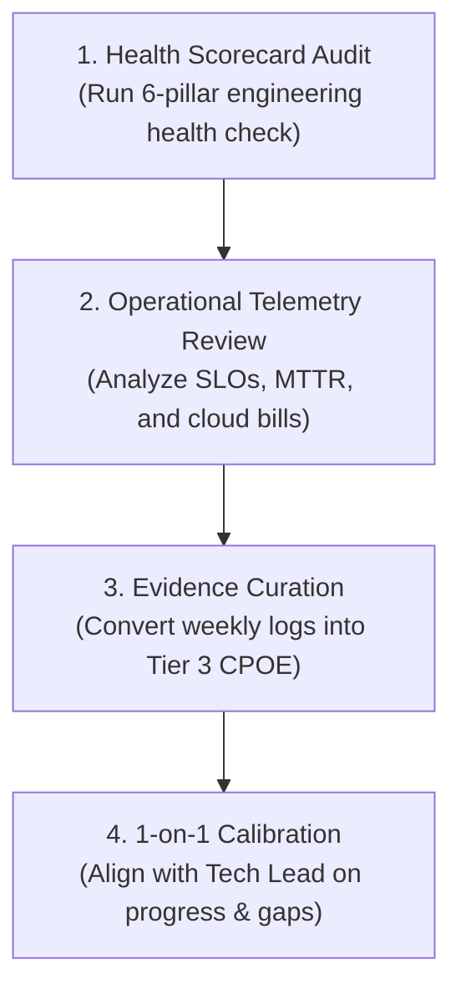

# The Monthly Engineering Calibration Loop

> **"A month is long enough for bad habits to calcify, and short enough to correct course before an entire quarter is lost."**

---

## 1. Overview of the Monthly Calibration

The **Monthly Engineering Calibration Loop** is a dedicated 1-to-2 hour review conducted at the end of every calendar month. Its primary objective is to inspect operational telemetry, audit engineering health, curate high-grade evidence, and align with engineering leadership in structured 1-on-1s.



---

## 2. The 4 Stages of the Monthly Review

### Stage 1: The Engineering Health Audit (30 Minutes)
Run the [Engineering Health Assessment Scorecard](../assessment/engineering-health-assessment.md):
- Calculate your updated **Composite Health Index (CHI)**.
- Identify negative drift (e.g., *Is our PR review turnaround time creeping past 24 hours? Are flaky tests starting to accumulate in CI?*).
- Formulate 1 concrete action item to address the lowest-scoring pillar.

### Stage 2: Operational Telemetry & Cost Review (30 Minutes)
Inspect the actual production telemetry for the services you own:
- **SLO Adherence**: Did your services operate within their 30-day rolling error budgets? If budget was burned, what architectural defect burned it?
- **P99 Latency Profile**: Did latency creep upward under increased business volume?
- **Cloud Infrastructure Invoices (FinOps)**: Review AWS Cost Explorer or GCP Billing. Are compute or database costs increasing faster than transaction volume?

### Stage 3: Evidence Curation & Portfolio Hardening (30 Minutes)
Review the raw links saved in your weekly scratchpads:
- Select the **top 1 or 2 artifacts** of the month.
- Translate them into the formal **Claim $\to$ Practice $\to$ Outcome $\to$ Evidence (CPOE)** format.
- Discard trivial, routine sprint tasks.
- Commit the new entries to your [portfolio.yaml](../evidence/engineering-portfolio.md).

### Stage 4: Tech Lead / Manager 1-on-1 Calibration (30 Minutes)
Bring your curated portfolio entries and health scorecard to your monthly career 1-on-1:
- Review your primary 90-day learning goal progress.
- Solicit direct, unvarnished feedback: *"Where do you see my biggest architectural or operational blind spot this month?"*
- Negotiate upcoming project assignments that provide high-value stretch opportunities.

---

## 3. Monthly Calibration Worksheet

```markdown
### Monthly Engineering Calibration — Month: [Month/Year]

**Engineer**: [Name]
**Current Target**: Advancing Production Engineering (L1 -> L2)

#### 1. Operational Telemetry Summary
- Service Availability: 99.98% (Target: 99.90%) — Within budget.
- P99 Latency: 42ms (Target: < 50ms) — Stable.
- Alert Volume: 4 off-hours pages this month (2 were false alarms; opened ticket #892 to tune threshold).

#### 2. Top Curated Evidence Entry
- **CPOE-2026-08**: Replaced synchronous REST call with asynchronous Kafka message in order fulfillment worker, reducing endpoint latency by 240ms (PR #512).

#### 3. Monthly Action Item
- Shadow on-call primary next week; write runbook for Kafka consumer group lag alerts.
```
